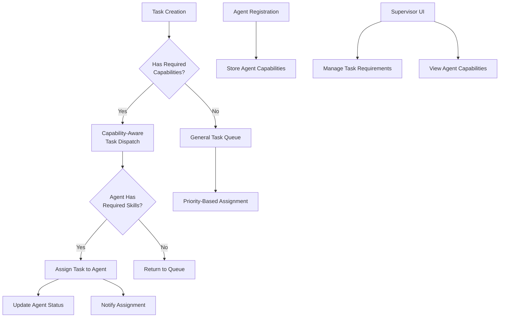

# Intelligent Agent Dispatch & Specialization Layer Design

## Overview

The current orchestration engine treats all agents as equals, assigning tasks from a general queue based only on priority. This approach is inefficient as it can assign a specialized "Code Review" agent to a simple "Build" task while a generic "Executor" agent remains idle. 

This design document outlines the implementation of an Intelligent Agent Dispatch & Specialization Layer that transforms the orchestrator from a simple FIFO queue manager into a smart, capability-aware router that matches the right agent to the right job.

This strategic evolution consists of three distinct, standalone tasks that introduce the concepts of agent capabilities and task requirements, making the entire system more efficient and specialized.

## Architecture

The solution involves three core components working together:

1. **Capability Management System** - Database schema and API endpoints for defining agent capabilities and task requirements
2. **Capability-Aware Task Dispatch Engine** - Enhanced task claiming logic that matches agents to tasks based on capabilities
3. **UI Visualization Layer** - Supervisor dashboard enhancements for managing and visualizing agent specializations



## Data Models

### Tasks Table Enhancement

The `tasks` table will be enhanced with a new column to store required capabilities:

```sql
ALTER TABLE tasks
  ADD COLUMN required_capabilities JSONB;

COMMENT ON COLUMN tasks.required_capabilities IS 'A JSON array of strings representing skills needed for this task, e.g., ''["python", "code-review"]''.';

-- Create a GIN index for efficient searching of capabilities.
CREATE INDEX idx_tasks_required_capabilities ON tasks USING GIN (required_capabilities);
```

### Agents Table (Existing)

The `agents` table already has a capabilities field:

```sql
-- Existing column in agents table
capabilities JSONB -- e.g., '["python", "react", "code-review"]'
```

## API Endpoints

### PUT /api/tasks/:taskId/capabilities

This endpoint allows supervisors to add or update skill requirements for a specific task after it has been created. This endpoint should be protected by RBAC (supervisor/admin).

**Request:**
```
PUT /api/tasks/{taskId}/capabilities
Content-Type: application/json

{
  "capabilities": ["python", "code-review"]
}
```

**Response:**
```
{
  "id": "task-uuid",
  "title": "Code Review Task",
  "description": "Review the latest code changes",
  "status": "TODO",
  "priority": "HIGH",
  "agent_id": null,
  "required_capabilities": ["python", "code-review"],
  "created_at": "2023-05-15T10:30:00Z",
  "updated_at": "2023-05-15T11:45:00Z"
}
```

### Enhanced Task Claiming Endpoint

The existing task claiming logic will be updated to use capability-aware matching:

**Request:**
```
POST /api/agents/{agentId}/claim-task
Content-Type: application/json

{
  "agentId": "agent-uuid",
  "apiKey": "agent-api-key"
}
```

**Response:**
```
{
  "id": "task-uuid",
  "title": "Specialized Task",
  "description": "Task requiring specific skills",
  "status": "IN_PROGRESS",
  "priority": "HIGH",
  "agent_id": "agent-uuid",
  "required_capabilities": ["python", "testing"],
  "created_at": "2023-05-15T10:30:00Z",
  "updated_at": "2023-05-15T11:45:00Z"
}
```

## PostgreSQL Functions

### claim_next_task_by_capability

This function replaces the existing `claim_next_task` function with a capability-aware version:

```sql
CREATE OR REPLACE FUNCTION claim_next_task_by_capability(requesting_agent_id UUID)
RETURNS tasks AS $$
DECLARE
  claimed_task tasks;
  agent_capabilities JSONB;
BEGIN
  -- 1. Get the capabilities of the requesting agent.
  SELECT capabilities INTO agent_capabilities FROM agents WHERE id = requesting_agent_id;

  -- 2. Find and claim the highest-priority task that the agent is qualified for.
  UPDATE tasks
  SET
    status = 'IN_PROGRESS',
    agent_id = requesting_agent_id
  WHERE id = (
    SELECT id FROM tasks
    WHERE
      status = 'TODO'
      -- The core matching logic: task requirements are a subset of agent capabilities.
      AND (required_capabilities IS NULL OR required_capabilities <@ agent_capabilities)
    ORDER BY priority, created_at
    LIMIT 1
    FOR UPDATE SKIP LOCKED
  )
  RETURNING * INTO claimed_task;

  -- 3. Update the agent's status to BUSY if a task was claimed.
  IF claimed_task IS NOT NULL THEN
    UPDATE agents SET status = 'BUSY', last_seen = NOW() WHERE id = requesting_agent_id;
  END IF;

  RETURN claimed_task;
END;
$$ LANGUAGE plpgsql;
```

## Business Logic

### Capability Matching Algorithm

The core of the intelligent dispatch system is the capability matching algorithm that uses PostgreSQL's JSONB containment operator (`<@`):

1. When an agent requests a task, the system retrieves the agent's capabilities
2. It then searches for tasks where:
   - The task status is 'TODO'
   - Either the task has no required capabilities (NULL) or all required capabilities are contained within the agent's capabilities
3. Tasks are ordered by priority and creation time
4. The highest priority task is claimed using PostgreSQL's `FOR UPDATE SKIP LOCKED` to prevent race conditions

### Backward Compatibility

The system maintains backward compatibility by:
- Allowing tasks with NULL required_capabilities to be claimed by any agent
- Preserving existing API endpoints while enhancing their functionality
- Maintaining the same data structures with additive changes only

## UI Components

### AgentMonitoringPanel Enhancement

The agent monitoring panel will display each agent's capabilities as a list of tags:

```tsx
// Conceptual code for capability display
function CapabilityTags({ tags }: { tags: string[] | null }) {
  if (!tags || tags.length === 0) {
    return <span className="text-xs text-gray-500">No specific capabilities</span>;
  }
  return (
    <div className="flex flex-wrap gap-1 mt-1">
      {tags.map(tag => (
        <span key={tag} className="px-2 py-1 text-xs bg-gray-600 text-gray-200 rounded-full">
          {tag}
        </span>
      ))}
    </div>
  );
}
```

### CreateTaskForm Enhancement

The task creation form will include a new input field for specifying required capabilities:

- Multi-select dropdown or tag input component (e.g., react-tag-input or a customized react-select)
- Allows supervisors to define skill requirements when creating new tasks
- Validates input to ensure it's an array of strings

### TaskDetailModal Enhancement

The task detail modal will display and allow editing of task requirements:

- Shows required capabilities for the selected task
- Provides editing interface for supervisors
- Calls the PUT /api/tasks/:taskId/capabilities endpoint on change
- Conditionally renders editing features based on the user's role

## Security Considerations

1. **RBAC Enforcement**: The new PUT /api/tasks/:taskId/capabilities endpoint will be secured by existing RBAC policies to ensure only authorized users can modify task requirements
2. **Input Validation**: All API endpoints will validate that capabilities are provided as arrays of strings
3. **Agent Authentication**: Existing agent API key verification mechanisms will be preserved

## Performance Considerations

1. **Indexing**: The GIN index on the required_capabilities column ensures efficient querying
2. **Containment Operator**: The PostgreSQL JSONB `<@` operator is highly efficient, especially with the GIN index
3. **Atomic Operations**: Task claiming uses PostgreSQL's `FOR UPDATE SKIP LOCKED` to prevent race conditions without blocking

## Testing Strategy

### Unit Tests

1. Test capability matching logic with various combinations of agent capabilities and task requirements
2. Verify that agents can only claim tasks for which they have all required skills
3. Test backward compatibility with tasks that have NULL required_capabilities
4. Validate input validation for the PUT /api/tasks/:taskId/capabilities endpoint

### Integration Tests

1. End-to-end test of task creation with capabilities and agent claiming
2. Test supervisor UI for managing task requirements
3. Verify real-time updates in the agent monitoring panel
4. Test RBAC enforcement for the new API endpoint

### Performance Tests

1. Load testing with high volumes of tasks and agents
2. Benchmark query performance with the GIN index
3. Test race condition handling under concurrent load

## Deployment Plan

1. **Database Schema Update**: Add required_capabilities column and GIN index to tasks table
2. **API Enhancement**: Deploy new PUT /api/tasks/:taskId/capabilities endpoint
3. **PostgreSQL Function Update**: Replace claim_next_task with claim_next_task_by_capability
4. **UI Component Updates**: Deploy enhanced agent monitoring, task creation, and task detail components
5. **Monitoring**: Implement metrics to track successful vs. failed task assignments

## Self-Check Questions

### DB/API Implementation (Task 01)

- [ ] Is the required_capabilities column correctly added to the tasks table?
- [ ] Is a GIN index created on this new column to ensure efficient queries?
- [ ] Does the new API endpoint correctly validate the input to ensure it's an array?

### API Implementation (Task 02)

- [ ] Does the new PostgreSQL function correctly fetch the agent's capabilities before searching for a task?
- [ ] Is the <@ operator used correctly to ensure the agent has all the skills required by the task?
- [ ] Does the API endpoint now call the new claim_next_task_by_capability function?

### UI Implementation (Task 03)

- [ ] Does the agent panel correctly display the list of capabilities for each agent?
- [ ] Can a supervisor successfully add, edit, and remove required capabilities when creating or editing a task?
- [ ] Is the display of capabilities consistent across all relevant UI components?

## Documentation Links

### PostgreSQL JSONB Containment
- [PostgreSQL Docs - JSON Functions and Operators](https://www.postgresql.org/docs/current/functions-json.html) (see the @> operator)
- [PostgreSQL Docs - GIN Indexes](https://www.postgresql.org/docs/current/gin.html)

### UI Component Libraries
- [React Select Documentation](https://react-select.com/home)

## Future Enhancements

1. **Dynamic Capability Discovery**: Allow agents to dynamically report new capabilities
2. **Learning System**: Implement machine learning to suggest optimal capability assignments
3. **Capability Hierarchy**: Define hierarchical relationships between capabilities (e.g., "python" implies "programming")
4. **Load Balancing**: Extend the system to consider agent workload in addition to capabilities