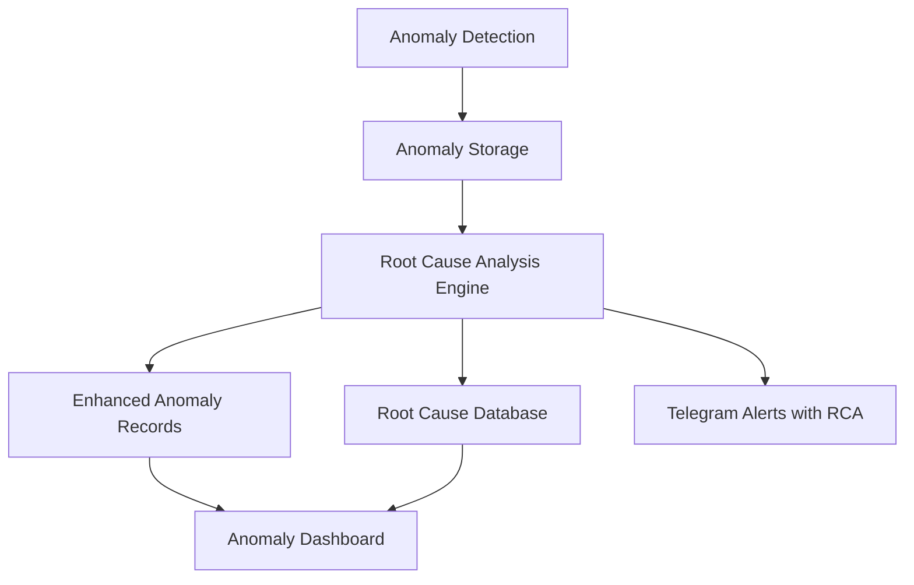

# Root Cause Analysis for Anomaly Detection System

## 1. Overview

This document outlines the design for implementing a Root Cause Analysis (RCA) feature for the existing anomaly detection system in devart.ai. The current system can detect various types of anomalies (performance, security, resource) but only flags them without suggesting potential causes. This enhancement will analyze detected anomalies and provide likely root causes to help supervisors quickly identify and resolve issues.

## 2. Architecture

The Root Cause Analysis system will be implemented as an extension to the existing anomaly detection pipeline with the following components:



### 2.1 Key Components

1. **Root Cause Analysis Engine**: Core service that analyzes anomalies and determines likely causes
2. **Root Cause Database**: Storage for root cause patterns and historical analysis
3. **Enhanced Anomaly Records**: Updated anomaly records with root cause information
4. **Anomaly Dashboard Integration**: UI components to display root cause information
5. **Alerting System Integration**: Enhanced alerts with root cause information

## 3. Data Models

### 3.1 Enhanced Anomaly Record

The existing `trace_anomalies` table will be extended with root cause information:

```sql
ALTER TABLE trace_anomalies ADD COLUMN root_cause JSONB;
ALTER TABLE trace_anomalies ADD COLUMN root_cause_confidence TEXT; -- 'LOW', 'MEDIUM', 'HIGH'
ALTER TABLE trace_anomalies ADD COLUMN suggested_actions JSONB;
```

### 3.2 Root Cause Patterns Table

A new table to store root cause patterns for learning and improvement:

```sql
CREATE TABLE root_cause_patterns (
  id UUID PRIMARY KEY DEFAULT gen_random_uuid(),
  anomaly_type TEXT NOT NULL,
  anomaly_subtype TEXT,
  root_cause_category TEXT NOT NULL,
  root_cause_details TEXT,
  pattern_identifiers JSONB,
  confidence_score NUMERIC,
  created_at TIMESTAMPTZ DEFAULT NOW()
);
```

## 4. Root Cause Analysis Logic

### 4.1 Performance Anomalies

For performance-related anomalies, the system will analyze:

1. **High Latency Anomalies**
   - Check service dependency chains
   - Analyze database query performance
   - Identify external API call delays
   - Review resource utilization (CPU, memory)

2. **Error Rate Anomalies**
   - Identify common error types
   - Check recent code deployments
   - Analyze service dependencies
   - Review configuration changes

3. **Throughput Anomalies**
   - Check traffic patterns
   - Analyze resource constraints
   - Identify bottlenecks in processing pipelines

### 4.2 Security Anomalies

For security-related anomalies, the system will analyze:

1. **Unusual Access Patterns**
   - Check user authentication logs
   - Analyze IP address patterns
   - Review permission changes
   - Identify potential credential leaks

2. **Data Access Anomalies**
   - Check for unusual data queries
   - Analyze data export patterns
   - Review user role changes

### 4.3 Resource Anomalies

For resource-related anomalies, the system will analyze:

1. **Memory Leaks**
   - Check service memory usage trends
   - Analyze garbage collection patterns
   - Review recent code changes

2. **CPU Saturation**
   - Identify high CPU usage processes
   - Check for infinite loops or recursive operations
   - Analyze concurrent request handling

## 5. Implementation Plan

### 5.1 Backend Implementation

1. **Root Cause Analysis Service** (`apps/api/src/services/rootCauseAnalysis.ts`):
   - Implement analysis algorithms for different anomaly types
   - Create pattern matching logic
   - Integrate with existing anomaly detection pipeline

2. **Enhanced Anomaly Storage**:
   - Modify `storeResults` function in `anomalyDetection.ts` to include root cause information
   - Update database schema with new columns

3. **Pattern Learning**:
   - Implement feedback mechanism to improve root cause suggestions
   - Create pattern storage and retrieval functions

### 5.2 Frontend Implementation

1. **Anomaly Dashboard Enhancement**:
   - Add root cause display section to anomaly details
   - Implement suggested actions panel
   - Add confidence indicators for root cause suggestions

2. **Anomaly Alert Panel Enhancement**:
   - Include root cause information in alert summaries
   - Add quick action buttons based on suggested actions

### 5.3 Alerting System Enhancement

1. **Telegram Alert Enhancement**:
   - Modify alert messages to include root cause information
   - Add suggested actions to critical alerts

## 6. Root Cause Categories

The system will categorize root causes into the following types:

| Category | Description | Example |
|----------|-------------|---------|
| Infrastructure | Issues with underlying infrastructure | Server overload, network latency |
| Application | Problems in application code or logic | Memory leaks, inefficient algorithms |
| Configuration | Incorrect system configurations | Wrong environment variables, misconfigured services |
| External Dependencies | Issues with third-party services | API downtime, rate limiting |
| Security | Security-related issues | Unauthorized access, credential leaks |
| Data | Issues with data quality or processing | Corrupted data, schema mismatches |
| Human Error | Mistakes made by operators | Incorrect deployments, manual errors |

## 7. Confidence Scoring

The system will assign confidence scores to root cause suggestions:

- **HIGH (80-100%)**: Strong evidence supporting the root cause
- **MEDIUM (50-79%)**: Moderate evidence supporting the root cause
- **LOW (1-49%)**: Weak evidence, requires supervisor validation

## 8. Suggested Actions

For each identified root cause, the system will provide actionable suggestions:

| Root Cause Category | Suggested Actions |
|---------------------|-------------------|
| Infrastructure | Scale resources, check network connectivity |
| Application | Review code, optimize algorithms, fix memory leaks |
| Configuration | Verify settings, rollback recent changes |
| External Dependencies | Contact service provider, implement fallbacks |
| Security | Review access logs, rotate credentials, update permissions |
| Data | Validate data quality, check schema compatibility |
| Human Error | Review recent changes, implement process improvements |

## 9. Machine Learning Enhancement

Future enhancements could include:

1. **Pattern Learning**: Use historical data to improve root cause identification
2. **Clustering**: Group similar anomalies for common root cause analysis
3. **Feedback Loop**: Allow supervisors to validate/invalidate root cause suggestions

## 10. Testing Strategy

1. **Unit Tests**: Test individual root cause analysis functions
2. **Integration Tests**: Test the complete anomaly detection with RCA pipeline
3. **Performance Tests**: Ensure RCA doesn't significantly impact anomaly detection performance
4. **User Acceptance Tests**: Validate root cause suggestions with supervisors

## 11. Security Considerations

1. Ensure root cause analysis doesn't expose sensitive system information
2. Protect pattern data with appropriate RLS policies
3. Sanitize all data before including in alerts or UI

## 12. Monitoring and Observability

1. Track root cause analysis accuracy through supervisor feedback
2. Monitor performance impact of RCA processing
3. Log all root cause suggestions for audit purposes