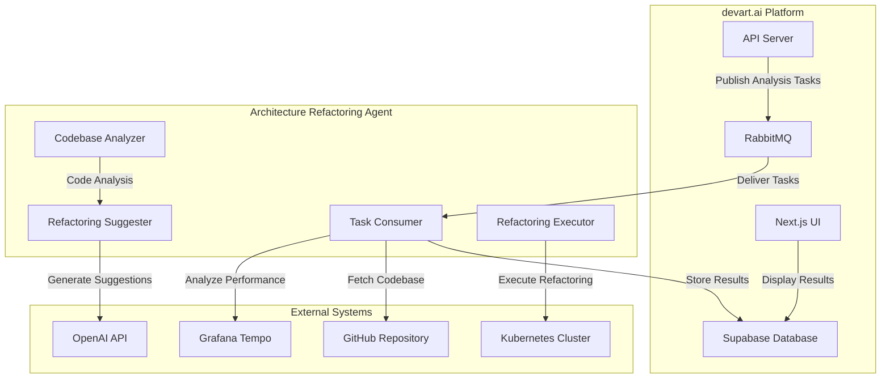
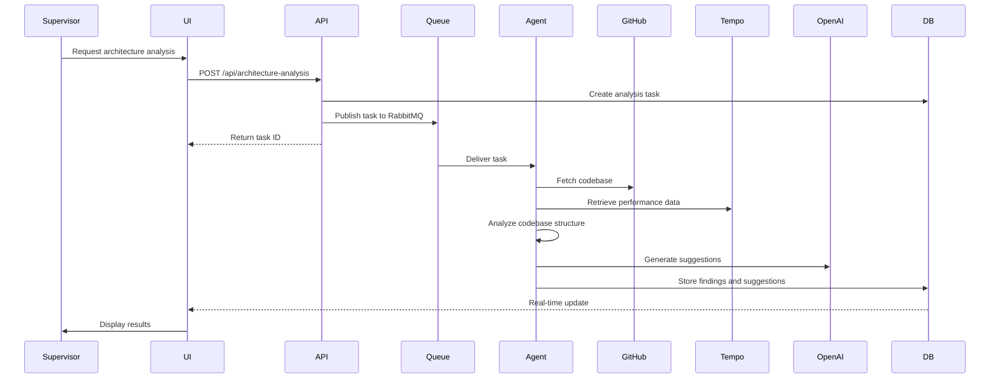

# AI-driven Architecture Refactoring Agent Design

## 1. Overview

The AI-driven Architecture Refactoring Agent is a specialized GenAI agent that analyzes codebases and performance data to suggest and implement architectural improvements. This agent extends the devart.ai platform's capabilities by providing automated analysis of software architecture patterns, identifying potential bottlenecks, and generating refactoring recommendations to improve system performance, maintainability, and scalability.

The agent leverages the existing platform infrastructure including:
- OpenTelemetry-based distributed tracing for performance data collection
- Supabase database for storing analysis results and refactoring suggestions
- Kubernetes sandbox orchestration for safe execution of refactoring operations
- RabbitMQ task distribution for workload management
- LLM integration for generating intelligent refactoring suggestions

## 2. Architecture

The Architecture Refactoring Agent follows the existing agent pattern in the devart.ai system, consisting of three main components:



### 2.1 Component Description

#### 2.1.1 Task Consumer
- Consumes architecture analysis tasks from the RabbitMQ queue
- Coordinates the analysis workflow
- Integrates with GitHub to fetch codebase data
- Interfaces with Grafana Tempo to retrieve performance trace data

#### 2.1.2 Codebase Analyzer
- Parses and analyzes codebase structure
- Identifies architectural patterns and anti-patterns
- Detects code quality issues and technical debt
- Evaluates dependency relationships and coupling

#### 2.1.3 Refactoring Suggester
- Uses LLM to generate refactoring suggestions based on analysis results
- Prioritizes recommendations based on impact and complexity
- Creates detailed implementation plans for each suggestion
- Integrates performance data to validate potential improvements

#### 2.1.4 Refactoring Executor
- Implements approved refactoring suggestions in a sandboxed environment
- Validates refactoring results through automated testing
- Generates before/after performance comparisons
- Manages rollback capabilities in case of issues

## 3. API Endpoints Reference

### 3.1 Request/Response Schema

#### 3.1.1 POST /api/architecture-analysis
Initiates a new architecture analysis task

**Request Body:**

Specification for initiating a new architecture analysis task with parameters including repository URL, branch, analysis scope, target modules, and performance data window.

**Response:**

Response containing the task ID, status, and creation timestamp.

#### 3.1.2 GET /api/architecture-analysis/{taskId}
Retrieves the status and results of an architecture analysis

**Response:**

Detailed response containing task information, repository details, findings array with issue identification and severity, refactoring suggestions with complexity and implementation plans, and completion timestamp.

#### 3.1.3 POST /api/architecture-analysis/{taskId}/refactor
Applies a refactoring suggestion

**Request Body:**

Specification for applying a refactoring suggestion with the suggestion ID and sandbox execution flag.

**Response:**

Response containing the execution ID, status, and sandbox URL for monitoring the refactoring process.

### 3.2 Authentication Requirements
All API endpoints require authentication through Supabase Auth with appropriate role-based access control:
- Supervisors can initiate analyses and approve refactorings
- Agents can only read analysis results
- Admins have full access to all features

## 4. Data Models & ORM Mapping

### 4.1 Architecture Analysis Task
Database table schema for storing architecture analysis tasks with fields for repository information, analysis scope, status tracking, and timestamps.

### 4.2 Architecture Findings
Database table schema for storing architecture findings with references to analysis tasks, issue type and severity classification, location information, and impact scoring.

### 4.3 Refactoring Suggestions
Database table schema for storing refactoring suggestions with references to findings and tasks, complexity and risk assessment, and implementation planning.

### 4.4 Refactoring Executions
Database table schema for tracking refactoring executions with status information, sandbox details, execution timestamps, and error handling.

## 5. Business Logic Layer

### 5.1 Architecture Analysis Workflow



### 5.2 Codebase Analysis Process

The codebase analysis process involves several steps:

1. **Repository Analysis**
   - Parse project structure and identify modules/components
   - Analyze dependency relationships and coupling
   - Identify architectural patterns (MVC, microservices, etc.)
   - Detect architectural anti-patterns (God classes, circular dependencies, etc.)

2. **Code Quality Assessment**
   - Calculate code complexity metrics (cyclomatic complexity, etc.)
   - Identify code duplication
   - Detect code smells (long methods, large classes, etc.)
   - Evaluate test coverage

3. **Performance Data Integration**
   - Correlate code structure with performance trace data
   - Identify performance bottlenecks in specific components
   - Analyze resource usage patterns
   - Detect scalability issues

### 5.3 Refactoring Suggestion Generation

The refactoring suggestion generation process:

1. **Pattern Matching**
   - Match identified issues with known refactoring patterns
   - Prioritize suggestions based on severity and impact
   - Consider implementation complexity and risk

2. **LLM-Based Enhancement**
   - Use OpenAI to generate detailed implementation plans
   - Create code examples for each refactoring step
   - Provide explanations of benefits and trade-offs

3. **Validation and Scoring**
   - Score suggestions based on impact, complexity, and risk
   - Validate suggestions against codebase constraints
   - Ensure suggestions align with project architecture goals

### 5.4 Refactoring Execution Workflow

1. **Sandbox Provisioning**
   - Create isolated Kubernetes environment
   - Clone repository with specific branch/commit
   - Set up required dependencies and services

2. **Refactoring Implementation**
   - Apply refactoring steps in the sandbox
   - Run automated tests to validate changes
   - Generate performance comparison reports

3. **Result Validation**
   - Compare before/after performance metrics
   - Verify code quality improvements
   - Ensure no regressions in functionality

## 6. Middleware & Interceptors

### 6.1 Authentication Middleware
- Validates user authentication and authorization
- Enforces role-based access control
- Logs access attempts for security monitoring

### 6.2 Tracing Middleware
- Instruments all API requests with OpenTelemetry
- Correlates requests with performance trace data
- Provides observability for debugging and monitoring

### 6.3 Rate Limiting Middleware
- Prevents abuse of analysis services
- Ensures fair resource allocation among users
- Protects against denial-of-service attacks

### 6.4 Validation Middleware
- Validates request payloads against defined schemas
- Ensures required parameters are provided
- Prevents invalid data from reaching business logic

## 7. Testing Strategy

### 7.1 Unit Tests

#### 7.1.1 Codebase Analyzer Tests
Test cases for the CodebaseAnalyzer component to verify circular dependency detection, cyclomatic complexity calculation, and architectural anti-pattern detection.
```

#### 7.1.2 Refactoring Suggester Tests
Test cases for the RefactoringSuggester component to verify implementation plan generation, suggestion prioritization, and performance data integration.
```

### 7.2 Integration Tests

#### 7.2.1 API Endpoint Tests
Integration tests for the Architecture Analysis API endpoints to verify task creation, result retrieval, and refactoring execution functionality.
```

### 7.3 End-to-End Tests

#### 7.3.1 Full Analysis Workflow Test
End-to-end tests for the full architecture analysis workflow, covering repository analysis, suggestion generation, sandbox execution, and result validation.
```

### 7.4 Performance Tests

#### 7.4.1 Analysis Performance Tests
Performance tests to verify that the architecture analysis can handle large repositories within acceptable time limits and manage concurrent analysis requests efficiently.
```