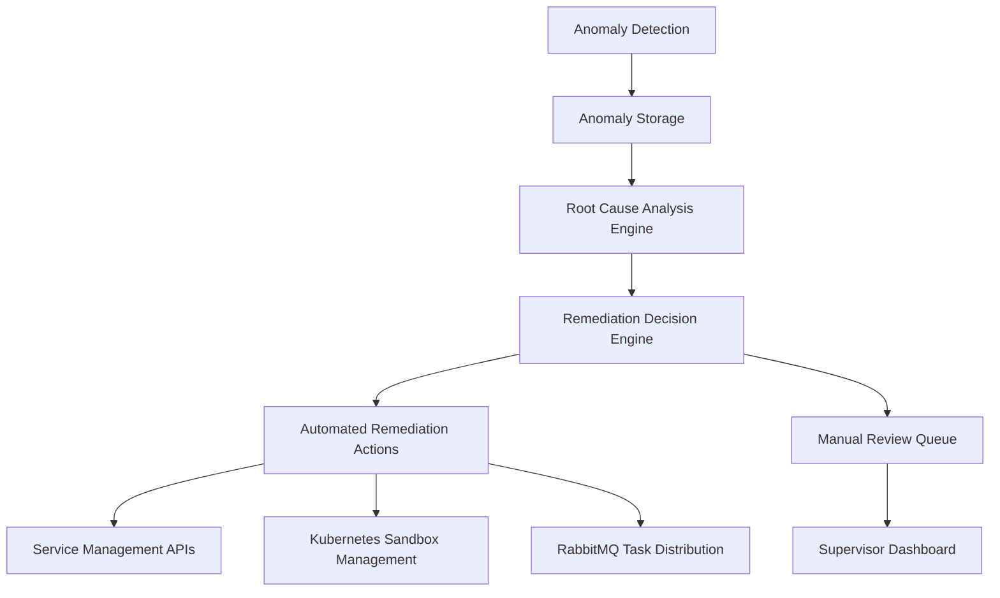

# Automated Remediation System Design

## Overview

The Automated Remediation system is designed to enable agents to act on high-confidence Root Cause Analysis (RCA) findings to perform automated remediation actions. This system extends the existing anomaly detection and root cause analysis capabilities by adding automated response mechanisms for specific, well-understood issues.

## Architecture

The Automated Remediation system follows a modular architecture that integrates with the existing anomaly detection and root cause analysis pipeline:



### Key Components

1. **Remediation Decision Engine**: Evaluates RCA confidence scores and determines appropriate remediation actions
2. **Automated Remediation Actions**: Executes predefined remediation procedures based on root cause categories
3. **Manual Review Queue**: Routes low-confidence RCA findings to human supervisors for review
4. **Service Management APIs**: Interfaces with external systems for configuration changes
5. **Kubernetes Sandbox Management**: Manages containerized environments for testing remediation actions
6. **RabbitMQ Task Distribution**: Queues remediation tasks for execution

## Data Models

### Remediation Actions Table

A new table to store predefined remediation actions:

```sql
CREATE TABLE remediation_actions (
  id UUID PRIMARY KEY DEFAULT gen_random_uuid(),
  root_cause_category TEXT NOT NULL,
  root_cause_details TEXT,
  action_type TEXT NOT NULL, -- 'ROLLBACK', 'RESTART', 'SCALE', 'NOTIFY'
  action_parameters JSONB,
  confidence_threshold TEXT NOT NULL, -- 'HIGH', 'MEDIUM', 'LOW'
  is_active BOOLEAN DEFAULT TRUE,
  created_at TIMESTAMPTZ DEFAULT NOW(),
  updated_at TIMESTAMPTZ DEFAULT NOW()
);
```

### Remediation Execution Log Table

A table to track executed remediation actions:

```sql
CREATE TABLE remediation_logs (
  id UUID PRIMARY KEY DEFAULT gen_random_uuid(),
  anomaly_id UUID REFERENCES trace_anomalies(id),
  action_id UUID REFERENCES remediation_actions(id),
  execution_status TEXT NOT NULL, -- 'SUCCESS', 'FAILED', 'PARTIAL'
  execution_result JSONB,
  executed_at TIMESTAMPTZ DEFAULT NOW(),
  executed_by TEXT -- 'AUTOMATED', 'MANUAL'
);
```

## Remediation Decision Logic

The system evaluates RCA findings based on confidence scores to determine appropriate actions:

| Confidence Score | Action |
|------------------|--------|
| HIGH (80-100%) | Execute automated remediation if predefined action exists |
| MEDIUM (50-79%) | Queue for supervisor review with suggested action |
| LOW (1-49%) | Queue for supervisor review without automated suggestion |

## Supported Remediation Actions

### 1. Configuration Rollback

- **Category**: Configuration
- **Action Type**: ROLLBACK
- **Description**: Reverts a configuration change to a previous known good state
- **Parameters**: 
  - `config_key`: The configuration key to rollback
  - `previous_value`: The previous value to restore
  - `service_id`: The service affected by the configuration

### 2. Service Restart

- **Category**: Infrastructure, Application
- **Action Type**: RESTART
- **Description**: Restarts a faulty service to resolve transient issues
- **Parameters**:
  - `service_id`: The service to restart
  - `container_id`: Specific container instance (optional)
  - `grace_period`: Time to wait before force restart (optional)

### 3. Resource Scaling

- **Category**: Infrastructure, Resource
- **Action Type**: SCALE
- **Description**: Adjusts compute resources allocated to a service
- **Parameters**:
  - `service_id`: The service to scale
  - `resource_type`: CPU, memory, or instances
  - `scale_direction`: UP or DOWN
  - `scale_amount`: Amount to scale by

### 4. Task Requeuing

- **Category**: Application
- **Action Type**: REQUEUE
- **Description**: Places a failed task back in the processing queue with appropriate delay
- **Parameters**:
  - `task_id`: The task to requeue
  - `delay_ms`: Delay before task should be processed again

## Implementation Details

### Backend Implementation

#### 1. Remediation Service (`apps/api/src/services/remediation.ts`)

- Implements remediation action execution logic
- Integrates with Kubernetes, RabbitMQ, and service management APIs
- Logs all remediation actions for audit purposes

#### 2. Remediation Decision Engine

- Evaluates RCA confidence scores
- Matches root causes to predefined remediation actions
- Routes actions to appropriate execution systems

#### 3. API Endpoints

- `GET /api/remediation-actions` - Retrieve all remediation actions
- `POST /api/remediation-actions` - Create a new remediation action
- `PUT /api/remediation-actions/:id` - Update a remediation action
- `POST /api/remediation/execute` - Manually trigger a remediation action
- `GET /api/remediation-logs` - Retrieve remediation execution logs

### Frontend Implementation

#### 1. Remediation Dashboard

- Displays automated remediation actions and their status
- Shows remediation logs and execution results
- Allows supervisors to manually trigger remediation actions

#### 2. Anomaly Dashboard Enhancement

- Adds remediation status to anomaly details
- Shows suggested remediation actions for high-confidence RCAs
- Provides quick action buttons for manual remediation

#### 3. Supervisor Interface

- Integrates remediation actions into task management workflows
- Allows supervisors to approve/reject automated remediation suggestions

## Security Considerations

1. All remediation actions must be logged with detailed audit trails
2. Only high-confidence actions should be executed automatically
3. Role-based access control for remediation action configuration
4. Rate limiting on automated remediation to prevent cascading failures
5. Dry-run capability for testing remediation actions before execution

## Testing Strategy

1. **Unit Tests**: Test individual remediation action functions
2. **Integration Tests**: Test the complete remediation pipeline
3. **Simulation Tests**: Test remediation actions in a sandboxed environment
4. **Failure Mode Tests**: Ensure remediation actions don't cause additional issues
5. **User Acceptance Tests**: Validate remediation suggestions with supervisors

## Monitoring and Observability

1. Track remediation action success/failure rates
2. Monitor performance impact of remediation actions
3. Log all remediation decisions for audit purposes
4. Alert on failed remediation attempts
5. Dashboard metrics for remediation effectiveness

## Deployment

### Prerequisites

1. Updated database schema with remediation tables
2. Configuration of remediation actions in the database
3. Proper RBAC setup for remediation controls

### Environment Variables

```bash
# Remediation service configuration
MAX_AUTOMATED_REMEDIATION_RATE=5 # Maximum automated actions per minute
REMEDIATION_DRY_RUN=false # Enable dry-run mode for testing
```

## Rollback Procedures

1. All remediation actions should have corresponding rollback procedures
2. Failed remediation actions should trigger alerts to supervisors
3. Critical remediation actions should require manual confirmation
4. System should maintain a history of all configuration changes for rollback