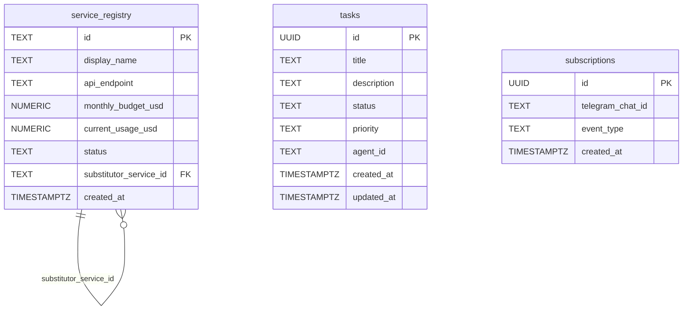
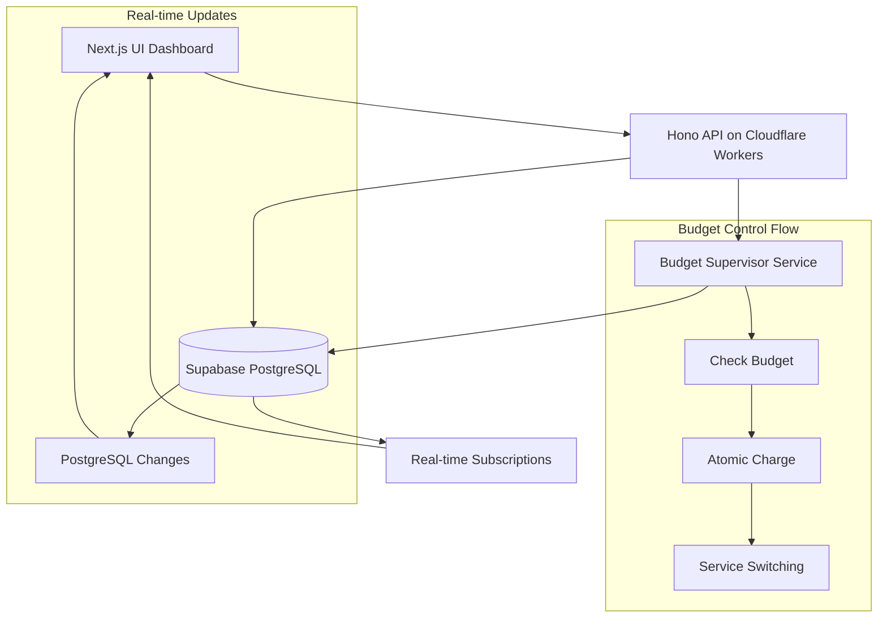
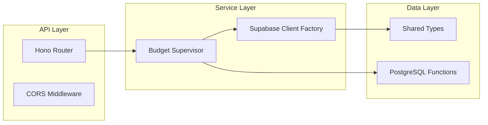
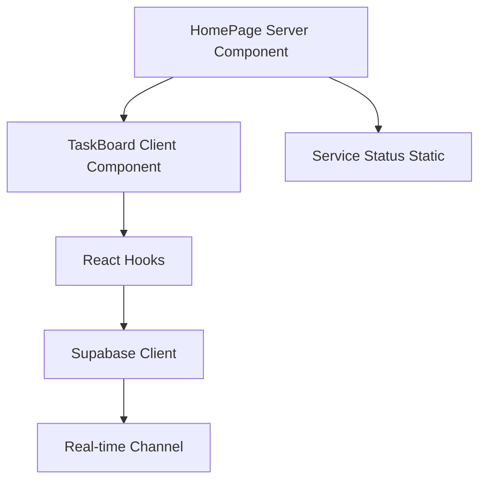
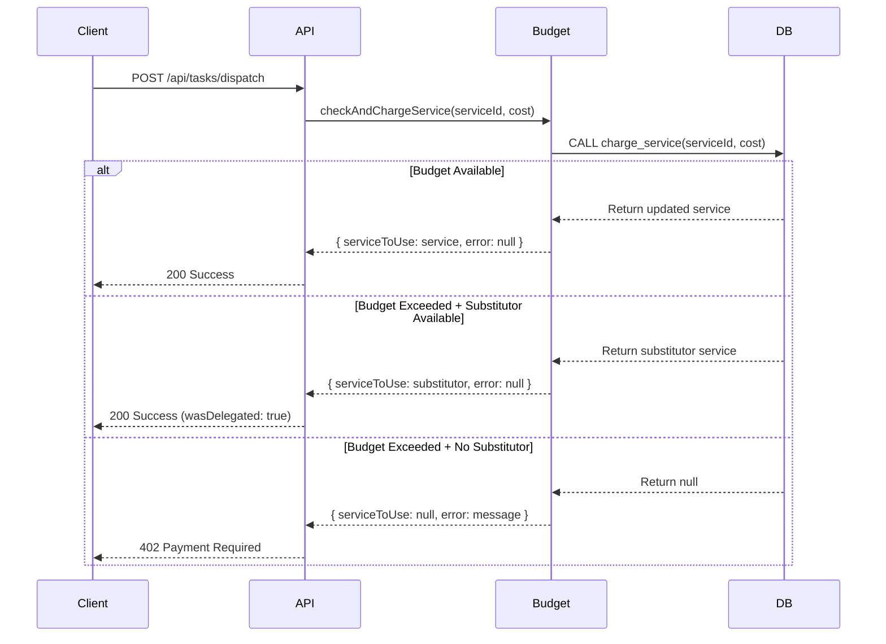
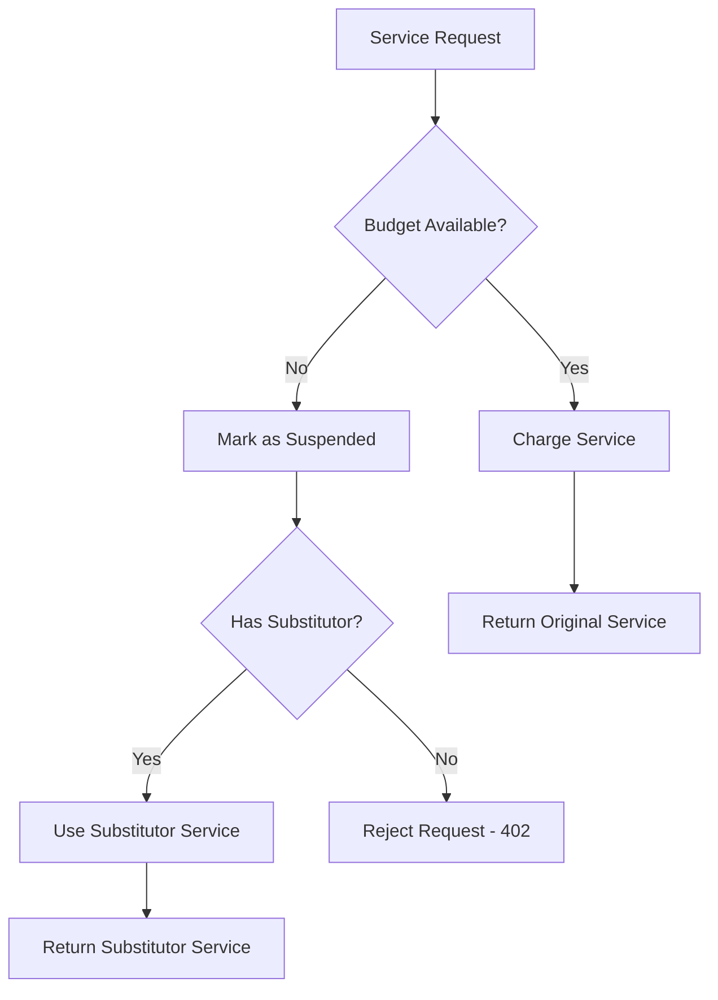
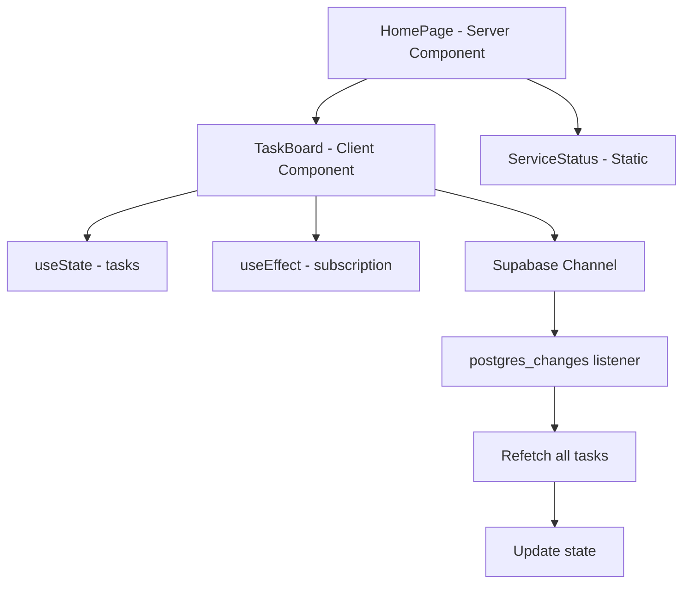
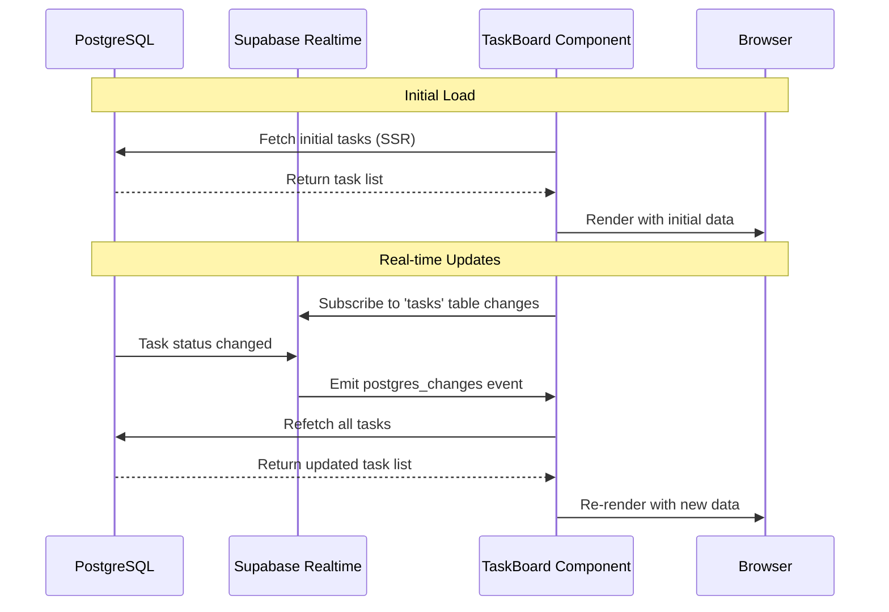

# Budget Supervisor System Design

## Overview

The Budget Supervisor System is a core component of the devart.ai platform that provides real-time budget monitoring, service gating, and automatic fallback mechanisms for AI services. The system ensures cost control by tracking service usage against allocated budgets and automatically switching to fallback services when budgets are exceeded.

This design implements a full-stack solution with:
- **Backend**: Hono-based API with atomic budget checking and charging
- **Database**: PostgreSQL functions for transaction-safe operations
- **Frontend**: Real-time React dashboard with Supabase subscriptions
- **Architecture**: Event-driven with automatic service substitution

## Technology Stack & Dependencies

### Backend Stack
- **Framework**: Hono 4.4.0 on Cloudflare Workers
- **Database**: Supabase PostgreSQL with real-time capabilities
- **Language**: TypeScript with strict type safety
- **Deployment**: Cloudflare Workers runtime

### Frontend Stack
- **Framework**: Next.js 14.2.3 with App Router
- **Styling**: Tailwind CSS
- **State Management**: React hooks with Supabase real-time subscriptions
- **Language**: TypeScript with React components

### Database Schema


## Architecture

### System Architecture Overview


### Component Architecture

#### Backend Components


#### Frontend Components


## API Endpoints Reference

### Task Dispatch Endpoint

**POST** `/api/tasks/dispatch`

#### Request Schema
```typescript
{
  serviceId: string;    // e.g., 'premium_llm'
  cost: number;         // USD amount to charge
}
```

#### Response Schema

**Success (200)**
```typescript
{
  message: string;
  serviceUsed: string;
  wasDelegated: boolean;
}
```

**Budget Exceeded (402)**
```typescript
{
  error: string;
  status: 'SUSPENDED';
}
```

**Server Error (500)**
```typescript
{
  error: string;
}
```

#### Authentication Requirements
- Requires `SUPABASE_SERVICE_KEY` in environment
- Uses service role for administrative budget operations

### Tasks Endpoint

**GET** `/api/tasks`

Returns array of task objects for dashboard display.

## Data Models & Database Schema

### Service Registry Model
```typescript
interface Service {
  id: string;                          // Unique service identifier
  display_name: string;                // Human-readable name
  api_endpoint: string;                // Service API URL
  monthly_budget_usd: number;          // Monthly budget limit
  current_usage_usd: number;           // Current month usage
  status: 'ACTIVE' | 'SUSPENDED';     // Service status
  substitutor_service_id: string | null; // Fallback service
  created_at: string;                  // ISO timestamp
}
```

### Task Model
```typescript
interface Task {
  id: string;                          // UUID
  title: string;                       // Task title
  description: string | null;          // Optional description
  status: TaskStatus;                  // Current status
  priority: TaskPriority;              // Task priority
  agent_id: string | null;             // Assigned agent
  created_at: string;                  // ISO timestamp
  updated_at: string;                  // ISO timestamp
}

type TaskStatus = 
  | 'TODO' 
  | 'IN_PROGRESS' 
  | 'DONE' 
  | 'QUARANTINED' 
  | 'PENDING_BUDGET_APPROVAL';

type TaskPriority = 'LOW' | 'MEDIUM' | 'HIGH' | 'CRITICAL';
```

## Business Logic Layer

### Budget Supervisor Core Logic

#### Budget Checking Flow


#### Atomic Transaction Logic

The system uses PostgreSQL stored procedures to ensure atomicity:

```sql
CREATE OR REPLACE FUNCTION charge_service(
  service_id_to_charge TEXT, 
  charge_amount NUMERIC
) RETURNS service_registry AS $$
DECLARE
  service RECORD;
  substitutor_service RECORD;
BEGIN
  -- Lock row for transaction
  SELECT * INTO service 
  FROM service_registry 
  WHERE id = service_id_to_charge 
  FOR UPDATE;

  -- Check budget and handle suspension
  IF service.current_usage_usd + charge_amount > service.monthly_budget_usd THEN
    -- Update status to suspended
    UPDATE service_registry 
    SET status = 'SUSPENDED' 
    WHERE id = service_id_to_charge;
    
    -- Return substitutor if available
    IF service.substitutor_service_id IS NOT NULL THEN
      SELECT * INTO substitutor_service 
      FROM service_registry 
      WHERE id = service.substitutor_service_id;
      RETURN substitutor_service;
    ELSE
      RETURN NULL;
    END IF;
  ELSE
    -- Charge the service
    UPDATE service_registry
    SET current_usage_usd = service.current_usage_usd + charge_amount
    WHERE id = service_id_to_charge;
    
    SELECT * INTO service 
    FROM service_registry 
    WHERE id = service_id_to_charge;
    RETURN service;
  END IF;
END;
$$ LANGUAGE plpgsql;
```

### Service Substitution Logic



## Real-time UI Architecture

### Component Hierarchy


### Real-time Data Flow



### State Management Strategy

#### Client-Side State
- **Initial Data**: Server-side rendered for SEO and performance
- **Real-time Updates**: Client-side subscription with automatic refetch
- **State Synchronization**: Simple refetch strategy for data consistency

#### Subscription Management
```typescript
useEffect(() => {
  const channel = supabase
    .channel('realtime-tasks')
    .on('postgres_changes', 
        { event: '*', schema: 'public', table: 'tasks' },
        (payload) => {
          // Refetch all tasks on any change
          fetchTasks();
        })
    .subscribe();

  return () => supabase.removeChannel(channel);
}, []);
```

## Implementation Architecture

### File Structure
```
apps/
├── api/src/
│   ├── lib/
│   │   ├── types.ts           # Shared TypeScript interfaces
│   │   └── supabase.ts        # Supabase client factory
│   ├── services/
│   │   └── budget.ts          # Budget supervisor logic
│   └── index.ts               # Hono app with routes
└── ui/src/
    ├── lib/
    │   └── supabase.ts        # Browser Supabase client
    ├── components/
    │   └── TaskBoard.tsx      # Real-time task board
    └── app/
        └── page.tsx           # Main dashboard page
```

### Dependency Injection Pattern

#### API Layer
```typescript
// Supabase client creation per request (serverless pattern)
export const createSupabaseClient = (env: Env): SupabaseClient => {
  return createClient(env.SUPABASE_URL, env.SUPABASE_SERVICE_KEY);
};

// Usage in route handlers
app.post('/api/tasks/dispatch', async (c) => {
  const supabase = createSupabaseClient(c.env);
  const result = await checkAndChargeService(supabase, serviceId, cost);
});
```

#### UI Layer
```typescript
// Singleton client for browser environment
export const supabase = createClient(
  process.env.NEXT_PUBLIC_SUPABASE_URL!,
  process.env.NEXT_PUBLIC_SUPABASE_ANON_KEY!
);
```

### Error Handling Strategy

#### API Error Responses
- **400**: Invalid request parameters
- **402**: Budget exceeded (Payment Required)
- **500**: Database or system errors

#### Frontend Error Handling
- **Connection Issues**: Automatic retry with exponential backoff
- **Real-time Failures**: Graceful degradation to polling
- **Data Inconsistency**: Refetch strategy ensures consistency

## Testing Strategy

### Backend Testing
- **Unit Tests**: Budget calculation logic
- **Integration Tests**: Database transaction behavior
- **API Tests**: Endpoint contracts and error cases

### Frontend Testing
- **Component Tests**: TaskBoard rendering and state updates
- **Real-time Tests**: Subscription behavior and cleanup
- **E2E Tests**: Complete budget flow from UI to database

### Test Data Setup
```sql
-- Test services with different budget scenarios
INSERT INTO service_registry VALUES
('test_premium', 'Test Premium', 'https://api.test.com', 10.00, 8.00, 'ACTIVE', 'test_free'),
('test_free', 'Test Free', 'https://free.test.com', 0.00, 0.00, 'ACTIVE', NULL),
('test_suspended', 'Test Suspended', 'https://suspended.test.com', 5.00, 5.00, 'SUSPENDED', NULL);
```