# Collaborative Agent Platform Design

## Overview

This design document outlines the evolution of the existing AI development platform from a collection of individual workers into a truly Collaborative and Proactive Development Team. The platform currently provides intelligent task management, budget supervision, and analytics capabilities. This enhancement introduces three core collaborative features: task chaining for multi-step workflows, proactive code review through GitHub integration, and performance outlier detection for continuous improvement.

**Repository Type**: Full-Stack Application with AI Agent Orchestration

## Technology Stack & Dependencies

- **Backend**: Hono 4.4.0 on Cloudflare Workers
- **Frontend**: Next.js 14.2.3 with React and Tailwind CSS
- **Database**: Supabase PostgreSQL with pgvector extension
- **Real-time**: Supabase Realtime for live UI updates
- **Monorepo Management**: pnpm workspaces
- **External Integrations**: GitHub Webhooks, Telegram notifications

## Architecture

The collaborative platform architecture extends the existing three-layer system with workflow orchestration capabilities:

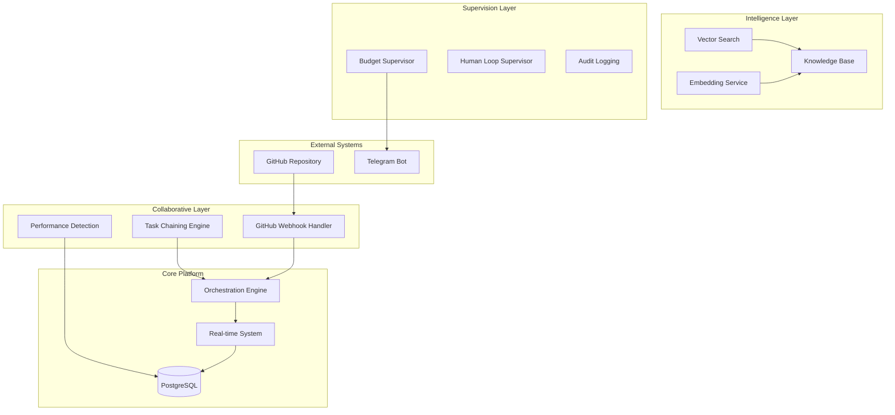

## Database Schema Extensions

### Task Chaining Schema

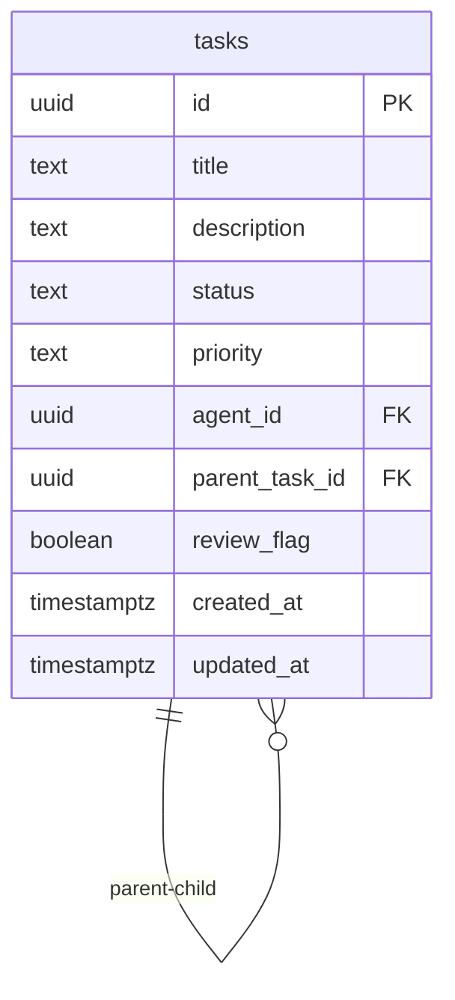

**Schema Modifications**:

1. **Parent-Child Relationship**:
   - `parent_task_id UUID REFERENCES tasks(id) ON DELETE SET NULL`
   - Enables task chaining with inheritance of priority and context
   - Indexed for efficient workflow traversal

2. **Performance Monitoring**:
   - `review_flag BOOLEAN DEFAULT FALSE`
   - Marks tasks requiring supervisor attention
   - Automated flagging based on cost outliers

### Analytics Enhancement

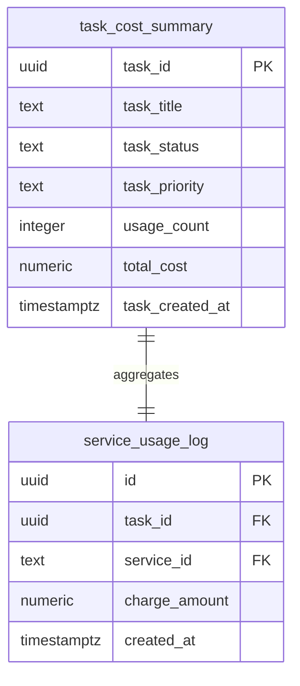

## API Architecture

### Task Chaining Endpoints

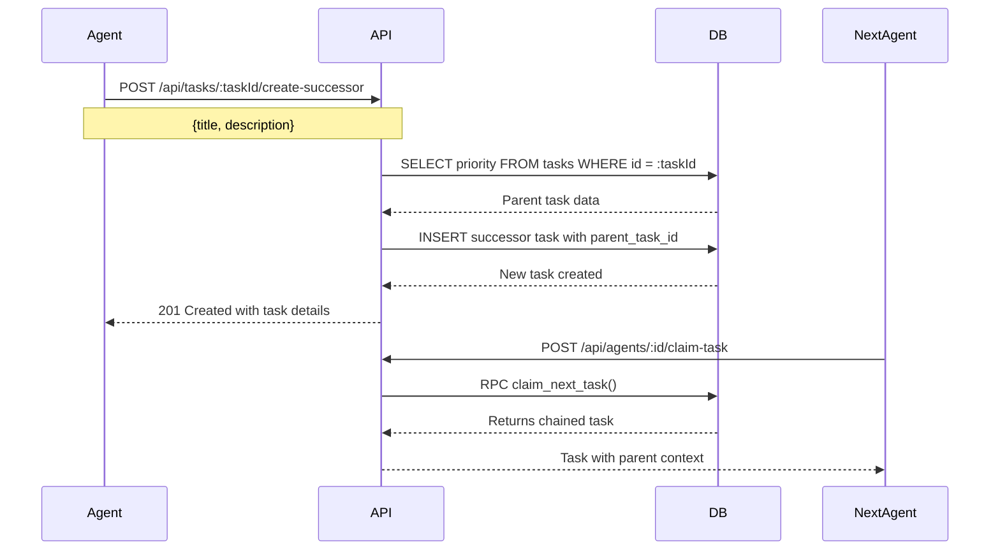

**Endpoint Specification**:
- **Method**: POST `/api/tasks/:taskId/create-successor`
- **Input**: `{title: string, description?: string}`
- **Output**: Created task with inherited priority and parent relationship
- **Security**: Validates parent task existence before creation

### GitHub Integration Endpoints

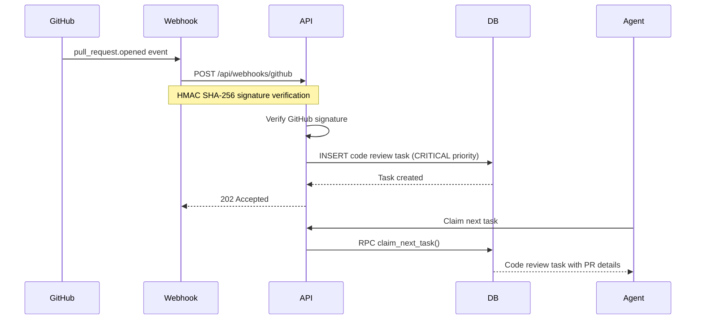

**Security Implementation**:
- HMAC SHA-256 signature verification using Web Crypto API
- Environment variable for webhook secret management
- Request validation and sanitization

## Business Logic Layer

### Task Chaining Workflow

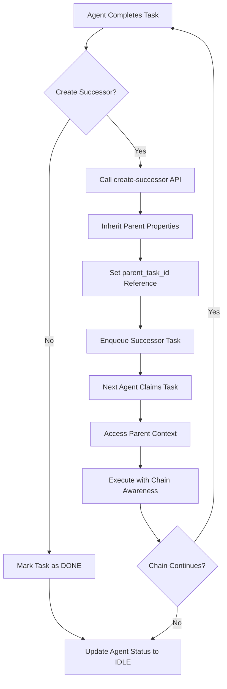

**Inheritance Rules**:
- Priority level inherited from parent task
- Task chain metadata preserved for context
- Atomic successor creation with rollback protection

### Proactive Code Review Logic

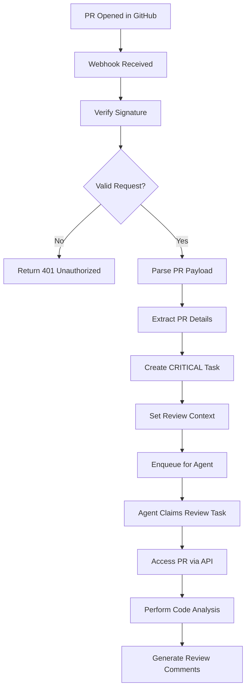

**Task Creation Pattern**:
- **Priority**: CRITICAL (highest urgency)
- **Title**: "Code Review: {PR Title}"
- **Description**: PR URL, diff URL, and context
- **Immediate availability**: Ready for agent claiming

### Performance Outlier Detection

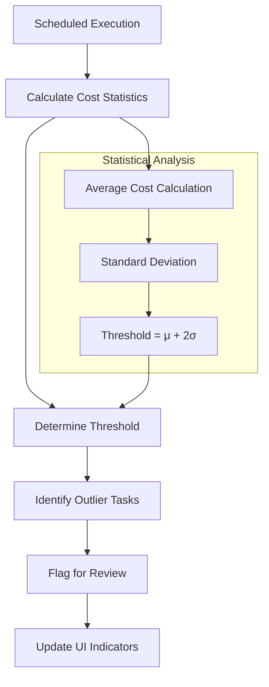

**Statistical Method**:
- Uses task_cost_summary view for aggregated data
- Threshold: Average + 2 Standard Deviations
- Automated flagging with manual review workflow

## User Interface Architecture

### Task Board Enhancement

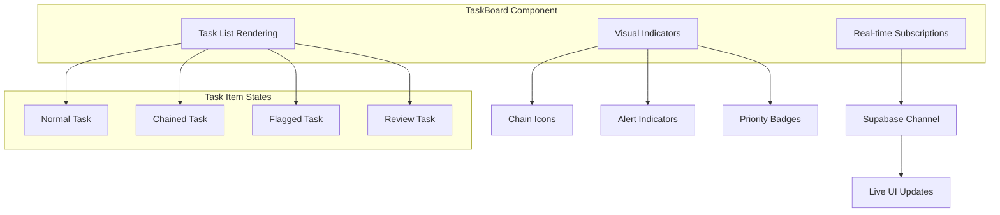

**Visual Design Patterns**:
- **Flagged Tasks**: Red ring border with warning icon
- **Chain Tasks**: Link icons showing parent-child relationship
- **Code Reviews**: GitHub icon with CRITICAL badge
- **Real-time Updates**: Smooth transitions for status changes

### Component State Management

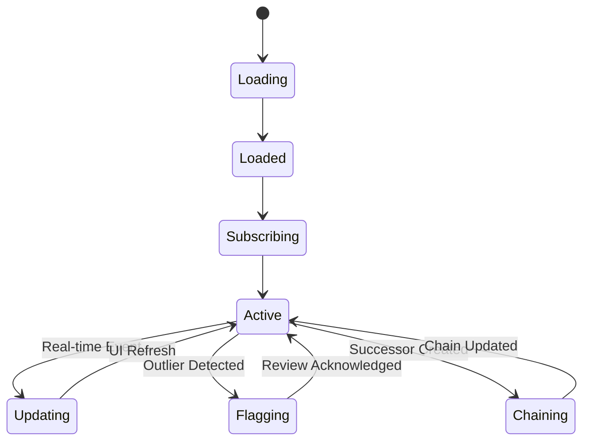

## Data Flow Architecture

### Multi-Agent Collaboration Flow

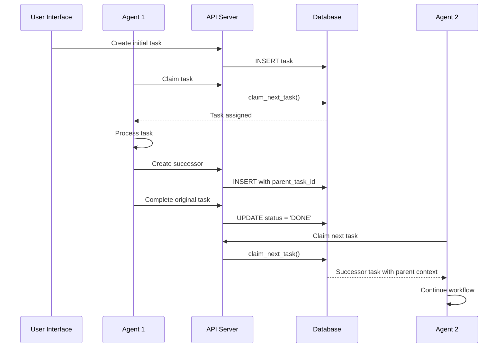

### GitHub Integration Data Flow

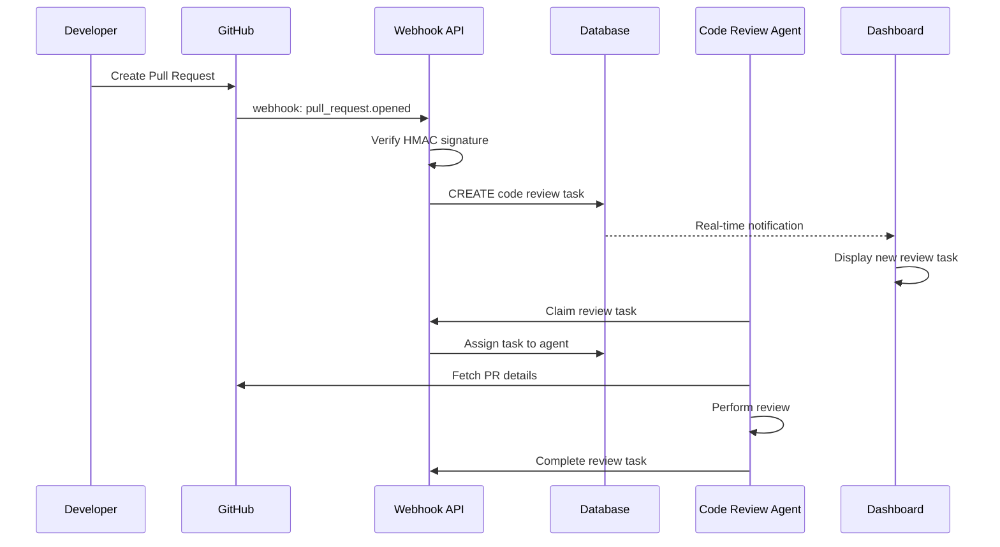

## Testing Strategy

### Unit Testing Approach

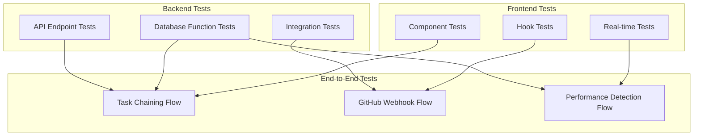

**Test Coverage Requirements**:
- API endpoints: Input validation, error handling, response formats
- Database functions: Atomic operations, race condition prevention
- Real-time features: WebSocket connections, state synchronization
- UI components: Visual indicators, user interactions, accessibility

### Integration Testing Patterns

**Task Chaining Tests**:
- Verify parent-child relationship creation
- Test priority inheritance
- Validate atomic successor creation

**GitHub Webhook Tests**:
- Mock webhook payloads
- Test signature verification
- Validate task creation from PR events

**Performance Detection Tests**:
- Statistical calculation accuracy
- Threshold determination logic
- UI flag synchronization**Statistical Method**:
- Uses task_cost_summary view for aggregated data
- Threshold: Average + 2 Standard Deviations
- Automated flagging with manual review workflow

## User Interface Architecture

### Task Board Enhancement

**Visual Design Patterns**:
- **Flagged Tasks**: Red ring border with warning icon
- **Chain Tasks**: Link icons showing parent-child relationship
- **Code Reviews**: GitHub icon with CRITICAL badge
- **Real-time Updates**: Smooth transitions for status changes

### Component State Management

## Data Flow Architecture

### Multi-Agent Collaboration Flow

### GitHub Integration Data Flow

## Testing Strategy

### Unit Testing Approach

**Test Coverage Requirements**:
- API endpoints: Input validation, error handling, response formats
- Database functions: Atomic operations, race condition prevention
- Real-time features: WebSocket connections, state synchronization
- UI components: Visual indicators, user interactions, accessibility

### Integration Testing Patterns

**Task Chaining Tests**:
- Verify parent-child relationship creation
- Test priority inheritance
- Validate atomic successor creation

**GitHub Webhook Tests**:
- Mock webhook payloads
- Test signature verification
- Validate task creation from PR events

**Performance Detection Tests**:
- Statistical calculation accuracy
- Threshold determination logic
- UI flag synchronization

