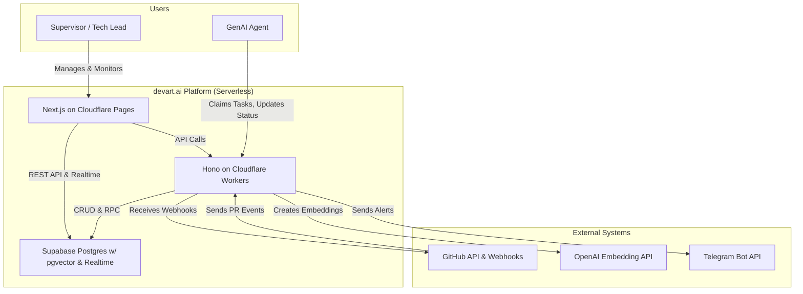
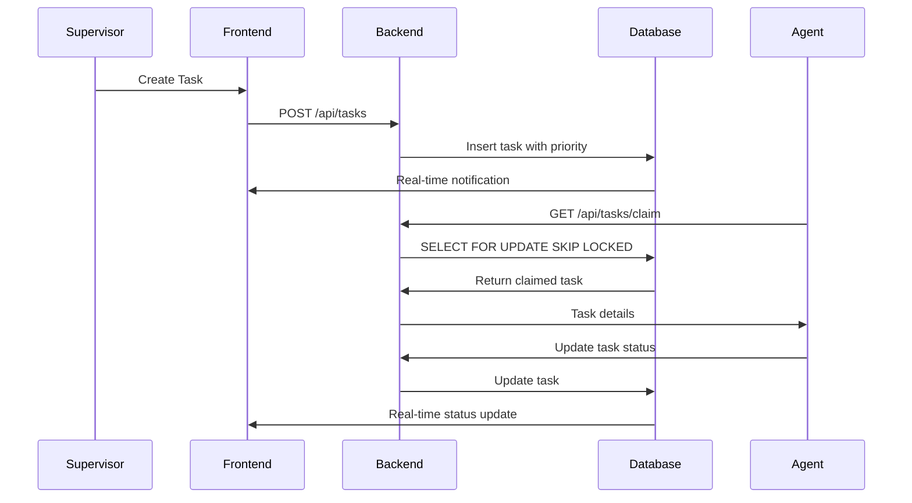
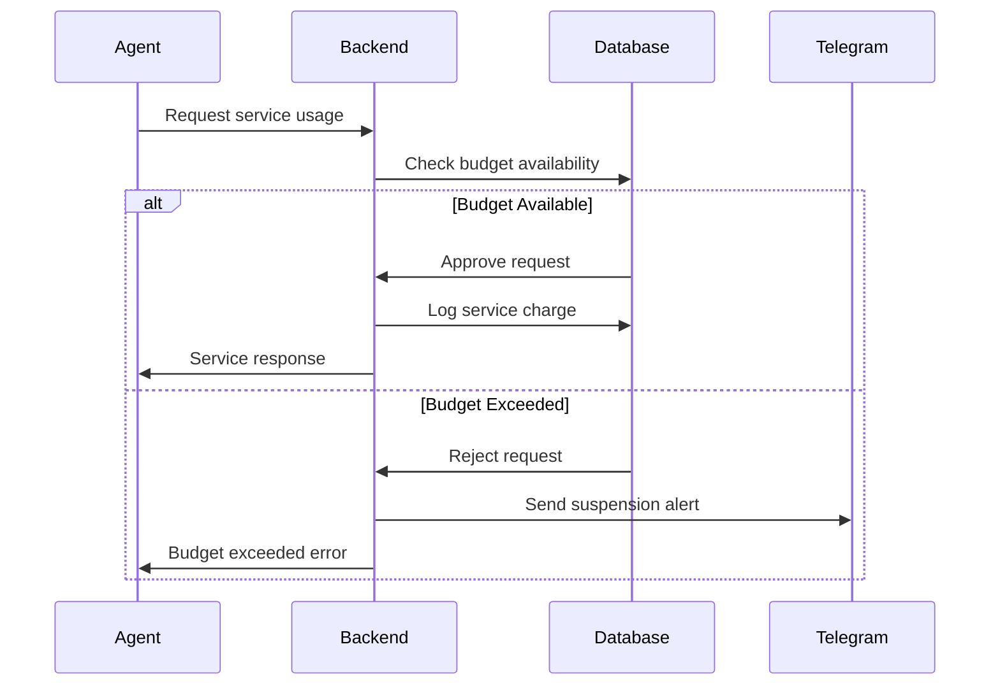

# devart.ai - The Autonomous AI Development Platform

**A serverless, enterprise-ready control plane for orchestrating, supervising, and analyzing a team of autonomous GenAI agents.**

devart.ai provides a real-time command center for human supervisors to manage the entire AI-driven software development lifecycle, from task creation to code review and performance analysis.

## 🎯 Overview

devart.ai has evolved through eight strategic phases from a simple monitoring dashboard into a mature, enterprise-ready platform for autonomous AI development teams:

**Phase 1: The Monitor** → Basic real-time dashboard  
**Phase 2: The Reactive Supervisor** → Budget controls and active supervision  
**Phase 3: The Auditable Platform** → Complete audit trail and historical analysis  
**Phase 4: The Autonomous Orchestrator** → Agent and task lifecycle management  
**Phase 5: The Command Center** → Human-supervisor interface with active control  
**Phase 6: The Intelligent System** → Knowledge base integration and analytics  
**Phase 7: The Collaborative Team** → Task chaining and proactive webhook integration  
**Phase 8: The Enterprise Product** → Governance, security, and production readiness

## ✨ Core Features

### Governance & Security
- **Role-Based Access Control (RBAC)**: Secure platform with admin, supervisor, and viewer roles enforced at database level with RLS
- **Secure Agent Management**: Onboard agents with secure, hashed API keys and toggle activation status from UI
- **Dynamic System Configuration**: Tune system parameters like performance thresholds from live settings panel without redeploying

### Orchestration & Collaboration
- **Autonomous Agent Lifecycle**: Agents register, claim tasks from priority queue, and report status
- **Atomic Task Claiming**: Race-condition-free queue system (FOR UPDATE SKIP LOCKED) ensures tasks are never worked on by multiple agents
- **Task Chaining**: Agents create successor tasks, enabling complex, multi-step workflows
- **Proactive GitHub Integration**: Automatically create high-priority code review tasks from pull_request webhooks

### Intelligence & Analytics
- **Knowledge Base**: pgvector-powered knowledge base allows agents to perform semantic searches for contextual information
- **Performance Analytics**: Dedicated dashboard panel provides insights into task costs and service usage patterns
- **Outlier Detection**: System automatically flags tasks with unusually high costs for supervisor review

### Supervision & Control
- **Real-Time Dashboards**: Live, streaming updates for tasks, agents, and service budgets using Supabase Realtime
- **Interactive Task Management**: Supervisors can create, prioritize, update, and delete tasks from UI
- **Budget Supervisor**: Set monthly spending limits on external services (e.g., LLM APIs) with automatic suspension, delegation to cheaper alternatives, and proactive Telegram alerts

## 🏛️ Architecture

The system is built on a modern, free-tier-friendly, serverless stack designed for scalability and zero operational overhead.



### Technology Stack

**Frontend**
- Next.js 14+ with React 18
- Tailwind CSS for styling
- Supabase client for real-time subscriptions
- TypeScript for type safety

**Backend**
- Hono framework on Cloudflare Workers
- Serverless edge computing with global distribution
- TypeScript with strict type checking
- Supabase service client for privileged operations

**Database & Real-time**
- Supabase PostgreSQL with pgvector extension
- Row Level Security (RLS) for data protection
- Real-time subscriptions for live updates
- Stored procedures for atomic operations

**Infrastructure**
- Cloudflare Pages for frontend hosting
- Cloudflare Workers for API deployment
- pnpm workspaces for monorepo management
- GitHub Actions for CI/CD

## 🚀 Getting Started

### 1. Prerequisites
- Git, Node.js (v18+), pnpm
- Accounts: Cloudflare, Supabase, GitHub, OpenAI, Telegram

### 2. Setup

**Clone & Install:**
```bash
git clone https://github.com/YOUR_USERNAME/devart.ai.git
cd devart.ai
pnpm install
```

**Supabase:**
- Create a new project on Supabase
- In the SQL Editor, run the entire `supabase/schema.sql` script
- Enable the vector extension under Database → Extensions
- Enable Realtime for all tables under Database → Replication

**Environment Variables:**
- Copy `.env.example` to `.env` in `apps/api`
- Copy `.env.local.example` to `.env.local` in `apps/ui`
- Fill in all required keys from Supabase, OpenAI, and Telegram (create a bot via BotFather)

**GitHub Webhook:**
- In your GitHub repo settings, create a webhook for `pull_request` events
- Set the payload URL to your deployed API endpoint (`https://<your-worker>/api/webhooks/github`)
- Set a secure secret and add it to your `apps/api/.env` as `GITHUB_WEBHOOK_SECRET`

### 3. Running Locally

```bash
# From the project root
pnpm dev
```
- UI: http://localhost:3000
- API: http://localhost:8787

### 4. Deployment

**API to Cloudflare Workers:**
```bash
cd apps/api
wrangler secret put SUPABASE_URL
wrangler secret put SUPABASE_SERVICE_KEY
wrangler secret put OPENAI_API_KEY
wrangler secret put TELEGRAM_BOT_TOKEN
wrangler secret put TELEGRAM_CHAT_ID
wrangler secret put GITHUB_WEBHOOK_SECRET
pnpm deploy
```

**UI to Cloudflare Pages:**
- Push code to GitHub
- In Cloudflare dashboard: Workers & Pages → Create application → Pages → Connect to Git
- Select repository, set root directory to `apps/ui`
- Add environment variables: `NEXT_PUBLIC_SUPABASE_URL`, `NEXT_PUBLIC_SUPABASE_ANON_KEY`

## 🧠 System Concepts

### Core Entities

**Agents**: Autonomous workers that register with the platform, claim tasks, and execute them. Managed via secure API keys with hashed storage and activation controls.

**Tasks**: Discrete units of work with title, description, priority, and status. Support chaining for complex workflows and automatic creation from GitHub webhooks.

**Services**: External APIs (OpenAI, Groq, etc.) with budget limits, usage tracking, and automatic suspension when limits exceeded.

**Knowledge Base**: Vector store of documents (ADRs, code snippets, documentation) that agents query for context using semantic search.

### Key Workflows

**Task Dispatch Flow:**


**Budget Supervision Flow:**


### Data Models

**Tasks Table:**
- `id`: UUID primary key
- `title`: Task title
- `description`: Detailed description
- `status`: pending, in_progress, completed, failed
- `priority`: 1-5 (5 = highest)
- `agent_id`: Assigned agent
- `parent_task_id`: For task chaining
- `created_at`, `updated_at`: Timestamps

**Agents Table:**
- `id`: UUID primary key
- `name`: Agent identifier
- `api_key_hash`: Secure hash of API key
- `is_active`: Activation status
- `capabilities`: JSON array of skills
- `last_seen`: Last activity timestamp

**Service Registry Table:**
- `id`: UUID primary key
- `service_name`: OpenAI, Groq, etc.
- `monthly_budget`: Spending limit
- `current_usage`: Current month usage
- `is_active`: Service status
- `fallback_service_id`: Backup service

**Knowledge Base Table:**
- `id`: UUID primary key
- `title`: Document title
- `content`: Full text content
- `embedding`: pgvector embedding
- `tags`: JSON array of categories
- `created_at`: Timestamp

## 📊 Component Architecture

### Frontend Components

**ServiceStatusPanel**: Real-time monitoring of service budgets with visual indicators and budget increase controls.

**TaskBoard**: Interactive task management with drag-drop, status updates, and real-time synchronization.

**AgentMonitoringPanel**: Live agent status, capability display, and activation controls.

**TaskAnalyticsPanel**: Performance insights, cost analysis, and outlier detection with interactive charts.

**SettingsPanel**: System configuration management with validation and real-time updates.

### Backend Services

**Budget Service**: Enforces spending limits, manages service suspension/activation, and handles budget increases with atomic operations.

**Embedding Service**: Integrates with OpenAI Embedding API for knowledge base semantic search functionality.

**Telegram Service**: Handles alert notifications with markdown formatting and error handling.

**Task Orchestrator**: Manages task lifecycle, implements atomic claiming, and handles chain creation.

### Database Layer

**Row Level Security (RLS)**: Enforces role-based access at database level with policies for admin, supervisor, and viewer roles.

**Stored Procedures**: Atomic operations for budget checks, task claiming, and service usage logging.

**Real-time Subscriptions**: Live updates for tasks, agents, and service status using Supabase Realtime.

**Vector Search**: pgvector extension enables semantic search across knowledge base documents.

## 🔧 API Reference

### Core Endpoints

**Tasks**
- `GET /api/tasks` - List all tasks with filtering
- `POST /api/tasks` - Create new task
- `PUT /api/tasks/:id` - Update task
- `DELETE /api/tasks/:id` - Delete task
- `POST /api/tasks/:id/claim` - Claim task (agents only)

**Agents**
- `GET /api/agents` - List all agents
- `POST /api/agents` - Register new agent
- `PUT /api/agents/:id` - Update agent
- `POST /api/agents/:id/toggle` - Toggle activation

**Services**
- `GET /api/services` - List services with status
- `POST /api/services/:id/increase-budget` - Increase budget
- `GET /api/services/status` - Real-time status check

**Knowledge**
- `GET /api/knowledge/search` - Semantic search
- `POST /api/knowledge` - Add document
- `PUT /api/knowledge/:id` - Update document

**Webhooks**
- `POST /api/webhooks/github` - GitHub pull request events
- `POST /api/webhooks/ci` - CI/CD result notifications

### Authentication

All API endpoints require authentication via Supabase JWT tokens or agent API keys. Role-based permissions are enforced at both API and database levels.

## 🔐 Security Model

### Authentication & Authorization
- Supabase Auth for human users with JWT tokens
- Hashed API keys for agent authentication
- Role-based access control (admin, supervisor, viewer)
- Row Level Security policies in database

### Data Protection
- All sensitive data encrypted at rest
- API keys stored as secure hashes
- CORS policies restrict frontend origins
- Rate limiting on critical endpoints

### Audit Trail
- Complete service charge logging
- Task lifecycle tracking
- Agent activity monitoring
- Budget modification history

## 📈 Performance & Monitoring

### Analytics Dashboard
- Task completion rates and average times
- Service usage patterns and cost trends
- Agent performance metrics
- Budget utilization tracking

### Real-time Monitoring
- Live service status indicators
- Active agent monitoring
- Task queue depth tracking
- Budget threshold alerts

### Outlier Detection
- Automatic flagging of high-cost tasks
- Performance anomaly identification
- Budget overrun predictions
- Agent efficiency analysis

## 🔄 Deployment & Operations

### Development Workflow
```bash
# Local development
pnpm dev

# Run tests
pnpm test

# Build for production
pnpm build

# Deploy API
cd apps/api && pnpm deploy

# Deploy UI (automatic via GitHub)
git push origin main
```

### Production Monitoring
- Cloudflare analytics for API performance
- Supabase database metrics
- Real-time error tracking
- Budget alert notifications

### Backup & Recovery
- Automated Supabase backups
- Knowledge base export capabilities
- Configuration backup procedures
- Disaster recovery protocols

## 🛣️ Future Roadmap

While the core platform is feature-complete, potential enhancements include:

**Advanced Analytics**: Grafana integration for time-series dashboards on agent performance, task throughput, and cost trends.

**Enhanced UI/UX**: Replace browser prompts with modals, dedicated settings page, and enhanced data visualizations.

**Extended Integrations**: Support for GitLab, Bitbucket, and Slack integrations.

**Complex Workflows**: Evolution of task chaining into full DAG (Directed Acyclic Graph) engine for complex collaborative workflows.

**Production Hardening**: Structured logging, distributed tracing (OpenTelemetry), and formal CI/CD deployment pipelines.

## 📚 System Documentation

### Architecture Decision Records (ADRs)
- Serverless architecture choice rationale
- Database schema design decisions
- Real-time update implementation
- Security model considerations

### Operational Runbooks
- Deployment procedures
- Incident response protocols
- Budget management guidelines
- Agent onboarding processes

### Development Guidelines
- Code style and standards
- Testing strategies
- Performance optimization
- Security best practices

## 🤝 Contributing

### Development Setup
1. Follow the Getting Started guide
2. Create feature branch: `git checkout -b feature/your-feature`
3. Make changes with tests
4. Submit pull request

### Code Standards
- TypeScript strict mode required
- ESLint and Prettier configured
- Test coverage >80% for new features
- Documentation for all public APIs

### Review Process
- Automated CI/CD checks
- Peer code review required
- Security review for auth changes
- Performance testing for critical paths

## ⚖️ License

This project is licensed under the MIT License. See the [LICENSE](LICENSE) file for details.

---

**devart.ai represents the culmination of iterative development through eight strategic phases, resulting in a mature, enterprise-ready platform for autonomous AI development teams. The system balances powerful automation with human oversight, providing the tools necessary for safe, effective, and cost-controlled AI-driven software development.**