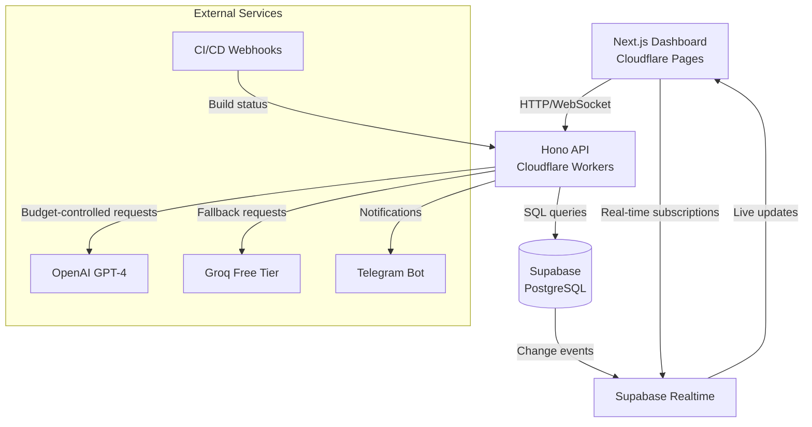
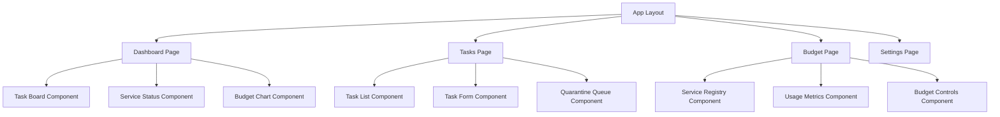
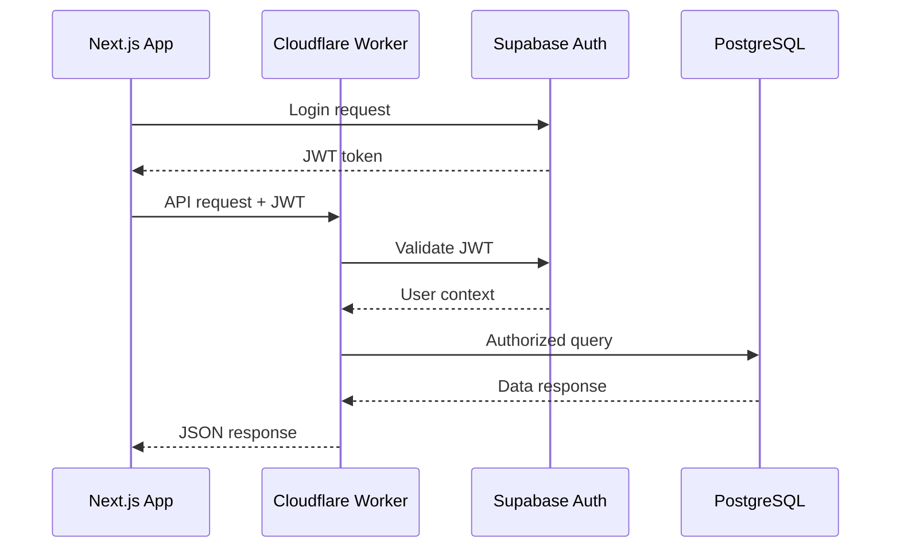
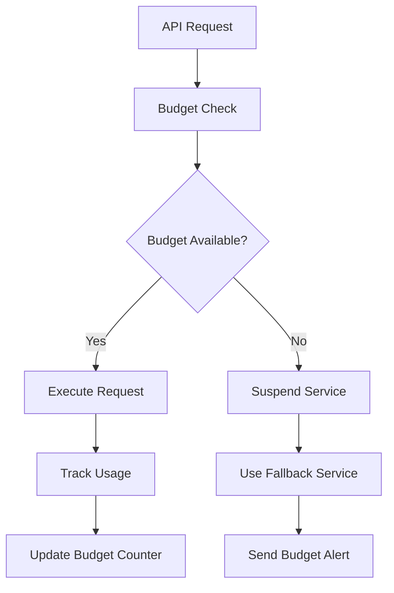

# devart.ai - Autonomous AI Development Hub Design

## Overview

devart.ai is a serverless control plane for supervising and managing an AI-powered coding team. The platform provides a central dashboard for status, roadmaps, and quality metrics, with a powerful, budget-aware backend to orchestrate GenAI agents. Built on a modern, free-tier-friendly stack designed for rapid development and zero operational overhead.

### Core Value Proposition
- **Budget Control**: Enforce spending limits on external services (LLM APIs) with automatic suspension and manual approval workflows
- **Real-time Monitoring**: Live dashboard showing agent status, task progress, and quality metrics
- **Pluggable Architecture**: Control plane/execution plane design supporting any cloud provider's free tier
- **Quality Assurance**: Automated CI/CD integration with agent-led regression fixes
- **Human Oversight**: Quarantine queue for tasks requiring manual intervention

### Target Users
- AI development teams managing multiple GenAI agents
- Organizations requiring budget oversight for AI operations
- Development teams implementing automated quality gates
- Projects needing centralized AI workflow coordination

## Technology Stack & Dependencies

### Frontend Stack
- **Framework**: Next.js 14.2.3 (React-based)
- **Styling**: Tailwind CSS 3.4.1
- **State Management**: React hooks with Supabase real-time subscriptions
- **Deployment**: Cloudflare Pages (free tier)
- **Package Manager**: pnpm (monorepo workspaces)

### Backend Stack
- **Runtime**: Cloudflare Workers (serverless)
- **Framework**: Hono 4.4.0 (lightweight web framework)
- **Database**: Supabase (PostgreSQL with real-time features)
- **Authentication**: Supabase Auth
- **Deployment**: Cloudflare Workers (free tier)

### Database & Storage
- **Primary Database**: PostgreSQL via Supabase
- **Real-time Features**: Supabase Realtime for live updates
- **Authentication**: Supabase Auth with JWT tokens
- **File Storage**: Supabase Storage (if needed for artifacts)

### External Integrations
- **LLM Services**: OpenAI GPT-4, Groq (configurable via service registry)
- **Notifications**: Telegram Bot API
- **CI/CD**: Webhook-based integration (GitHub, GitLab, etc.)
- **Monitoring**: Built-in budget tracking and usage analytics

## Architecture

### System Architecture



### Monorepo Structure

```
devart.ai/
├── apps/
│   ├── api/          # Cloudflare Worker backend
│   └── ui/           # Next.js frontend
├── supabase/         # Database schema and migrations
├── package.json      # Root workspace configuration
└── pnpm-workspace.yaml
```

### Control Plane vs Execution Plane

**Control Plane (devart.ai)**:
- Budget supervision and enforcement
- Task orchestration and routing
- Quality gate management
- Human intervention workflows
- Real-time monitoring and alerts

**Execution Plane (External Services)**:
- LLM API calls (OpenAI, Groq, etc.)
- CI/CD pipeline execution
- Code generation and testing
- Notification delivery

## Frontend Architecture

### Component Hierarchy



### Component Architecture

#### Core Components

**TaskBoard Component**
```typescript
interface TaskBoardProps {
  tasks: Task[];
  onTaskUpdate: (task: Task) => void;
  onTaskStatusChange: (taskId: string, status: TaskStatus) => void;
}

interface Task {
  id: string;
  title: string;
  description: string;
  status: 'TODO' | 'IN_PROGRESS' | 'DONE' | 'QUARANTINED' | 'PENDING_BUDGET_APPROVAL';
  priority: 'LOW' | 'MEDIUM' | 'HIGH' | 'CRITICAL';
  agent_id?: string;
  created_at: string;
  updated_at: string;
}
```

**ServiceStatus Component**
```typescript
interface ServiceStatusProps {
  services: ServiceRegistry[];
  onBudgetUpdate: (serviceId: string, budget: number) => void;
}

interface ServiceRegistry {
  id: string;
  display_name: string;
  api_endpoint: string;
  monthly_budget_usd: number;
  current_usage_usd: number;
  status: 'ACTIVE' | 'SUSPENDED';
  substitutor_service_id?: string;
}
```

### State Management

#### Supabase Real-time Integration
```typescript
// Real-time subscription for tasks
const subscription = supabase
  .channel('tasks-channel')
  .on('postgres_changes', 
      { event: '*', schema: 'public', table: 'tasks' },
      (payload) => {
        // Update local state with real-time changes
        updateTasksState(payload);
      })
  .subscribe();
```

#### Local State Patterns
- React hooks for component-level state
- Supabase subscriptions for real-time data
- Context providers for shared application state
- Custom hooks for data fetching and mutations

### Styling Strategy

#### Tailwind CSS Configuration
```typescript
// tailwind.config.ts
const config = {
  theme: {
    extend: {
      colors: {
        primary: '#3B82F6',    // Blue for active states
        success: '#10B981',    // Green for completed tasks
        warning: '#F59E0B',    // Amber for budget warnings
        danger: '#EF4444',     // Red for critical alerts
        dark: '#1F2937',       // Dark gray for backgrounds
      }
    }
  }
};
```

#### Component Styling Patterns
- Utility-first approach with Tailwind CSS
- Responsive design with mobile-first breakpoints
- Dark theme as default with consistent color palette
- Component-level CSS modules for complex layouts

## Backend Architecture

### API Endpoints Reference

#### Core Endpoints

**GET /api/tasks**
```typescript
// Retrieve all tasks with optional filtering
interface GetTasksResponse {
  tasks: Task[];
  pagination?: {
    page: number;
    limit: number;
    total: number;
  };
}

// Query parameters: status, priority, agent_id, page, limit
```

**POST /api/tasks**
```typescript
interface CreateTaskRequest {
  title: string;
  description?: string;
  priority?: TaskPriority;
}

interface CreateTaskResponse {
  task: Task;
  message: string;
}
```

**POST /api/tasks/dispatch**
```typescript
interface DispatchTaskRequest {
  taskId: string;
  serviceId: string;
  estimatedCost: number;
}

interface DispatchTaskResponse {
  success: boolean;
  message: string;
  budgetStatus?: BudgetCheckResult;
}
```

**GET /api/services**
```typescript
// Retrieve service registry with budget status
interface GetServicesResponse {
  services: ServiceRegistry[];
  totalBudget: number;
  totalUsage: number;
}
```

**POST /api/services/{serviceId}/budget**
```typescript
interface UpdateBudgetRequest {
  monthlyBudgetUsd: number;
  requiresApproval?: boolean;
}

interface UpdateBudgetResponse {
  service: ServiceRegistry;
  previousBudget: number;
  newBudget: number;
}
```

#### Webhook Endpoints

**POST /api/webhooks/ci-cd**
```typescript
interface CiCdWebhookPayload {
  repository: string;
  branch: string;
  status: 'success' | 'failure' | 'pending';
  buildUrl: string;
  timestamp: string;
}
```

**POST /api/webhooks/telegram**
```typescript
interface TelegramWebhookPayload {
  message: {
    chat: { id: string };
    text: string;
  };
}
```

### Authentication Requirements

#### API Authentication Flow


#### Authorization Levels
- **Admin**: Full access to budget controls, service registry, and system settings
- **Manager**: Task management, agent oversight, and budget monitoring
- **Agent**: Task execution status updates and resource requests
- **Viewer**: Read-only dashboard access

## Data Models & ORM Mapping

### Database Schema

#### Tasks Table
```sql
CREATE TABLE tasks (
  id UUID PRIMARY KEY DEFAULT gen_random_uuid(),
  title TEXT NOT NULL,
  description TEXT,
  status TEXT NOT NULL DEFAULT 'TODO',
  priority TEXT DEFAULT 'MEDIUM',
  agent_id TEXT,
  created_at TIMESTAMPTZ DEFAULT NOW(),
  updated_at TIMESTAMPTZ DEFAULT NOW()
);

-- Indexes for performance
CREATE INDEX idx_tasks_status ON tasks(status);
CREATE INDEX idx_tasks_priority ON tasks(priority);
CREATE INDEX idx_tasks_agent_id ON tasks(agent_id);
```

#### Service Registry Table
```sql
CREATE TABLE service_registry (
  id TEXT PRIMARY KEY,
  display_name TEXT NOT NULL,
  api_endpoint TEXT NOT NULL,
  monthly_budget_usd NUMERIC DEFAULT 0,
  current_usage_usd NUMERIC DEFAULT 0,
  status TEXT NOT NULL DEFAULT 'ACTIVE',
  substitutor_service_id TEXT REFERENCES service_registry(id),
  created_at TIMESTAMPTZ DEFAULT NOW()
);
```

#### Subscriptions Table
```sql
CREATE TABLE subscriptions (
  id UUID PRIMARY KEY DEFAULT gen_random_uuid(),
  telegram_chat_id TEXT NOT NULL UNIQUE,
  event_type TEXT NOT NULL,
  created_at TIMESTAMPTZ DEFAULT NOW()
);
```

### Supabase Client Integration

#### Database Operations
```typescript
// Supabase client configuration
const supabase = createClient(
  process.env.SUPABASE_URL!,
  process.env.SUPABASE_SERVICE_KEY!
);

// Task operations
class TaskRepository {
  async createTask(task: CreateTaskRequest): Promise<Task> {
    const { data, error } = await supabase
      .from('tasks')
      .insert(task)
      .select()
      .single();
    
    if (error) throw new Error(error.message);
    return data;
  }
  
  async updateTaskStatus(id: string, status: TaskStatus): Promise<Task> {
    const { data, error } = await supabase
      .from('tasks')
      .update({ status, updated_at: new Date().toISOString() })
      .eq('id', id)
      .select()
      .single();
    
    if (error) throw new Error(error.message);
    return data;
  }
}
```

## Business Logic Layer

### Budget Supervisor Architecture



#### Budget Enforcement Logic
```typescript
class BudgetSupervisor {
  async checkBudget(serviceId: string, estimatedCost: number): Promise<BudgetCheckResult> {
    const service = await this.getService(serviceId);
    
    if (!service) {
      throw new Error(`Service ${serviceId} not found`);
    }
    
    if (service.status === 'SUSPENDED') {
      return {
        allowed: false,
        reason: 'SERVICE_SUSPENDED',
        fallbackServiceId: service.substitutor_service_id
      };
    }
    
    const projectedUsage = service.current_usage_usd + estimatedCost;
    
    if (projectedUsage > service.monthly_budget_usd) {
      // Auto-suspend service
      await this.suspendService(serviceId);
      
      // Send notifications
      await this.notifyBudgetExceeded(serviceId, projectedUsage);
      
      return {
        allowed: false,
        reason: 'BUDGET_EXCEEDED',
        fallbackServiceId: service.substitutor_service_id,
        currentUsage: service.current_usage_usd,
        budgetLimit: service.monthly_budget_usd
      };
    }
    
    return {
      allowed: true,
      remainingBudget: service.monthly_budget_usd - projectedUsage
    };
  }
}
```

### Task Orchestration System

#### Task Lifecycle Management
```typescript
class TaskOrchestrator {
  async dispatchTask(taskId: string, serviceId: string): Promise<DispatchResult> {
    const task = await this.getTask(taskId);
    const budgetCheck = await this.budgetSupervisor.checkBudget(serviceId, task.estimatedCost);
    
    if (!budgetCheck.allowed) {
      if (budgetCheck.fallbackServiceId) {
        // Try fallback service
        return this.dispatchTask(taskId, budgetCheck.fallbackServiceId);
      } else {
        // Move to quarantine
        await this.quarantineTask(taskId, 'BUDGET_EXCEEDED');
        return { status: 'quarantined', reason: budgetCheck.reason };
      }
    }
    
    // Update task status and dispatch to agent
    await this.updateTaskStatus(taskId, 'IN_PROGRESS');
    const result = await this.executeTask(task, serviceId);
    
    // Track usage
    await this.budgetSupervisor.recordUsage(serviceId, result.actualCost);
    
    return result;
  }
}
```

### Quality Gate System

#### Automated Quality Checks
```typescript
class QualityGate {
  async processWebhook(payload: CiCdWebhookPayload): Promise<void> {
    if (payload.status === 'failure') {
      // Create regression fix task
      const task = await this.createRegressionTask({
        title: `Fix build failure in ${payload.repository}`,
        description: `Build failed on ${payload.branch}. URL: ${payload.buildUrl}`,
        priority: 'HIGH',
        metadata: {
          repository: payload.repository,
          branch: payload.branch,
          buildUrl: payload.buildUrl
        }
      });
      
      // Auto-dispatch to available agent
      await this.taskOrchestrator.dispatchTask(task.id, 'free_llm');
      
      // Notify subscribers
      await this.notificationService.sendAlert('BUILD_FAILURE', {
        repository: payload.repository,
        taskId: task.id
      });
    }
  }
}
```

## Middleware & Interceptors

### CORS Configuration
```typescript
app.use('/api/*', cors({
  origin: [
    'http://localhost:3000',      // Development
    'https://devart.ai',          // Production UI
    'https://*.pages.dev'         // Cloudflare Pages preview
  ],
  allowMethods: ['GET', 'POST', 'PUT', 'DELETE', 'OPTIONS'],
  allowHeaders: ['Authorization', 'Content-Type'],
  credentials: true
}));
```

### Authentication Middleware
```typescript
const authMiddleware = async (c: Context, next: Next) => {
  const authorization = c.req.header('Authorization');
  
  if (!authorization?.startsWith('Bearer ')) {
    return c.json({ error: 'Missing or invalid authorization header' }, 401);
  }
  
  const token = authorization.slice(7);
  
  try {
    const { data: user, error } = await supabase.auth.getUser(token);
    
    if (error || !user) {
      return c.json({ error: 'Invalid token' }, 401);
    }
    
    c.set('user', user);
    await next();
  } catch (error) {
    return c.json({ error: 'Authentication failed' }, 401);
  }
};
```

### Request Logging Middleware
```typescript
const loggingMiddleware = async (c: Context, next: Next) => {
  const start = Date.now();
  
  await next();
  
  const duration = Date.now() - start;
  
  console.log({
    method: c.req.method,
    path: c.req.path,
    status: c.res.status,
    duration: `${duration}ms`,
    timestamp: new Date().toISOString()
  });
};
```

### Budget Validation Middleware
```typescript
const budgetMiddleware = async (c: Context, next: Next) => {
  const { serviceId, estimatedCost } = await c.req.json();
  
  if (serviceId && estimatedCost) {
    const budgetCheck = await budgetSupervisor.checkBudget(serviceId, estimatedCost);
    
    if (!budgetCheck.allowed) {
      return c.json({
        error: 'Budget constraint violation',
        details: budgetCheck
      }, 402);
    }
    
    c.set('budgetCheck', budgetCheck);
  }
  
  await next();
};
```

## Testing Strategy

### Unit Testing Framework

#### Frontend Testing (Jest + React Testing Library)
```typescript
// TaskBoard.test.tsx
import { render, screen, fireEvent } from '@testing-library/react';
import { TaskBoard } from '@/components/TaskBoard';

describe('TaskBoard Component', () => {
  const mockTasks = [
    {
      id: '1',
      title: 'Test Task',
      status: 'TODO',
      priority: 'MEDIUM',
      created_at: '2024-01-01T00:00:00Z',
      updated_at: '2024-01-01T00:00:00Z'
    }
  ];
  
  it('should render tasks correctly', () => {
    render(<TaskBoard tasks={mockTasks} onTaskUpdate={jest.fn()} />);
    
    expect(screen.getByText('Test Task')).toBeInTheDocument();
    expect(screen.getByText('TODO')).toBeInTheDocument();
  });
  
  it('should handle status changes', async () => {
    const mockUpdate = jest.fn();
    render(<TaskBoard tasks={mockTasks} onTaskUpdate={mockUpdate} />);
    
    const statusButton = screen.getByText('TODO');
    fireEvent.click(statusButton);
    
    expect(mockUpdate).toHaveBeenCalledWith(
      expect.objectContaining({ status: 'IN_PROGRESS' })
    );
  });
});
```

#### Backend Testing (Cloudflare Workers)
```typescript
// budget-supervisor.test.ts
import { BudgetSupervisor } from '../src/services/BudgetSupervisor';

describe('BudgetSupervisor', () => {
  let budgetSupervisor: BudgetSupervisor;
  
  beforeEach(() => {
    budgetSupervisor = new BudgetSupervisor(mockSupabaseClient);
  });
  
  it('should allow requests within budget', async () => {
    const result = await budgetSupervisor.checkBudget('test-service', 10);
    
    expect(result.allowed).toBe(true);
    expect(result.remainingBudget).toBe(40);
  });
  
  it('should reject requests exceeding budget', async () => {
    const result = await budgetSupervisor.checkBudget('test-service', 100);
    
    expect(result.allowed).toBe(false);
    expect(result.reason).toBe('BUDGET_EXCEEDED');
    expect(result.fallbackServiceId).toBe('free-service');
  });
});
```

### Integration Testing

#### API Integration Tests
```typescript
// api.integration.test.ts
describe('API Integration Tests', () => {
  it('should create and dispatch tasks end-to-end', async () => {
    // Create task
    const createResponse = await fetch('/api/tasks', {
      method: 'POST',
      headers: { 'Content-Type': 'application/json' },
      body: JSON.stringify({
        title: 'Integration Test Task',
        priority: 'HIGH'
      })
    });
    
    const task = await createResponse.json();
    expect(task.id).toBeDefined();
    
    // Dispatch task
    const dispatchResponse = await fetch('/api/tasks/dispatch', {
      method: 'POST',
      headers: { 'Content-Type': 'application/json' },
      body: JSON.stringify({
        taskId: task.id,
        serviceId: 'free_llm',
        estimatedCost: 0
      })
    });
    
    const result = await dispatchResponse.json();
    expect(result.success).toBe(true);
  });
});
```

### Database Testing

#### Supabase Schema Tests
```typescript
// database.test.ts
describe('Database Schema', () => {
  it('should enforce task status constraints', async () => {
    const invalidTask = {
      title: 'Test Task',
      status: 'INVALID_STATUS'
    };
    
    await expect(
      supabase.from('tasks').insert(invalidTask)
    ).rejects.toThrow('invalid input value for enum task_status');
  });
  
  it('should cascade service registry updates', async () => {
    // Test foreign key constraints and cascading updates
    await supabase.from('service_registry')
      .update({ status: 'SUSPENDED' })
      .eq('id', 'premium_llm');
    
    const { data } = await supabase.from('tasks')
      .select('*')
      .eq('status', 'PENDING_BUDGET_APPROVAL');
    
    expect(data?.length).toBeGreaterThan(0);
  });
});
```

### Performance Testing

#### Load Testing Configuration
```typescript
// performance.test.ts
describe('Performance Tests', () => {
  it('should handle concurrent budget checks', async () => {
    const promises = Array(100).fill(0).map(() =>
      budgetSupervisor.checkBudget('test-service', 1)
    );
    
    const results = await Promise.all(promises);
    
    expect(results.every(r => r.allowed !== undefined)).toBe(true);
  });
  
  it('should maintain real-time subscription performance', async () => {
    const startTime = Date.now();
    
    // Simulate rapid task updates
    for (let i = 0; i < 50; i++) {
      await supabase.from('tasks').insert({
        title: `Performance Test ${i}`,
        status: 'TODO'
      });
    }
    
    const duration = Date.now() - startTime;
    expect(duration).toBeLessThan(5000); // 5 seconds max
  });
});
```