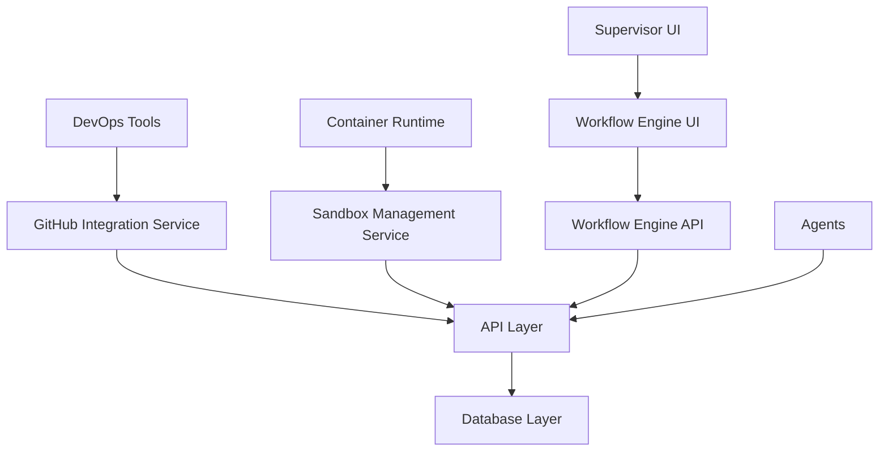

# Advanced DevOps Integration & Workflow Automation Layer Design

## 1. Overview

This document outlines the design for implementing the Advanced DevOps Integration & Workflow Automation Layer. This enhancement will transform the platform from a standalone supervisor into a deeply embedded, indispensable partner in a professional DevOps toolchain. The implementation will be broken down into three distinct, standalone tasks:

1. **Interactive GitHub Integration**: Enable agents to post comments and status checks directly back to GitHub Pull Requests
2. **Agent Execution Sandboxing**: Create a system for managing isolated, containerized execution environments for agents
3. **Workflow Engine**: Abstract the concept of "task chaining" into a formal, reusable workflow engine

## 2. Architecture

The implementation will extend the existing monorepo architecture with new backend services, database tables, and frontend components. The system will maintain the current separation between the API layer (Cloudflare Workers with Hono) and the UI layer (Next.js), while adding new integration points.

### 2.1 System Context



## 3. Task 1: Interactive GitHub Integration

### 3.1 Objective
Elevate the existing GitHub integration from a passive listener to an active participant. This will enable agents to post comments and status checks directly back to GitHub Pull Requests, allowing them to report findings and gate merges.

### 3.2 Requirements

#### 3.2.1 Environment Configuration
- Add new secrets to `apps/api/.env.example`:
  - `GITHUB_APP_ID`
  - `GITHUB_PRIVATE_KEY`
  - `GITHUB_INSTALLATION_ID`

#### 3.2.2 GitHub Service Module
Create a new file at `apps/api/src/services/github.ts` to encapsulate all GitHub API interactions:

```typescript
// apps/api/src/services/github.ts
import { Octokit } from "@octokit/rest";
import { createAppAuth } from "@octokit/auth-app";
import { Env } from '../index';

/**
 * Creates an authenticated Octokit instance using GitHub App credentials
 * @param env Environment variables containing GitHub App configuration
 * @returns Authenticated Octokit instance
 */
async function getAuthenticatedOctokit(env: Env): Promise<Octokit> {
  // Validate required environment variables
  if (!env.GITHUB_APP_ID || !env.GITHUB_PRIVATE_KEY || !env.GITHUB_INSTALLATION_ID) {
    throw new Error('Missing GitHub App configuration in environment variables');
  }

  try {
    const auth = createAppAuth({
      appId: env.GITHUB_APP_ID,
      privateKey: env.GITHUB_PRIVATE_KEY,
      installationId: env.GITHUB_INSTALLATION_ID,
    });
    
    const installationAuthentication = await auth({ type: "installation" });
    return new Octokit({ 
      auth: installationAuthentication.token,
      // Add request timeout for reliability
      request: {
        timeout: 5000
      }
    });
  } catch (error) {
    console.error('Failed to authenticate with GitHub App:', error);
    throw new Error('GitHub App authentication failed');
  }
}

/**
 * Posts a comment to a GitHub Pull Request
 * @param env Environment variables
 * @param owner Repository owner
 * @param repo Repository name
 * @param issue_number Pull Request number
 * @param body Comment content
 * @returns GitHub API response
 */
export async function postPRComment(env: Env, owner: string, repo: string, issue_number: number, body: string) {
  try {
    const octokit = await getAuthenticatedOctokit(env);
    return await octokit.issues.createComment({ owner, repo, issue_number, body });
  } catch (error) {
    console.error(`Failed to post comment to PR ${owner}/${repo}#${issue_number}:`, error);
    throw error;
  }
}

/**
 * Creates a check run (status check) for a commit
 * @param env Environment variables
 * @param owner Repository owner
 * @param repo Repository name
 * @param head_sha Commit SHA to attach the check to
 * @param conclusion Check conclusion (success, failure, neutral)
 * @param title Check title
 * @param summary Check summary
 * @returns GitHub API response
 */
export async function createCheckRun(
  env: Env, 
  owner: string, 
  repo: string, 
  head_sha: string, 
  conclusion: 'success' | 'failure' | 'neutral', 
  title: string, 
  summary: string
) {
  try {
    const octokit = await getAuthenticatedOctokit(env);
    return await octokit.checks.create({ 
      owner, 
      repo, 
      name: 'DevArt.ai Agent Review', 
      head_sha, 
      status: 'completed', 
      conclusion, 
      output: { title, summary } 
    });
  } catch (error) {
    console.error(`Failed to create check run for ${owner}/${repo}@${head_sha}:`, error);
    throw error;
  }
}

/**
 * Updates repository settings or performs other GitHub operations
 * @param env Environment variables
 * @param owner Repository owner
 * @param repo Repository name
 * @param settings Settings to update
 * @returns GitHub API response
 */
export async function updateRepoSettings(env: Env, owner: string, repo: string, settings: any) {
  try {
    const octokit = await getAuthenticatedOctokit(env);
    return await octokit.repos.update({ owner, repo, ...settings });
  } catch (error) {
    console.error(`Failed to update repository settings for ${owner}/${repo}:`, error);
    throw error;
  }
}
```

#### 3.2.3 API Endpoint
Create a new endpoint `POST /api/integrations/github/pr-feedback` in `apps/api/src/index.ts`:

```typescript
// Add this new route to apps/api/src/index.ts
import { postPRComment, createCheckRun } from './services/github';

app.post('/api/integrations/github/pr-feedback', async (c) => {
  const { owner, repo, prNumber, sha, comment, status } = await c.req.json();

  if (!owner || !repo || !prNumber || !sha || !status) {
    return c.json({ error: 'Missing required GitHub parameters' }, 400);
  }

  // Post a comment if one is provided
  if (comment) {
    await postPRComment(c.env, owner, repo, prNumber, comment);
  }

  // Create a status check
  await createCheckRun(c.env, owner, repo, sha, status, 'AI Code Review', comment || 'Review complete.');

  return c.json({ message: 'Feedback posted to GitHub successfully.' });
});
```

### 3.3 Implementation Plan

1. Install required dependencies in the API package:
   ```bash
   pnpm add @octokit/rest @octokit/auth-app
   ```

2. Create the GitHub service module with authentication and API interaction functions

3. Add the new endpoint to the main API router

4. Update environment configuration documentation

### 3.4 Security Considerations

- Use GitHub App authentication for secure server-to-server integration
- Store sensitive credentials in environment variables
- Validate all input parameters to prevent injection attacks

### 3.5 Monitoring and Metrics

- Track API call success/failure rates to GitHub
- Monitor response times for GitHub API interactions
- Log all PR comment and check run activities for audit purposes
- Set up alerts for authentication failures or rate limiting issues

## 4. Task 2: Agent Execution Sandboxing

### 4.1 Objective
Create a system for managing isolated, containerized execution environments ("sandboxes") for agents. This prevents agents from interfering with each other and provides a clean, reproducible environment for each task.

### 4.2 Database Schema
Add a new table to `supabase/schema.sql`:

```sql
CREATE TABLE agent_sandboxes (
  id UUID PRIMARY KEY DEFAULT gen_random_uuid(),
  agent_id UUID REFERENCES agents(id) ON DELETE SET NULL,
  task_id UUID REFERENCES tasks(id) ON DELETE SET NULL,
  status TEXT NOT NULL DEFAULT 'PROVISIONING', -- 'PROVISIONING', 'ACTIVE', 'TERMINATED'
  container_id TEXT, -- The ID from the container runtime (e.g., Docker container ID)
  connection_details JSONB, -- e.g., { "host": "...", "port": 22 }
  created_at TIMESTAMPTZ DEFAULT NOW(),
  expires_at TIMESTAMPTZ
);

COMMENT ON TABLE agent_sandboxes IS 'Tracks isolated execution environments for agents.';
```

### 4.3 API Endpoints

#### 4.3.1 Request Sandbox Endpoint
Create `POST /api/agents/:agentId/request-sandbox` in `apps/api/src/index.ts`:

```typescript
app.post('/api/agents/:agentId/request-sandbox', async (c) => {
  const agentId = c.req.param('agentId');
  const { taskId } = await c.req.json<{ taskId: string }>();

  // Validate input
  if (!taskId) {
    return c.json({ error: 'Task ID is required' }, 400);
  }

  // Verify agent exists and is active
  const supabase = createSupabaseClient(c.env);
  const { data: agent, error: agentError } = await supabase
    .from('agents')
    .select('id, is_active')
    .eq('id', agentId)
    .single();

  if (agentError || !agent) {
    return c.json({ error: 'Agent not found' }, 404);
  }

  if (!agent.is_active) {
    return c.json({ error: 'Agent is not active' }, 400);
  }

  // Verify task exists
  const { data: task, error: taskError } = await supabase
    .from('tasks')
    .select('id')
    .eq('id', taskId)
    .single();

  if (taskError || !task) {
    return c.json({ error: 'Task not found' }, 404);
  }

  // --- Placeholder for Provisioning Logic ---
  // In a real system, this would call a Docker API, Kubernetes API, or a cloud service.
  // Example implementation outline:
  // 1. Generate unique container name
  // 2. Call container orchestration API to create container
  // 3. Configure container with required environment and dependencies
  // 4. Set up networking and security policies
  const containerId = `sandbox-${crypto.randomUUID()}`;
  const connectionDetails = { host: 'localhost', port: 2222 }; // Example
  const expiresAt = new Date(Date.now() + 30 * 60 * 1000); // 30 minutes from now
  
  console.log(`Provisioning sandbox ${containerId} for task ${taskId}...`);
  // --- End of Placeholder ---

  // Create sandbox record in database
  const { data: sandbox, error } = await supabase
    .from('agent_sandboxes')
    .insert({
      agent_id: agentId,
      task_id: taskId,
      status: 'ACTIVE', // Assume provisioning is instant for this example
      container_id: containerId,
      connection_details: connectionDetails,
      expires_at: expiresAt.toISOString(),
    })
    .select()
    .single();

  if (error) {
    console.error('Failed to create sandbox record:', error);
    return c.json({ error: 'Failed to create sandbox record' }, 500);
  }

  return c.json(sandbox, 201);
});
```

#### 4.3.2 Terminate Sandbox Endpoint
Create `DELETE /api/sandboxes/:sandboxId` in `apps/api/src/index.ts`:

```typescript
app.delete('/api/sandboxes/:sandboxId', async (c) => {
  const sandboxId = c.req.param('sandboxId');
  
  // Validate input
  if (!sandboxId) {
    return c.json({ error: 'Sandbox ID is required' }, 400);
  }

  const supabase = createSupabaseClient(c.env);
  
  // Verify sandbox exists
  const { data: sandbox, error: fetchError } = await supabase
    .from('agent_sandboxes')
    .select('id, container_id, status')
    .eq('id', sandboxId)
    .single();

  if (fetchError || !sandbox) {
    return c.json({ error: 'Sandbox not found' }, 404);
  }

  // Check if sandbox is already terminated
  if (sandbox.status === 'TERMINATED') {
    return c.json({ message: 'Sandbox already terminated' });
  }

  // --- Placeholder for Termination Logic ---
  // In a real system, this would call a Docker API, Kubernetes API, or a cloud service.
  // Example implementation outline:
  // 1. Call container orchestration API to stop and remove container
  // 2. Clean up any associated resources (volumes, networks, etc.)
  // 3. Update any monitoring or logging systems
  console.log(`Terminating sandbox ${sandboxId} (container: ${sandbox.container_id})...`);
  // --- End of Placeholder ---
  
  // Update sandbox status in database
  const { error } = await supabase
    .from('agent_sandboxes')
    .update({ 
      status: 'TERMINATED',
      expires_at: new Date().toISOString() // Set expiration to now
    })
    .eq('id', sandboxId);

  if (error) {
    console.error('Failed to update sandbox status:', error);
    return c.json({ error: 'Failed to terminate sandbox' }, 500);
  }

  return c.json({ message: 'Sandbox terminated successfully' });
});
```

### 4.4 Implementation Plan

1. Add the new `agent_sandboxes` table to the database schema
2. Implement the sandbox request and termination endpoints
3. Add placeholder logic for container provisioning (to be replaced with actual implementation)

### 4.5 Security Considerations

- Isolate agent execution environments to prevent cross-contamination
- Implement proper authentication and authorization for sandbox management endpoints
- Set expiration times for sandboxes to prevent resource leaks

### 4.6 Monitoring and Metrics

- Track sandbox provisioning success/failure rates
- Monitor resource consumption (CPU, memory, disk) per sandbox
- Log sandbox lifecycle events (creation, usage, termination)
- Set up alerts for orphaned or expired sandboxes
- Monitor container orchestration API response times

## 5. Task 3: Workflow Engine

### 5.1 Objective
Abstract the concept of "task chaining" into a formal, reusable "Workflow Engine." This will allow supervisors to define multi-stage workflows (e.g., build → test → review) that can be triggered on demand.

### 5.2 Database Schema
Add new tables to `supabase/schema.sql`:

```sql
CREATE TABLE workflows (
  id UUID PRIMARY KEY DEFAULT gen_random_uuid(),
  name TEXT NOT NULL UNIQUE,
  description TEXT
);

CREATE TABLE task_templates (
  id UUID PRIMARY KEY DEFAULT gen_random_uuid(),
  workflow_id UUID NOT NULL REFERENCES workflows(id) ON DELETE CASCADE,
  stage_order INT NOT NULL,
  title_template TEXT NOT NULL, -- e.g., "Build service: service_name"
  description_template TEXT,
  priority TEXT NOT NULL DEFAULT 'MEDIUM',
  UNIQUE (workflow_id, stage_order)
);
```

### 5.3 API Endpoints

#### 5.3.1 Trigger Workflow Endpoint
Create `POST /api/workflows/:workflowId/trigger` in `apps/api/src/index.ts`:

```typescript
app.post('/api/workflows/:workflowId/trigger', async (c) => {
  const workflowId = c.req.param('workflowId');
  const context = await c.req.json<Record<string, any>>();

  const supabase = createSupabaseClient(c.env);

  // Get the first task template in the workflow
  const { data: firstTaskTemplate, error: templateError } = await supabase
    .from('task_templates')
    .select('*')
    .eq('workflow_id', workflowId)
    .order('stage_order', { ascending: true })
    .limit(1)
    .single();

  if (templateError || !firstTaskTemplate) {
    return c.json({ error: 'Workflow not found or has no tasks' }, 404);
  }

  // Template rendering function with better error handling
  const renderTemplate = (template: string, context: Record<string, any>): string => {
    try {
      let result = template;
      // Replace all template variables in the format {{variable_name}}
      for (const [key, value] of Object.entries(context)) {
        const regex = new RegExp(`{{\s*${key}\s*}}`, 'g');
        result = result.replace(regex, String(value));
      }
      return result;
    } catch (error) {
      console.error('Template rendering error:', error);
      return template; // Return original template if rendering fails
    }
  };

  // Render the template with context
  const title = renderTemplate(firstTaskTemplate.title_template, context);
  const description = firstTaskTemplate.description_template 
    ? renderTemplate(firstTaskTemplate.description_template, context)
    : undefined;

  // Create the first task
  const { data: task, error: taskError } = await supabase
    .from('tasks')
    .insert({
      title,
      description,
      priority: firstTaskTemplate.priority,
      status: 'TODO',
    })
    .select()
    .single();

  if (taskError) {
    return c.json({ error: 'Failed to create initial task' }, 500);
  }

  return c.json({ 
    message: 'Workflow triggered successfully',
    initialTask: task
  });
});
```

#### 5.3.2 Enhanced Successor Creation Logic
Modify the existing task completion logic to check for workflow continuation:

```typescript
// Enhanced version of the existing successor creation logic
// This would be integrated into the task completion endpoint
async function createWorkflowSuccessor(supabase: any, completedTaskId: string) {
  // Check if the completed task was part of a workflow
  const { data: completedTask, error: taskError } = await supabase
    .from('tasks')
    .select('id, parent_task_id')
    .eq('id', completedTaskId)
    .single();

  if (taskError || !completedTask) {
    return null;
  }

  // If there's no parent, this task wasn't part of a workflow
  if (!completedTask.parent_task_id) {
    return null;
  }

  // Find the parent task to get the workflow context
  const { data: parentTask, error: parentError } = await supabase
    .from('tasks')
    .select('id')
    .eq('id', completedTask.parent_task_id)
    .single();

  if (parentError || !parentTask) {
    return null;
  }

  // Find the workflow associated with the parent task
  // This requires looking up the workflow through the task_templates
  // For a complete implementation, we would need to:
  // 1. Find the task template that created the parent task
  // 2. Identify the workflow from that template
  // 3. Find the next template in the sequence
  // 4. Create a new task from that template
  
  // Placeholder for full implementation
  console.log(`Task ${completedTaskId} completed as part of a workflow`);
  
  // In a full implementation, this would return the newly created task
  return null;
}
```

### 5.4 UI Component
Create a new UI panel for workflow management in the dashboard:

#### 5.4.1 Workflow Management Panel
Create `apps/ui/src/components/WorkflowManagementPanel.tsx`:

```tsx
// apps/ui/src/components/WorkflowManagementPanel.tsx
import { useState, useEffect } from 'react';

interface Workflow {
  id: string;
  name: string;
  description: string;
}

interface ContextVariable {
  name: string;
  type: 'string' | 'number' | 'boolean';
  required: boolean;
  defaultValue?: string;
}

export default function WorkflowManagementPanel() {
  const [workflows, setWorkflows] = useState<Workflow[]>([]);
  const [selectedWorkflow, setSelectedWorkflow] = useState<Workflow | null>(null);
  const [context, setContext] = useState<Record<string, string>>({});
  const [isLoading, setIsLoading] = useState(false);
  const [error, setError] = useState<string | null>(null);
  const [success, setSuccess] = useState<string | null>(null);

  useEffect(() => {
    // Fetch workflows from API
    fetchWorkflows();
  }, []);

  const fetchWorkflows = async () => {
    try {
      setIsLoading(true);
      setError(null);
      const response = await fetch('/api/workflows');
      if (!response.ok) throw new Error('Failed to fetch workflows');
      const data = await response.json();
      setWorkflows(data);
    } catch (err) {
      setError('Failed to load workflows');
      console.error('Error fetching workflows:', err);
    } finally {
      setIsLoading(false);
    }
  };

  const triggerWorkflow = async () => {
    if (!selectedWorkflow) return;
    
    try {
      setIsLoading(true);
      setError(null);
      setSuccess(null);
      
      const response = await fetch(`/api/workflows/${selectedWorkflow.id}/trigger`, {
        method: 'POST',
        headers: { 'Content-Type': 'application/json' },
        body: JSON.stringify(context),
      });
      
      if (response.ok) {
        setSuccess('Workflow triggered successfully!');
        // Reset form
        setSelectedWorkflow(null);
        setContext({});
      } else {
        const errorData = await response.json();
        throw new Error(errorData.error || 'Failed to trigger workflow');
      }
    } catch (err) {
      setError(err instanceof Error ? err.message : 'Failed to trigger workflow');
      console.error('Error triggering workflow:', err);
    } finally {
      setIsLoading(false);
    }
  };

  // Handle context variable changes
  const handleContextChange = (name: string, value: string) => {
    setContext(prev => ({
      ...prev,
      [name]: value
    }));
  };

  return (
    <div className="bg-gray-800 rounded-lg p-6">
      <h2 className="text-2xl font-bold mb-4">Workflow Engine</h2>
      
      {error && (
        <div className="bg-red-500 text-white p-3 rounded mb-4">
          {error}
        </div>
      )}
      
      {success && (
        <div className="bg-green-500 text-white p-3 rounded mb-4">
          {success}
        </div>
      )}
      
      <div className="mb-4">
        <label className="block mb-2">Select Workflow</label>
        <select 
          className="w-full p-2 rounded bg-gray-700"
          onChange={(e) => {
            const workflow = workflows.find(w => w.id === e.target.value);
            setSelectedWorkflow(workflow || null);
          }}
          disabled={isLoading}
        >
          <option value="">Choose a workflow</option>
          {workflows.map(workflow => (
            <option key={workflow.id} value={workflow.id}>
              {workflow.name}
            </option>
          ))}
        </select>
      </div>

      {selectedWorkflow && (
        <div className="mb-4">
          <h3 className="text-lg font-semibold mb-2">Context Variables</h3>
          <p className="text-gray-400 text-sm mb-4">{selectedWorkflow.description}</p>
          
          {/* In a full implementation, this would be dynamically generated based on the workflow definition */}
          <div className="mb-4">
            <label className="block mb-2">Service Name</label>
            <input 
              type="text" 
              className="w-full p-2 rounded bg-gray-700"
              placeholder="Enter service name"
              value={context['service_name'] || ''}
              onChange={(e) => handleContextChange('service_name', e.target.value)}
            />
          </div>
          
          <div className="mb-4">
            <label className="block mb-2">Branch Name</label>
            <input 
              type="text" 
              className="w-full p-2 rounded bg-gray-700"
              placeholder="Enter branch name"
              value={context['branch_name'] || ''}
              onChange={(e) => handleContextChange('branch_name', e.target.value)}
            />
          </div>
          
          <button 
            className={`px-4 py-2 rounded ${isLoading ? 'bg-gray-600' : 'bg-blue-600 hover:bg-blue-700'}`}
            onClick={triggerWorkflow}
            disabled={isLoading}
          >
            {isLoading ? 'Running...' : 'Run Workflow'}
          </button>
        </div>
      )}
      
      {isLoading && (
        <div className="flex justify-center">
          <div className="animate-spin rounded-full h-6 w-6 border-b-2 border-white"></div>
        </div>
      )}
    </div>
  );
}
```

#### 5.4.2 Integration with Dashboard
Add the workflow panel to the main dashboard in `apps/ui/src/app/page.tsx`:

```tsx
// Add to the imports
import WorkflowManagementPanel from '../components/WorkflowManagementPanel';

// Add to the Enterprise Governance section
<div className="grid grid-cols-1 lg:grid-cols-3 gap-8">
  <AgentRegistrationPanel />
  <SettingsPanel />
  <WorkflowManagementPanel />
</div>
```

### 5.5 Implementation Plan

1. Add the new `workflows` and `task_templates` tables to the database schema
2. Implement the workflow trigger endpoint
3. Enhance the task completion logic to support workflow continuation
4. Create the workflow management UI component
5. Integrate the UI component into the dashboard

### 5.6 Security Considerations

- Validate workflow templates to prevent injection attacks
- Implement proper authorization for workflow management
- Ensure context variables are properly sanitized

### 5.7 Monitoring and Metrics

- Track workflow execution success/failure rates
- Monitor workflow execution times and identify bottlenecks
- Log workflow trigger events and task creation activities
- Set up alerts for failed workflows or stuck tasks
- Monitor database performance for workflow-related queries

## 6. Integration Points

### 6.1 GitHub Integration
- Agents will call the GitHub feedback endpoint to post PR comments and status checks
- The endpoint will authenticate with GitHub using App credentials

### 6.2 Sandbox Management
- Agents will request sandboxes when claiming tasks that require isolated environments
- The sandbox management service will track sandbox lifecycle and resources

### 6.3 Workflow Engine
- The workflow engine will integrate with the existing task system
- Task completion will trigger workflow continuation logic
- The UI will provide controls for workflow management and execution

## 7. Testing Strategy

### 7.1 Unit Tests
- Test GitHub service functions for proper authentication and API calls
- Test sandbox management endpoints for proper state transitions
- Test workflow template rendering with various context variables

### 7.2 Integration Tests
- Test end-to-end GitHub feedback flow
- Test sandbox provisioning and termination workflows
- Test workflow execution from trigger to completion

### 7.3 UI Tests
- Test workflow panel functionality
- Test form validation and error handling
- Test responsive design across different screen sizes

## 8. Deployment Considerations

### 8.1 Database Migrations
- Add new tables: `agent_sandboxes`, `workflows`, `task_templates`
- Add new columns if needed for workflow tracking

### 8.2 API Deployments
- Deploy new endpoints with the existing Cloudflare Workers setup
- Ensure proper environment variable configuration for GitHub integration

### 8.3 UI Deployments
- Deploy new components with the existing Next.js application
- Ensure proper integration with existing state management

## 9. Monitoring and Observability

### 9.1 Logging
- Log GitHub API interactions for debugging and audit purposes
- Log sandbox provisioning and termination events
- Log workflow execution and task creation events

### 9.2 Metrics
- Track GitHub feedback submissions
- Monitor sandbox usage and resource consumption
- Measure workflow execution times and success rates

### 9.3 Error Handling
- Implement proper error handling for GitHub API failures
- Handle sandbox provisioning failures gracefully
- Manage workflow execution errors and provide recovery mechanisms

#### 9.3.1 GitHub Integration Error Handling
- Implement retry logic with exponential backoff for transient failures
- Gracefully handle rate limiting by queuing requests
- Provide meaningful error messages to users when GitHub operations fail
- Log detailed error information for debugging purposes

#### 9.3.2 Sandbox Management Error Handling
- Implement rollback mechanisms for failed sandbox provisioning
- Handle partial failures in container orchestration systems
- Provide fallback mechanisms for critical sandbox operations
- Implement health checks for provisioned sandboxes

#### 9.3.3 Workflow Engine Error Handling
- Implement workflow state recovery mechanisms
- Provide manual intervention options for stuck workflows
- Implement timeout mechanisms for long-running tasks
- Provide detailed error reporting for workflow failures

## 10. Scalability Considerations

### 10.1 GitHub Integration Scalability
- Implement connection pooling for GitHub API clients
- Use caching mechanisms for frequently accessed repository information
- Design rate-limit aware batching for bulk operations
- Consider webhook-based event processing for high-volume scenarios

### 10.2 Sandbox Management Scalability
- Implement container orchestration with Kubernetes for horizontal scaling
- Use resource quotas to prevent individual sandboxes from consuming excessive resources
- Design efficient container image caching strategies
- Implement load balancing across multiple container hosts

### 10.3 Workflow Engine Scalability
- Use database indexing for efficient workflow and task template lookups
- Implement asynchronous task processing with message queues
- Design workflow state management for concurrent executions
- Use database connection pooling for high-concurrency scenarios

## 11. Future Enhancements

### 11.1 Advanced GitHub Integration Features
- Implement auto-merge capabilities for PRs that pass all checks
- Add support for GitHub Actions integration and triggering
- Develop branch protection rule management
- Create automated release note generation

### 11.2 Enhanced Sandbox Features
- Implement persistent storage volumes for sandboxes
- Add support for GPU-enabled sandboxes for ML workloads
- Develop network policy enforcement for secure sandbox communication
- Create template-based sandbox configurations

### 11.3 Workflow Engine Improvements
- Add support for parallel task execution within workflows
- Implement conditional workflow branching based on task results
- Develop a visual workflow designer UI
- Add workflow versioning and rollback capabilities
- Create workflow template marketplace for sharing common patterns