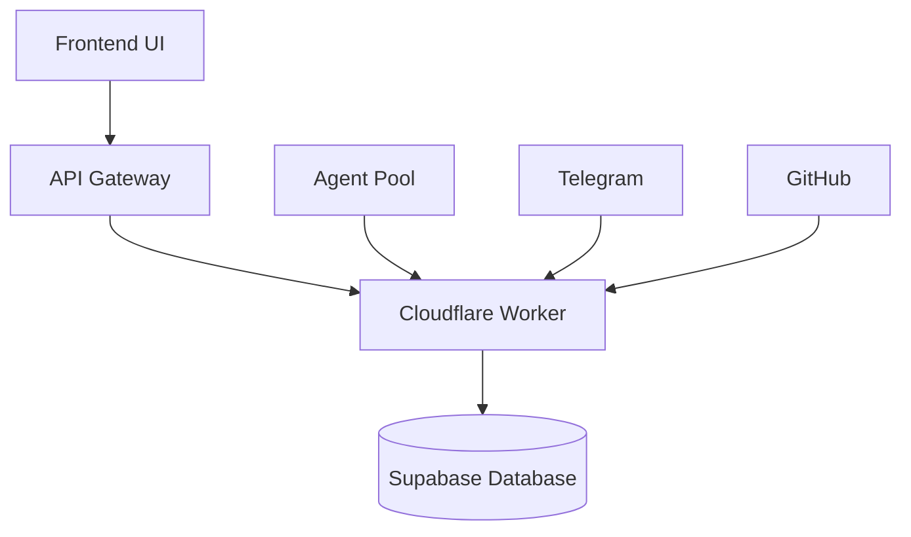
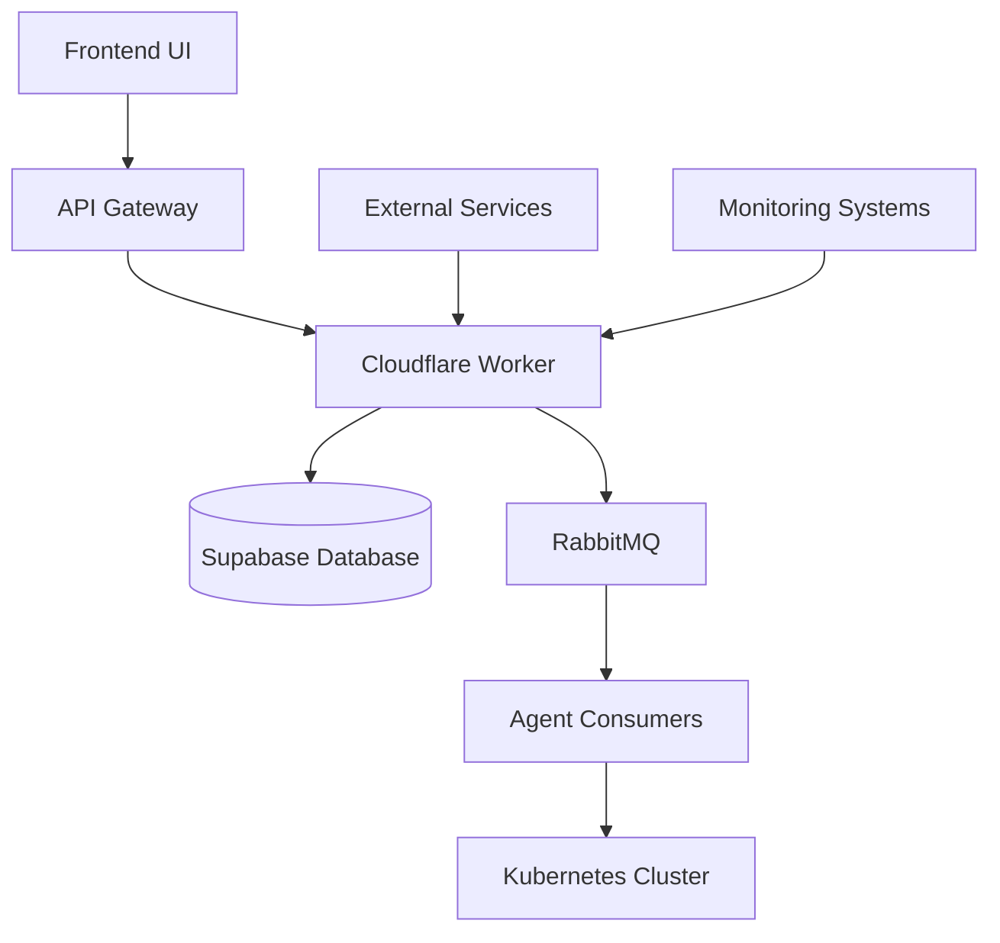

# Strategic Phase 10: Ecosystem and Enterprise Scalability

## 1. Overview

The devart.ai platform has evolved into a mature, end-to-end DevOps partner with robust governance, intelligence, and orchestration capabilities. However, the current architecture relies on simplified infrastructure patterns that will not scale to meet the demands of a true enterprise ecosystem with hundreds of agents and complex, high-throughput workflows.

This strategic phase focuses on re-architecting the foundational infrastructure for high performance and reliability while simultaneously building ecosystem features that drive adoption and collaboration.

## 2. Current Architecture Analysis

### 2.1 Key Components

- **Frontend**: React-based UI with real-time monitoring capabilities
- **Backend API**: Hono-based API running on Cloudflare Workers
- **Database**: Supabase (PostgreSQL) with custom functions and RLS policies
- **Agent System**: Python-based agents that poll for tasks
- **Messaging**: Database-as-a-queue pattern for task distribution
- **Monitoring**: Integration with Telegram for notifications

### 2.2 Identified Scalability Limitations

1. **Database-as-a-Queue**: Current task distribution uses database polling which doesn't scale well
2. **Conceptual Sandboxing**: Agent execution environments are not production-grade
3. **Limited Marketplace**: No mechanism for sharing agents and workflows
4. **Basic Error Handling**: Minimal retry mechanisms for failed tasks
5. **Insufficient Performance Data**: Limited metrics collection for workflow optimization

## 3. Strategic Goals

1. **Infrastructure Scalability**: Implement production-grade components for high-throughput operations
2. **Ecosystem Enablement**: Create features that encourage community collaboration
3. **Reliability Enhancement**: Build robust error handling and recovery mechanisms
4. **Performance Optimization**: Establish data foundation for AI-driven optimizations

## 4. Task Breakdown and Implementation Plan

### 4.1 Task 1: Marketplace - Backend and Schema Implementation

#### 4.1.1 Database Schema Changes

Add a new `marketplace_items` table to store metadata for shared agents and workflows:

```sql
CREATE TABLE marketplace_items (
  id UUID PRIMARY KEY DEFAULT gen_random_uuid(),
  item_type TEXT NOT NULL, -- 'agent' or 'workflow'
  name TEXT NOT NULL,
  description TEXT,
  version TEXT NOT NULL,
  publisher_id UUID REFERENCES auth.users(id),
  tags JSONB, -- For search and categorization
  repository_url TEXT, -- Link to the source code
  created_at TIMESTAMPTZ DEFAULT NOW(),
  UNIQUE (name, version)
);

COMMENT ON TABLE marketplace_items IS 'Stores metadata for shared agents and workflows.';
```

#### 4.1.2 API Endpoint Implementation

Add new routes to `apps/api/src/index.ts`:

1. **GET /api/marketplace** - List/search all items
2. **POST /api/marketplace** - Publish a new item

Key considerations:
- Endpoints must be secured using RBAC (supervisor/admin role)
- Publisher ID should be automatically associated with authenticated user
- Validation logic should prevent duplicate name/version combinations

### 4.2 Task 2: Agents - Error Handling and Retry Mechanism

#### 4.2.1 Database Schema Changes

Enhance the `tasks` table to track retries and errors:

```sql
ALTER TABLE tasks
  ADD COLUMN retry_count INT DEFAULT 0,
  ADD COLUMN max_retries INT DEFAULT 3,
  ADD COLUMN last_error TEXT;

COMMENT ON COLUMN tasks.retry_count IS 'The number of times this task has been attempted.';
COMMENT ON COLUMN tasks.max_retries IS 'The maximum number of retries allowed for this task.';
COMMENT ON COLUMN tasks.last_error IS 'The error message from the last failed attempt.';
```

#### 4.2.2 API Endpoint Implementation

Add new route to `apps/api/src/index.ts`:

**POST /api/tasks/:taskId/report-failure** - Endpoint for agents to report failures

Key logic:
1. Validate task ownership (agent can only report on assigned tasks)
2. Increment retry count
3. If max retries exceeded, move task to QUARANTINED status
4. Reset agent status to IDLE for new work assignment
5. Unassign task (set agent_id to null) to allow different agents to attempt

### 4.3 Task 3: Workflows - Performance Data Collection

#### 4.3.1 Database Schema Changes

Create `workflow_runs` table to track workflow execution instances:

```sql
CREATE TABLE workflow_runs (
  id UUID PRIMARY KEY DEFAULT gen_random_uuid(),
  workflow_id UUID NOT NULL REFERENCES workflows(id) ON DELETE CASCADE,
  status TEXT NOT NULL DEFAULT 'RUNNING', -- 'RUNNING', 'COMPLETED', 'FAILED'
  trigger_context JSONB, -- The initial variables used to start the workflow
  start_time TIMESTAMPTZ DEFAULT NOW(),
  end_time TIMESTAMPTZ,
  total_cost NUMERIC
);
```

Link tasks to workflow runs:

```sql
ALTER TABLE tasks ADD COLUMN workflow_run_id UUID REFERENCES workflow_runs(id) ON DELETE SET NULL;
```

#### 4.3.2 Implementation Requirements

1. Modify `/api/workflows/:workflowId/trigger` endpoint to create workflow_runs records
2. Enhance task completion logic to detect workflow completion
3. Update parent workflow_runs record with final status, duration, and cost
4. Implement PostgreSQL function for atomic workflow completion detection

### 4.4 Task 4: Infrastructure - Production Sandbox Orchestrator

#### 4.4.1 Technology Integration

Replace conceptual sandbox provisioning with Kubernetes integration:

1. Install Kubernetes client library: `pnpm add @kubernetes/client-node`
2. Add Kubernetes configuration to environment:
   - KUBE_CONFIG_DATA (base64 encoded)
   - K8S_NAMESPACE
   - AGENT_CONTAINER_IMAGE

#### 4.4.2 Service Implementation

Create `apps/api/src/services/kubernetes.ts` with functions:

1. `provisionSandbox(taskId)` - Create Kubernetes resources for task execution
2. `terminateSandbox(containerId)` - Clean up resources after task completion

#### 4.4.3 API Integration

Replace placeholder logic in:
- `/api/agents/:agentId/request-sandbox`
- `/api/sandboxes/:sandboxId`

### 4.5 Task 5: Infrastructure - Advanced Job Queue

#### 4.5.1 Architectural Shift

Migrate from database polling to message queue (RabbitMQ) architecture:

1. **Current Model**: Agents poll API for tasks
2. **New Model**: API publishes tasks to queue; agents consume messages

#### 4.5.2 API Endpoint Changes

1. **POST /api/tasks** - Publish message to RabbitMQ queue in addition to database write
2. **POST /api/tasks/:taskId/report-failure** - Republish task to queue with delay or to dead-letter queue
3. **POST /api/agents/:agentId/claim-task** - Deprecated and removed

#### 4.5.3 Agent SDK Updates

Update `devart-agent-template/sdk/agent_sdk.py`:

1. Replace `claim_task()` method with `start_consuming(callback)`
2. Establish persistent connection to RabbitMQ
3. Listen for messages on tasks.todo queue
4. Invoke callback with task details when messages received

## 5. System Architecture Evolution

### 5.1 Current Architecture



### 5.2 Target Architecture



## 6. Data Models

### 6.1 Marketplace Items

| Column | Type | Description |
|--------|------|-------------|
| id | UUID | Primary key |
| item_type | TEXT | 'agent' or 'workflow' |
| name | TEXT | Item name |
| description | TEXT | Item description |
| version | TEXT | Version identifier |
| publisher_id | UUID | Reference to auth.users |
| tags | JSONB | Search and categorization tags |
| repository_url | TEXT | Link to source code |
| created_at | TIMESTAMPTZ | Creation timestamp |

### 6.2 Enhanced Tasks Table

| Column | Type | Description |
|--------|------|-------------|
| retry_count | INT | Number of retry attempts |
| max_retries | INT | Maximum allowed retries |
| last_error | TEXT | Last error message |
| workflow_run_id | UUID | Link to workflow execution |

### 6.3 Workflow Runs

| Column | Type | Description |
|--------|------|-------------|
| id | UUID | Primary key |
| workflow_id | UUID | Reference to workflows |
| status | TEXT | Execution status |
| trigger_context | JSONB | Initial variables |
| start_time | TIMESTAMPTZ | Execution start time |
| end_time | TIMESTAMPTZ | Execution end time |
| total_cost | NUMERIC | Aggregated cost |

## 7. API Endpoints

### 7.1 Marketplace Endpoints

| Method | Endpoint | Description |
|--------|----------|-------------|
| GET | /api/marketplace | List/search marketplace items |
| POST | /api/marketplace | Publish new item |

### 7.2 Task Error Handling Endpoints

| Method | Endpoint | Description |
|--------|----------|-------------|
| POST | /api/tasks/:taskId/report-failure | Report task failure |

### 7.3 Workflow Performance Endpoints

| Method | Endpoint | Description |
|--------|----------|-------------|
| POST | /api/workflows/:workflowId/trigger | Trigger workflow with performance tracking |

## 8. Security Considerations

1. **RBAC Enforcement**: All new endpoints must respect existing role-based access controls
2. **Authentication**: Publisher ID must be securely associated with authenticated users
3. **Kubernetes Security**: Service accounts must have minimal required permissions
4. **Queue Security**: RabbitMQ connections must use secure authentication

## 9. Performance and Scalability Improvements

1. **Message Queue**: RabbitMQ provides high-throughput task distribution
2. **Kubernetes Orchestration**: Production-grade container management
3. **Database Optimization**: Reduced database load through queue-based architecture
4. **Retry Mechanisms**: Automated task recovery with configurable retry limits
5. **Performance Data**: Rich metrics for AI-driven optimization

## 10. Implementation Dependencies

1. **Task 1** (Marketplace): Independent
2. **Task 2** (Error Handling): Independent
3. **Task 3** (Workflow Performance): Requires existing workflow tables
4. **Task 4** (Sandbox Orchestration): Requires Kubernetes cluster access
5. **Task 5** (Job Queue): Requires RabbitMQ instance; affects all task-related endpoints

## 11. Testing Strategy

1. **Unit Tests**: Validate database schema changes and business logic
2. **Integration Tests**: Verify API endpoint functionality
3. **End-to-End Tests**: Test complete workflow scenarios
4. **Load Testing**: Validate performance improvements with high task volumes
5. **Security Testing**: Verify RBAC enforcement and authentication

## 12. Rollout Plan

1. **Phase 1**: Implement marketplace backend (Tasks 1)
2. **Phase 2**: Add error handling and retry mechanisms (Task 2)
3. **Phase 3**: Implement workflow performance data collection (Task 3)
4. **Phase 4**: Deploy production sandbox orchestrator (Task 4)
5. **Phase 5**: Migrate to advanced job queue architecture (Task 5)