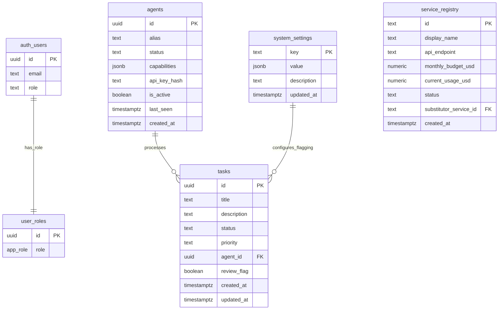
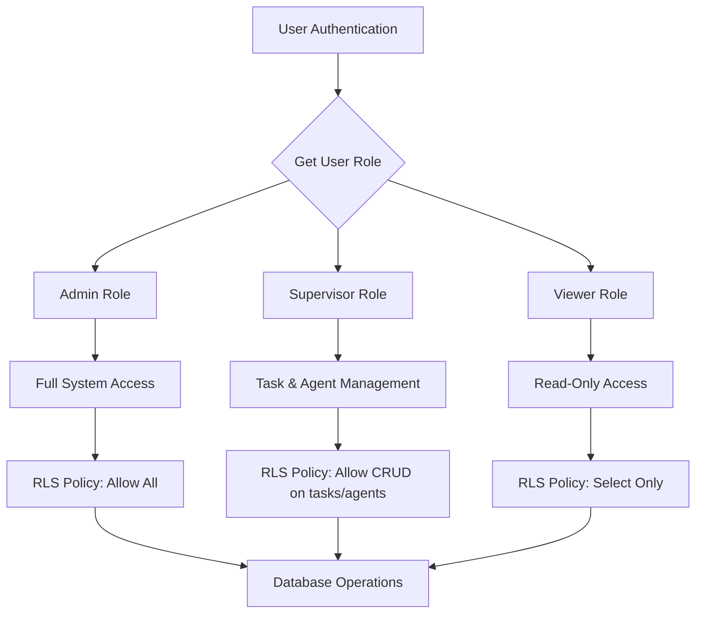
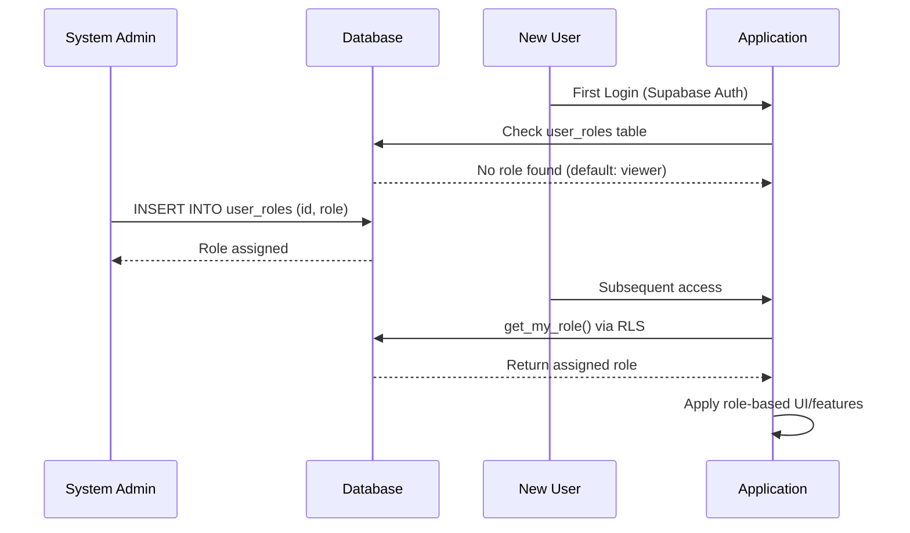
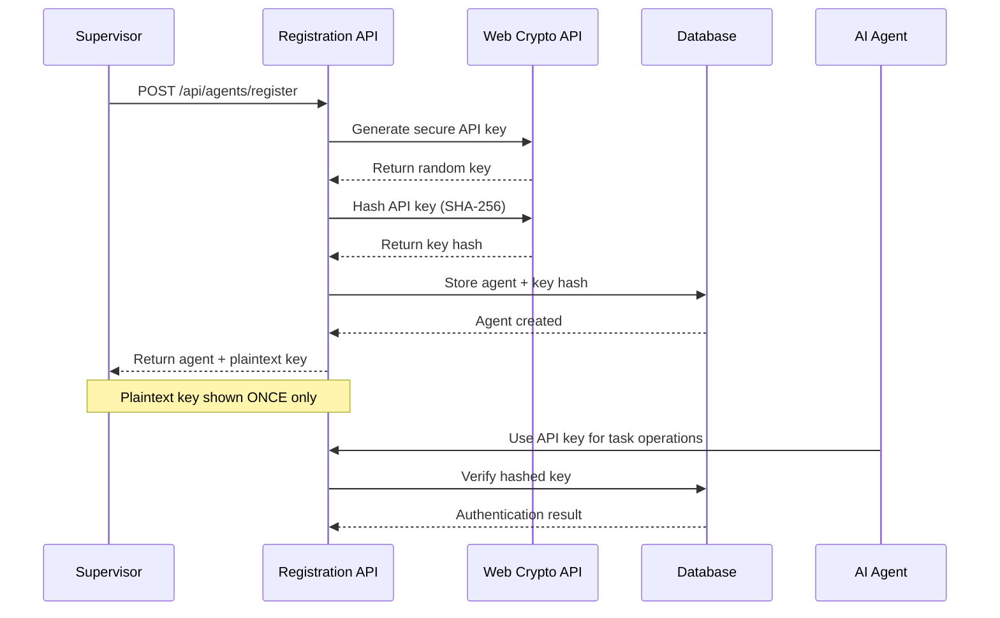
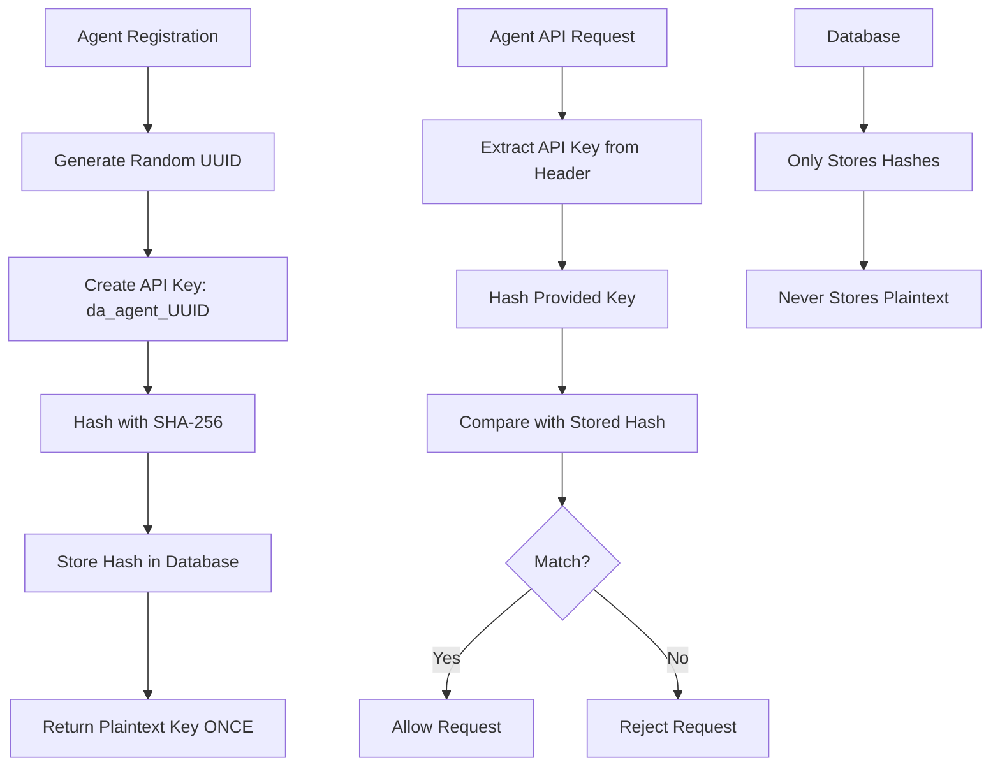
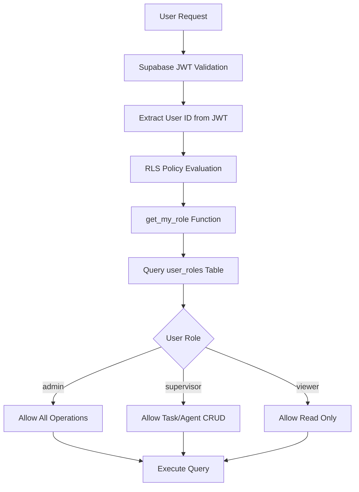

# Enterprise Governance Layer Design

## Overview

This design document outlines the implementation of enterprise-grade governance features for the DevArt.ai task orchestration platform. The governance layer transforms the system from a functional tool into a secure, manageable, and adaptable enterprise product by introducing role-based access control (RBAC), secure agent lifecycle management, and configurable system parameters.

### Core Objectives

- **Security**: Implement role-based access control with Row Level Security (RLS) policies
- **Agent Management**: Establish secure onboarding and lifecycle management for AI agents
- **Configurability**: Move hardcoded parameters to database-driven configuration
- **Auditability**: Maintain comprehensive audit trails for governance operations

## Technology Stack & Dependencies

### Database Layer
- **PostgreSQL with Supabase**: Enhanced with Row Level Security policies
- **User Roles**: Leveraging Supabase Auth with custom application roles
- **Cryptographic Security**: Web Crypto API for secure API key hashing

### Backend Extensions
- **Hono Framework**: New governance endpoints for role and agent management
- **Environment Variables**: Secure configuration management through Cloudflare Workers

### Frontend Enhancements
- **React Components**: New governance panels for role and settings management
- **Real-time Updates**: Supabase subscriptions for live governance data

## Component Architecture

### Database Schema Extensions



### Role-Based Access Control Architecture



## Role-Based Access Control Implementation

### User Role Schema

```sql
-- Application role enumeration
CREATE TYPE app_role AS ENUM ('admin', 'supervisor', 'viewer');

-- User roles mapping table
CREATE TABLE user_roles (
  id UUID PRIMARY KEY REFERENCES auth.users(id) ON DELETE CASCADE,
  role app_role NOT NULL DEFAULT 'viewer'
);
```

### Row Level Security Policies

The RBAC system enforces permissions at the database level using PostgreSQL's Row Level Security:

#### Helper Function
```sql
CREATE OR REPLACE FUNCTION get_my_role()
RETURNS app_role AS $$
DECLARE
  user_role app_role;
BEGIN
  SELECT role INTO user_role FROM user_roles WHERE id = auth.uid();
  RETURN user_role;
END;
$$ LANGUAGE plpgsql SECURITY DEFINER;
```

#### Task Table Security
```sql
-- Enable RLS on tasks table
ALTER TABLE tasks ENABLE ROW LEVEL SECURITY;

-- Supervisors and admins: full access
CREATE POLICY "Allow all access for supervisors and admins" ON tasks
  FOR ALL USING (get_my_role() IN ('supervisor', 'admin'));

-- Viewers: read-only access
CREATE POLICY "Allow read-only access for viewers" ON tasks
  FOR SELECT USING (get_my_role() = 'viewer');
```

#### Service Registry Security
```sql
-- Enable RLS on service_registry table
ALTER TABLE service_registry ENABLE ROW LEVEL SECURITY;

-- Supervisors and admins: full access
CREATE POLICY "Allow all access for supervisors and admins" ON service_registry
  FOR ALL USING (get_my_role() IN ('supervisor', 'admin'));

-- Viewers: read-only access  
CREATE POLICY "Allow read-only access for viewers" ON service_registry
  FOR SELECT USING (get_my_role() = 'viewer');
```

### Role Assignment Workflow



## Secure Agent Management

### Enhanced Agent Schema

The agent management system introduces secure API key-based authentication and lifecycle controls:

```sql
-- Enhanced agents table
ALTER TABLE agents
  ADD COLUMN api_key_hash TEXT,
  ADD COLUMN is_active BOOLEAN DEFAULT TRUE;
```

### Agent Registration Workflow



### Agent Registration API

```typescript
// POST /api/agents/register endpoint
app.post('/api/agents/register', async (c) => {
  const { alias, capabilities } = await c.req.json<{ 
    alias: string; 
    capabilities?: string[] 
  }>();
  
  if (!alias) return c.json({ error: 'Agent alias is required' }, 400);

  // Generate secure API key
  const apiKey = `da_agent_${crypto.randomUUID()}`;
  
  // Hash the API key using Web Crypto API
  const encoder = new TextEncoder();
  const data = encoder.encode(apiKey);
  const hashBuffer = await crypto.subtle.digest('SHA-256', data);
  const apiKeyHash = Array.from(new Uint8Array(hashBuffer))
    .map(b => b.toString(16).padStart(2, '0'))
    .join('');

  const supabase = createSupabaseClient(c.env);
  const { data: newAgent, error } = await supabase
    .from('agents')
    .insert({ alias, capabilities, api_key_hash: apiKeyHash })
    .select('id, alias, created_at')
    .single();

  if (error) {
    return c.json({ error: 'Could not register agent. Alias may be taken.' }, 500);
  }

  // Return plaintext key ONCE
  return c.json({ ...newAgent, apiKey });
});
```

### Agent Activation Management

```typescript
// PUT /api/agents/:agentId/activation endpoint
app.put('/api/agents/:agentId/activation', async (c) => {
  const agentId = c.req.param('agentId');
  const { isActive } = await c.req.json<{ isActive: boolean }>();

  const supabase = createSupabaseClient(c.env);
  const { data, error } = await supabase
    .from('agents')
    .update({ is_active: isActive })
    .eq('id', agentId)
    .select()
    .single();

  if (error) return c.json({ error: 'Agent not found' }, 404);
  return c.json(data);
});
```

### Agent Authentication Middleware

```typescript
// API key verification for agent endpoints
const verifyAgentApiKey = async (apiKey: string, supabase: SupabaseClient): Promise<Agent | null> => {
  // Hash the provided key
  const encoder = new TextEncoder();
  const data = encoder.encode(apiKey);
  const hashBuffer = await crypto.subtle.digest('SHA-256', data);
  const hashedKey = Array.from(new Uint8Array(hashBuffer))
    .map(b => b.toString(16).padStart(2, '0'))
    .join('');

  // Verify against database
  const { data: agent, error } = await supabase
    .from('agents')
    .select('*')
    .eq('api_key_hash', hashedKey)
    .eq('is_active', true)
    .single();

  return error ? null : agent;
};
```

## System Configuration Management

### Configuration Schema

The system configuration introduces a flexible key-value store for runtime parameters:

```sql
CREATE TABLE system_settings (
  key TEXT PRIMARY KEY,
  value JSONB NOT NULL,
  description TEXT,
  updated_at TIMESTAMPTZ DEFAULT NOW()
);

-- Initial configuration values
INSERT INTO system_settings (key, value, description)
VALUES ('outlier_detection_stddev', '2.0', 'Number of standard deviations above average cost to flag a task for review.');
```

### Dynamic Configuration Function

The performance monitoring function is enhanced to use configurable thresholds:

```sql
CREATE OR REPLACE FUNCTION flag_costly_tasks()
RETURNS void AS $$
DECLARE
  avg_cost NUMERIC;
  stddev_cost NUMERIC;
  threshold_stddev NUMERIC;
  threshold NUMERIC;
BEGIN
  -- Read dynamic threshold from settings
  SELECT (value::NUMERIC) INTO threshold_stddev 
  FROM system_settings 
  WHERE key = 'outlier_detection_stddev';

  SELECT AVG(total_cost), STDDEV(total_cost) 
  INTO avg_cost, stddev_cost 
  FROM task_cost_summary;
  
  -- Calculate dynamic threshold
  threshold := avg_cost + (threshold_stddev * stddev_cost);

  UPDATE tasks SET review_flag = TRUE WHERE id IN (
    SELECT task_id FROM task_cost_summary WHERE total_cost > threshold
  ) AND review_flag = FALSE;
END;
$$ LANGUAGE plpgsql;
```

### Configuration API Endpoints

```typescript
// GET /api/settings/:key
app.get('/api/settings/:key', async (c) => {
  const key = c.req.param('key');
  const supabase = createSupabaseClient(c.env);
  const { data, error } = await supabase
    .from('system_settings')
    .select('value')
    .eq('key', key)
    .single();
    
  if (error) return c.json({ error: 'Setting not found' }, 404);
  return c.json(data);
});

// PUT /api/settings/:key
app.put('/api/settings/:key', async (c) => {
  const key = c.req.param('key');
  const { value } = await c.req.json<{ value: any }>();
  
  const supabase = createSupabaseClient(c.env);
  const { data, error } = await supabase
    .from('system_settings')
    .update({ value, updated_at: new Date().toISOString() })
    .eq('key', key)
    .select()
    .single();
    
  if (error) return c.json({ error: 'Setting not found or could not be updated' }, 404);
  return c.json(data);
});
```

## UI Component Enhancements

### Agent Monitoring Panel Enhancement

The existing `AgentMonitoringPanel` component is enhanced with activation controls:

```typescript
interface Agent {
  id: string;
  alias: string;
  status: string;
  capabilities: string[];
  is_active: boolean;
  last_seen: string;
  created_at: string;
}

const handleToggleActivation = async (agent: Agent) => {
  await fetch(`/api/agents/${agent.id}/activation`, {
    method: 'PUT',
    headers: { 'Content-Type': 'application/json' },
    body: JSON.stringify({ isActive: !agent.is_active }),
  });
  // Real-time subscription handles UI update
};

// Enhanced agent display with toggle
<div className="flex justify-between items-center">
  <p className="font-semibold">{agent.alias}</p>
  <label className="inline-flex items-center cursor-pointer">
    <input 
      type="checkbox" 
      checked={agent.is_active} 
      onChange={() => handleToggleActivation(agent)} 
      className="sr-only peer" 
    />
    <div className="relative w-11 h-6 bg-gray-600 rounded-full peer peer-checked:after:translate-x-full peer-checked:after:border-white after:content-[''] after:absolute after:top-0.5 after:start-[2px] after:bg-white after:border-gray-300 after:border after:rounded-full after:h-5 after:w-5 after:transition-all peer-checked:bg-green-600"></div>
  </label>
</div>
```

### System Settings Panel

A new settings management component provides runtime configuration:

```typescript
'use client';

import { useEffect, useState } from 'react';

export default function SettingsPanel() {
  const [threshold, setThreshold] = useState('');
  const [initialValue, setInitialValue] = useState('');

  useEffect(() => {
    fetch('/api/settings/outlier_detection_stddev')
      .then(res => res.json())
      .then(data => {
        setThreshold(data.value);
        setInitialValue(data.value);
      });
  }, []);

  const handleSave = async () => {
    await fetch('/api/settings/outlier_detection_stddev', {
      method: 'PUT',
      headers: { 'Content-Type': 'application/json' },
      body: JSON.stringify({ value: parseFloat(threshold) }),
    });
    setInitialValue(threshold);
  };

  return (
    <div className="bg-gray-800 p-6 rounded-lg">
      <h2 className="text-2xl font-semibold mb-4">System Settings</h2>
      <div className="space-y-2">
        <label htmlFor="threshold" className="block text-sm font-medium text-gray-300">
          Outlier Threshold (Std. Devs)
        </label>
        <div className="flex items-center space-x-2">
          <input
            id="threshold"
            type="number"
            step="0.1"
            value={threshold}
            onChange={(e) => setThreshold(e.target.value)}
            className="block w-full bg-gray-700 border border-gray-600 rounded-md py-2 px-3 text-white"
          />
          <button 
            onClick={handleSave} 
            disabled={threshold === initialValue}
            className="bg-blue-600 hover:bg-blue-700 text-white font-bold py-2 px-4 rounded disabled:opacity-50"
          >
            Save
          </button>
        </div>
      </div>
    </div>
  );
}
```

### Agent Registration Panel

A new component for supervisor-level agent onboarding:

```typescript
'use client';

import { useState } from 'react';

export default function AgentRegistrationPanel() {
  const [alias, setAlias] = useState('');
  const [capabilities, setCapabilities] = useState('');
  const [registrationResult, setRegistrationResult] = useState<{
    agent?: any;
    apiKey?: string;
    error?: string;
  } | null>(null);

  const handleRegisterAgent = async () => {
    const capabilityArray = capabilities.split(',').map(c => c.trim()).filter(Boolean);
    
    const response = await fetch('/api/agents/register', {
      method: 'POST',
      headers: { 'Content-Type': 'application/json' },
      body: JSON.stringify({ alias, capabilities: capabilityArray }),
    });
    
    const result = await response.json();
    setRegistrationResult(result);
    
    if (!result.error) {
      setAlias('');
      setCapabilities('');
    }
  };

  return (
    <div className="bg-gray-800 p-6 rounded-lg">
      <h2 className="text-2xl font-semibold mb-4">Register New Agent</h2>
      
      <div className="space-y-4">
        <div>
          <label className="block text-sm font-medium text-gray-300 mb-2">
            Agent Alias
          </label>
          <input
            type="text"
            value={alias}
            onChange={(e) => setAlias(e.target.value)}
            className="block w-full bg-gray-700 border border-gray-600 rounded-md py-2 px-3 text-white"
            placeholder="e.g., python-refactor-agent-01"
          />
        </div>
        
        <div>
          <label className="block text-sm font-medium text-gray-300 mb-2">
            Capabilities (comma-separated)
          </label>
          <input
            type="text"
            value={capabilities}
            onChange={(e) => setCapabilities(e.target.value)}
            className="block w-full bg-gray-700 border border-gray-600 rounded-md py-2 px-3 text-white"
            placeholder="python, react, code-review"
          />
        </div>
        
        <button
          onClick={handleRegisterAgent}
          disabled={!alias.trim()}
          className="bg-green-600 hover:bg-green-700 text-white font-bold py-2 px-4 rounded disabled:opacity-50"
        >
          Register Agent
        </button>
      </div>

      {registrationResult && (
        <div className="mt-4 p-4 rounded-md bg-gray-700">
          {registrationResult.error ? (
            <p className="text-red-400">Error: {registrationResult.error}</p>
          ) : (
            <div>
              <p className="text-green-400 mb-2">Agent registered successfully!</p>
              <div className="bg-gray-900 p-3 rounded border">
                <p className="text-yellow-400 font-semibold mb-2">⚠️ Save this API key - it will not be shown again:</p>
                <code className="text-green-300 break-all">{registrationResult.apiKey}</code>
              </div>
            </div>
          )}
        </div>
      )}
    </div>
  );
}
```

## Security Architecture

### API Key Security Model



### Row Level Security Flow



### Environment Variable Security

| Variable | Location | Purpose |
|----------|----------|---------|
| `SUPABASE_URL` | API .env | Database connection |
| `SUPABASE_SERVICE_KEY` | API .env | Elevated database access |
| `NEXT_PUBLIC_SUPABASE_URL` | UI .env.local | Client-side connection |
| `NEXT_PUBLIC_SUPABASE_ANON_KEY` | UI .env.local | Client-side RLS key |

## Testing Strategy

### Unit Testing Framework

```typescript
// Example test for agent registration
describe('Agent Registration', () => {
  test('should generate unique API keys', async () => {
    const agent1 = await registerAgent('test-agent-1', ['python']);
    const agent2 = await registerAgent('test-agent-2', ['javascript']);
    
    expect(agent1.apiKey).not.toBe(agent2.apiKey);
    expect(agent1.apiKey).toMatch(/^da_agent_/);
  });
  
  test('should hash API keys before storage', async () => {
    const agent = await registerAgent('test-agent', ['python']);
    const storedAgent = await getAgentFromDB(agent.id);
    
    expect(storedAgent.api_key_hash).not.toBe(agent.apiKey);
    expect(storedAgent.api_key_hash).toMatch(/^[a-f0-9]{64}$/);
  });
});
```

### RLS Policy Testing

```sql
-- Test RLS policies in different user contexts
BEGIN;
  SELECT set_config('request.jwt.claims', '{"sub":"test-supervisor-id"}', true);
  
  -- Should allow task creation for supervisor role
  INSERT INTO tasks (title, description) VALUES ('Test Task', 'Test Description');
  
  -- Should return 1 row
  SELECT COUNT(*) FROM tasks WHERE title = 'Test Task';
ROLLBACK;
```

### Integration Testing

```typescript
describe('Governance Integration', () => {
  test('should enforce role-based task access', async () => {
    // Setup test users with different roles
    const admin = await createTestUser('admin');
    const supervisor = await createTestUser('supervisor');
    const viewer = await createTestUser('viewer');
    
    // Test task creation permissions
    await expect(createTask(admin.token)).resolves.toBeTruthy();
    await expect(createTask(supervisor.token)).resolves.toBeTruthy();
    await expect(createTask(viewer.token)).rejects.toThrow();
  });
});
```

This enterprise governance layer design provides comprehensive security, management, and configuration capabilities that transform the DevArt.ai platform into an enterprise-ready solution. The implementation maintains backward compatibility while introducing robust access controls and administrative features essential for production deployment.