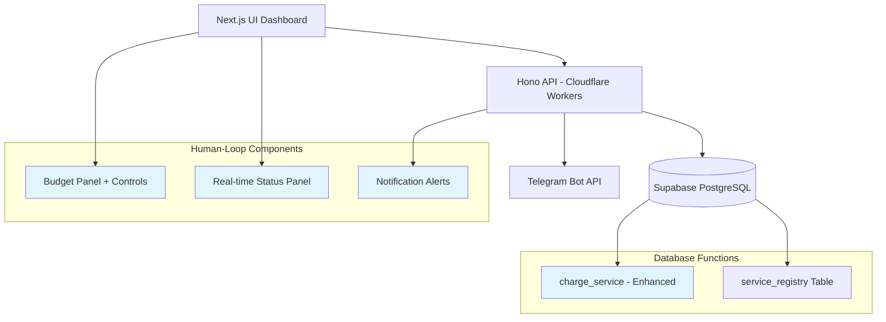
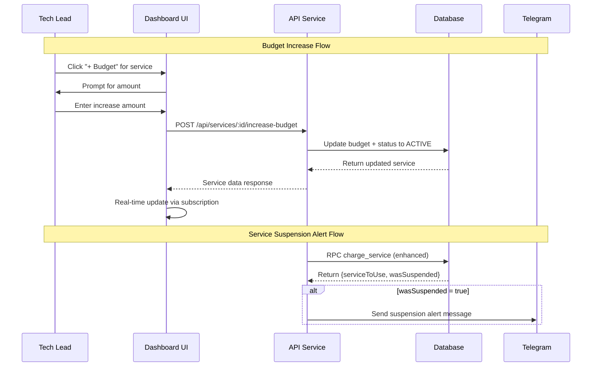
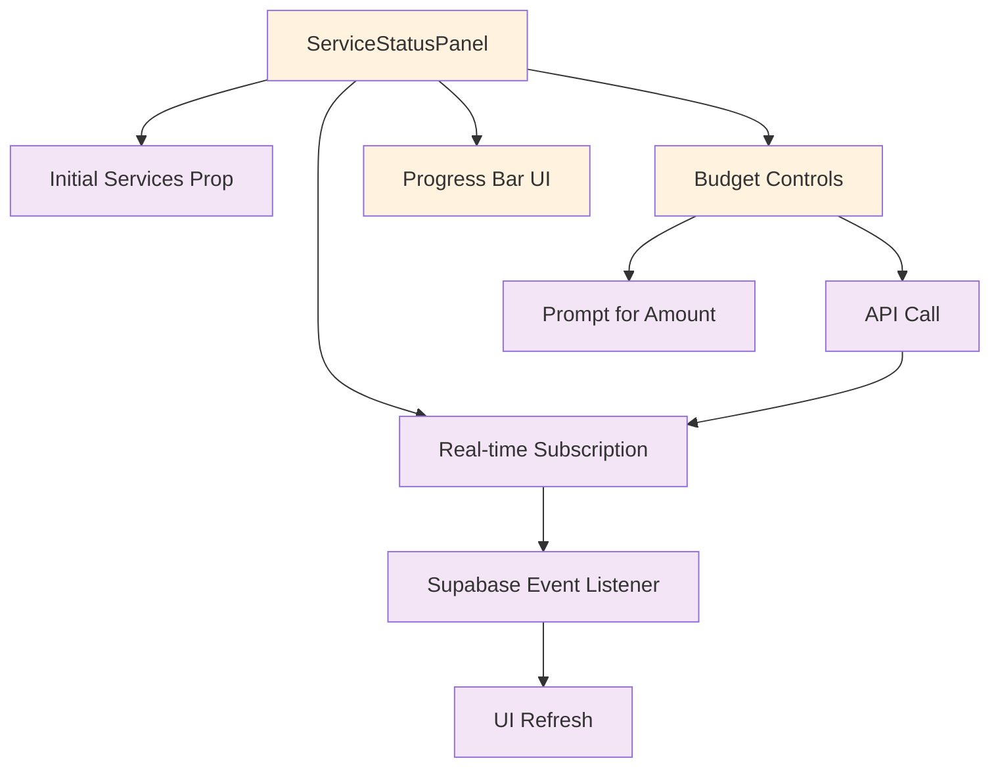
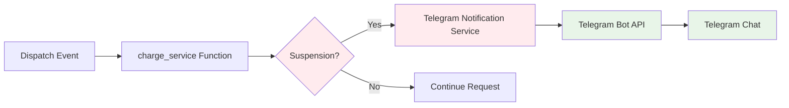

# Human-Loop Supervisor Tool Implementation Design

## Overview

This design outlines the implementation of human-in-the-loop supervisor capabilities for the devart.ai Budget Supervisor System. The system evolution transforms the current autonomous budget management into an interactive supervision tool with proactive alerting and user controls.

### Current System State
- Autonomous budget tracking with service suspension capabilities
- PostgreSQL-based atomic transactions using `charge_service` function
- Real-time task board with Supabase subscriptions
- Hono-based API with Cloudflare Workers deployment

### Target Enhancement
- **Human Control Interface**: Tech Lead controls for budget management
- **Real-time Monitoring**: Live service status dashboard with actionable controls
- **Proactive Alerting**: Telegram notifications for critical budget events

## Architecture

### System Components Overview



### Data Flow Architecture



## Task 1: Budget Management API Endpoints

### Objective
Create secure API endpoints enabling Tech Lead budget control and service reactivation capabilities.

### Technical Implementation

#### Service Registry Management Endpoints

| Endpoint | Method | Purpose | Input | Output |
|----------|--------|---------|--------|--------|
| `/api/services` | GET | Retrieve all services | None | Service[] |
| `/api/services/:id/increase-budget` | POST | Increase budget & reactivate | `{increaseAmount: number}` | Updated Service |

#### API Endpoint Specifications

**GET /api/services**
```typescript
// Response Schema
interface ServiceResponse {
  id: string;
  display_name: string;
  monthly_budget_usd: number;
  current_usage_usd: number;
  status: 'ACTIVE' | 'SUSPENDED';
  substitutor_service_id: string | null;
  created_at: string;
}[]
```

**POST /api/services/:id/increase-budget**
```typescript
// Request Schema
interface BudgetIncreaseRequest {
  increaseAmount: number; // Must be > 0
}

// Response Schema  
interface BudgetIncreaseResponse extends ServiceResponse {}
```

#### Validation Rules
- `increaseAmount` must be positive number
- Service ID must exist in service_registry
- Automatic status reset to 'ACTIVE' on budget increase
- Atomic operation: fetch current budget → calculate new budget → update with status

#### Error Handling Matrix

| Scenario | HTTP Code | Response |
|----------|-----------|----------|
| Service not found | 404 | `{error: "Service not found"}` |
| Invalid amount | 400 | `{error: "A positive increaseAmount is required"}` |
| Database error | 500 | `{error: "Could not update budget"}` |

## Task 2: Real-time Service Status Panel

### Objective
Replace static service status with dynamic, real-time component enabling budget control actions.

### Component Architecture

#### ServiceStatusPanel Component Design



#### Real-time Subscription Pattern

```typescript
// Subscription Implementation Pattern
useEffect(() => {
  const channel = supabase
    .channel('realtime-services')
    .on('postgres_changes', 
      { event: '*', schema: 'public', table: 'service_registry' },
      async () => {
        // Refetch all services on any change
        const { data } = await supabase.from('service_registry').select('*');
        setServices(data || []);
      }
    ).subscribe();

  return () => supabase.removeChannel(channel);
}, []);
```

#### Visual State Indicators

| Service Status | Border Color | Progress Bar Color | Interactive State |
|----------------|--------------|-------------------|-------------------|
| ACTIVE | Green (`border-green-500`) | Green (`bg-green-600`) | Budget button enabled |
| SUSPENDED | Red (`border-red-500`) | Red (`bg-red-600`) | Budget button enabled |

#### Usage Calculation Logic

```typescript
const usagePercent = service.monthly_budget_usd > 0
  ? (service.current_usage_usd / service.monthly_budget_usd) * 100
  : 0;
```

### Server-Side Integration

#### Page Component Enhancement

```typescript
// Enhanced getInitialServices function
async function getInitialServices(): Promise<Service[]> {
  const supabase = createClient(
    process.env.NEXT_PUBLIC_SUPABASE_URL!,
    process.env.NEXT_PUBLIC_SUPABASE_ANON_KEY!
  );
  const { data } = await supabase.from('service_registry').select('*');
  return data || [];
}
```

## Task 3: Telegram Notification Service

### Objective
Implement proactive Telegram alerting for automatic service suspensions during budget exhaustion.

### Notification Architecture

#### Telegram Integration Flow



#### Enhanced PostgreSQL Function

The `charge_service` function modification enables suspension detection:

```sql
-- Enhanced Return Type: JSONB with suspension signal
RETURNS JSONB AS $$
DECLARE
  was_suspended BOOLEAN := FALSE;
BEGIN
  -- Existing logic with suspension detection
  IF service.status = 'ACTIVE' THEN
    UPDATE service_registry SET status = 'SUSPENDED' WHERE id = service_id_to_charge;
    was_suspended := TRUE;  -- Key enhancement: track suspension event
  END IF;
  
  RETURN jsonb_build_object(
    'serviceToUse', row_to_json(substitutor_service),
    'wasSuspended', was_suspended  -- Signal for notification trigger
  );
END;
```

#### Telegram Service Module Structure

```typescript
// apps/api/src/services/telegram.ts
interface TelegramResponse {
  success: boolean;
  error?: string;
}

export async function sendTelegramMessage(
  env: Env, 
  message: string
): Promise<TelegramResponse>
```

#### Environment Configuration

| Variable | Purpose | Example Value |
|----------|---------|---------------|
| `TELEGRAM_BOT_TOKEN` | Bot authentication | `123456:ABC-DEF1234ghIkl-zyx57W2v1u123ew11` |
| `TELEGRAM_CHAT_ID` | Target chat/channel | `-1001234567890` |

#### Message Template Design

```markdown
*Budget Alert* 🚨

Service *{serviceId}* has been automatically suspended due to exceeding its budget.

Current Usage: ${current_usage_usd}
Budget Limit: ${monthly_budget_usd}
Status: SUSPENDED

Use the dashboard to increase the budget and reactivate the service.
```

### Notification Integration Pattern

#### API Endpoint Enhancement

```typescript
// Enhanced /api/tasks/dispatch with notification trigger
const { data: rpcResponse } = await supabase.rpc('charge_service', {
  service_id_to_charge: serviceId,
  charge_amount: cost,
});

const { serviceToUse, wasSuspended } = rpcResponse;

// Notification trigger point
if (wasSuspended) {
  const message = `*Budget Alert* 🚨\n\nService *${serviceId}* has been automatically suspended due to exceeding its budget.`;
  await sendTelegramMessage(c.env, message);
}
```

## Testing Strategy

### Unit Testing Requirements

#### API Endpoints Testing
```typescript
// Test Categories
describe('Budget Management API', () => {
  describe('GET /api/services', () => {
    it('should return all services with correct schema');
    it('should handle database connection errors');
  });
  
  describe('POST /api/services/:id/increase-budget', () => {
    it('should increase budget and reactivate service');
    it('should reject negative amounts');
    it('should handle non-existent service IDs');
  });
});
```

#### Real-time Component Testing
```typescript
describe('ServiceStatusPanel', () => {
  it('should render initial services correctly');
  it('should subscribe to real-time updates');
  it('should calculate usage percentages accurately');
  it('should trigger budget increase API calls');
});
```

#### Telegram Service Testing
```typescript
describe('Telegram Notification Service', () => {
  it('should send messages with correct format');
  it('should handle missing environment variables gracefully');
  it('should retry on network failures');
});
```

### Integration Testing Scenarios

| Scenario | Expected Behavior |
|----------|-------------------|
| Budget increase via UI | Real-time panel updates immediately |
| Service suspension | Telegram notification sent |
| Real-time subscription | UI reflects database changes |
| API endpoint failures | Graceful error handling in UI |

## Security Considerations

### Authentication & Authorization
- **Current State**: No authentication implemented (development phase)
- **Production Requirements**: JWT-based authentication for budget endpoints
- **Role-Based Access**: Tech Lead role verification for budget modifications

### Input Validation
- Server-side validation for all budget amounts
- SQL injection prevention through parameterized queries
- Cross-origin request validation via CORS middleware

### Environment Security
- Telegram bot tokens stored in environment variables
- Database credentials managed through Cloudflare Workers secrets
- No sensitive data in client-side code

## Performance Optimizations

### Real-time Subscriptions
- Single subscription channel for service_registry changes
- Debounced UI updates to prevent excessive re-renders
- Selective data fetching (only changed fields)

### API Response Caching
- Service list caching with cache invalidation on updates
- Optimistic UI updates for budget increases
- Background synchronization for data consistency

### Database Performance
- Indexed queries on service_registry.id
- Atomic transactions prevent lock contention
- Connection pooling via Supabase managed connections

## Deployment Configuration

### Environment Variables Setup

#### API Service (Cloudflare Workers)
```env
# Existing
SUPABASE_URL=https://[project].supabase.co
SUPABASE_SERVICE_KEY=[service_role_key]

# New for Telegram
TELEGRAM_BOT_TOKEN=[bot_token_from_botfather]
TELEGRAM_CHAT_ID=[target_chat_id]
```

#### UI Service (Next.js)
```env
# Existing (no changes required)
NEXT_PUBLIC_SUPABASE_URL=https://[project].supabase.co
NEXT_PUBLIC_SUPABASE_ANON_KEY=[anon_public_key]
```

### Database Migration Requirements
- Update `charge_service` function with enhanced return type
- Enable real-time replication on service_registry (if not already enabled)
- No schema changes required for existing tables

### API Routing Configuration
- New routes integrate with existing Hono application
- CORS middleware already configured for cross-origin requests
- No additional middleware required for new endpoints

## Implementation Checklist

### Task 1: Budget Management API
- [ ] Implement GET `/api/services` endpoint
- [ ] Implement POST `/api/services/:id/increase-budget` endpoint  
- [ ] Add input validation for budget amounts
- [ ] Integrate with existing Hono application routing
- [ ] Test endpoint responses and error handling

### Task 2: Real-time Service Status Panel
- [ ] Create ServiceStatusPanel component with real-time subscriptions
- [ ] Implement budget increase UI controls with prompt dialogs
- [ ] Add visual status indicators (colors, progress bars)
- [ ] Integrate server-side data fetching in page component
- [ ] Test real-time updates and UI interactions

### Task 3: Telegram Notification Service
- [ ] Create Telegram service module with message sending
- [ ] Enhance charge_service PostgreSQL function return type
- [ ] Integrate notification trigger in dispatch endpoint
- [ ] Configure environment variables for Telegram integration
- [ ] Test notification delivery and error handling

### Integration & Testing
- [ ] End-to-end testing of budget increase flow
- [ ] Real-time subscription synchronization testing
- [ ] Telegram notification delivery verification
- [ ] Error handling and edge case validation
- [ ] Performance testing under concurrent requests