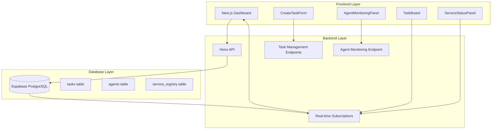
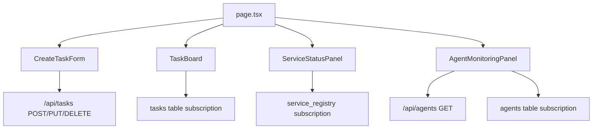
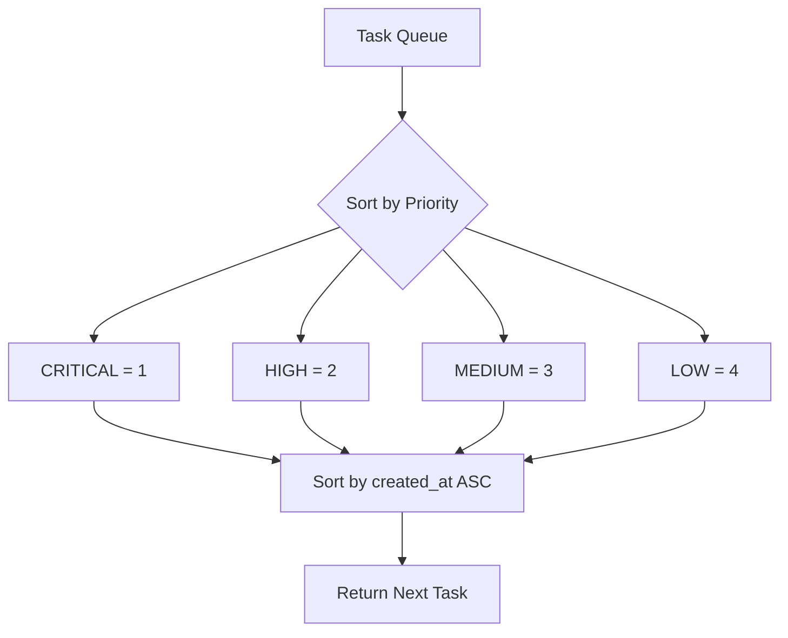
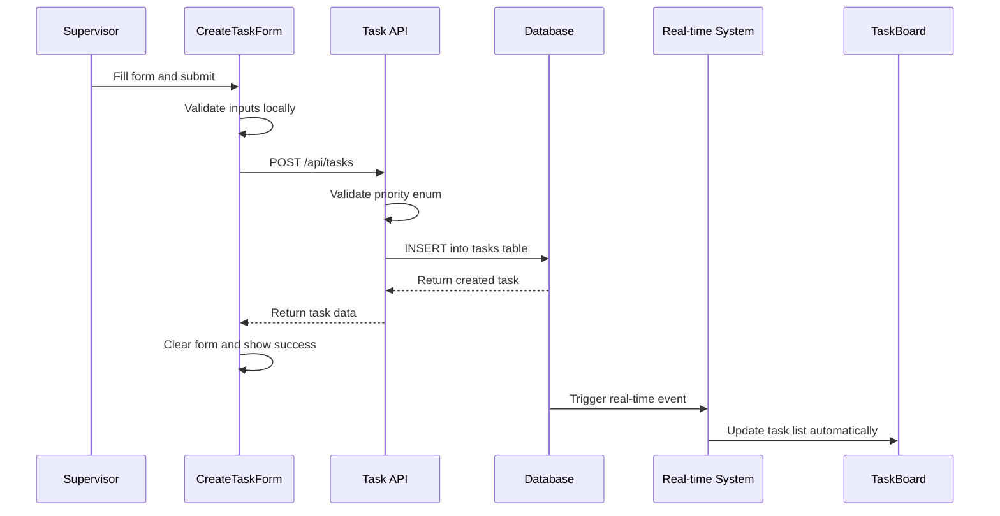
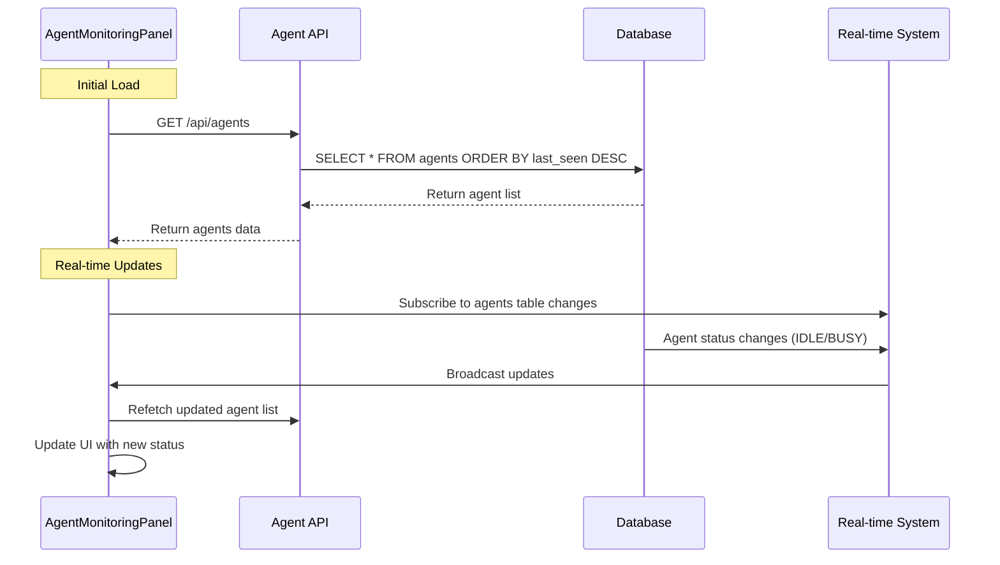
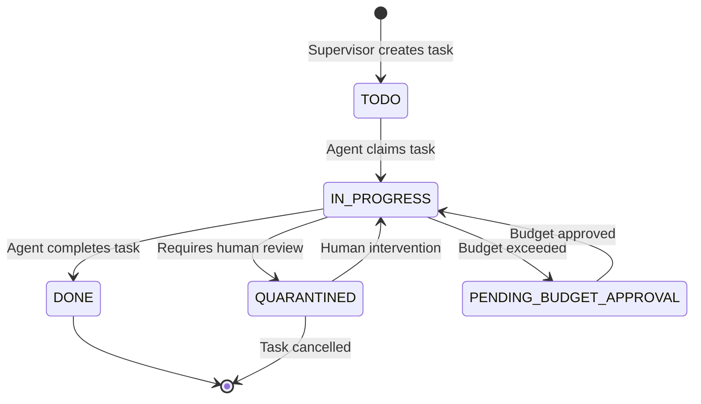
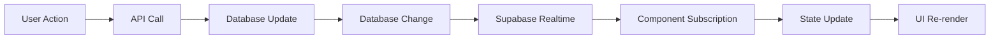

# Human-Supervisor Interface Design

## Overview

The Human-Supervisor Interface transforms the devart.ai system from a passive monitoring dashboard into an active command and control center. This evolution enables human supervisors to directly manage the AI agent workforce by creating tasks, monitoring agent health, and maintaining full oversight of the orchestration system. The interface builds upon the existing real-time architecture while introducing new interactive capabilities for task management and agent monitoring.

## Architecture

### System Context

The Human-Supervisor Interface operates within the existing three-tier architecture:



### Component Hierarchy



## API Endpoints Reference

### Task Management Endpoints

#### POST /api/tasks
Creates a new task in the system.

**Request Schema:**
```typescript
{
  title: string;           // Required: Task title
  description?: string;    // Optional: Task description
  priority: 'LOW' | 'MEDIUM' | 'HIGH' | 'CRITICAL'; // Required
}
```

**Response Schema:**
```typescript
{
  id: string;
  title: string;
  description: string | null;
  status: 'TODO';
  priority: string;
  agent_id: null;
  created_at: string;
  updated_at: string;
}
```

**Validation Rules:**
- Title is required and must not be empty
- Priority must be one of: LOW, MEDIUM, HIGH, CRITICAL
- Status defaults to 'TODO'
- Agent ID defaults to null

#### PUT /api/tasks/:taskId
Updates an existing task's properties.

**Request Schema:**
```typescript
{
  title?: string;
  description?: string;
  priority?: 'LOW' | 'MEDIUM' | 'HIGH' | 'CRITICAL';
}
```

**Authentication Requirements:**
- Currently unauthenticated (production requires authorization)
- Validates task existence before update
- Supports partial updates

#### DELETE /api/tasks/:taskId
Removes a task from the system.

**Cascade Behavior:**
- Automatically removes related service_usage_log entries
- Uses ON DELETE CASCADE constraint from database schema

### Agent Monitoring Endpoint

#### GET /api/agents
Retrieves all registered agents with their current status.

**Response Schema:**
```typescript
Agent[] = {
  id: string;
  alias: string;
  status: 'IDLE' | 'BUSY';
  capabilities: string[];
  last_seen: string;
  created_at: string;
}[]
```

**Ordering:**
- Results ordered by last_seen timestamp (descending)
- Most recently active agents appear first

## Data Models & ORM Mapping

### Task Entity

```typescript
interface Task {
  id: string;                    // UUID primary key
  title: string;                 // Human-readable task name
  description: string | null;    // Optional detailed description
  status: TaskStatus;            // Current task state
  priority: TaskPriority;        // Task urgency level
  agent_id: string | null;       // Currently assigned agent
  created_at: string;            // Task creation timestamp
  updated_at: string;            // Last modification timestamp
}

type TaskStatus = 'TODO' | 'IN_PROGRESS' | 'DONE' | 'QUARANTINED' | 'PENDING_BUDGET_APPROVAL';
type TaskPriority = 'LOW' | 'MEDIUM' | 'HIGH' | 'CRITICAL';
```

### Agent Entity

```typescript
interface Agent {
  id: string;              // UUID primary key
  alias: string;           // Human-readable agent identifier
  status: AgentStatus;     // Current working state
  capabilities: string[];   // Array of agent capabilities
  last_seen: string;       // Heartbeat timestamp
  created_at: string;      // Agent registration timestamp
}

type AgentStatus = 'IDLE' | 'BUSY';
```

### Priority-Based Task Selection

Task selection follows priority-based ordering with tiebreaker logic:



## Business Logic Layer

### Task Creation Workflow



### Agent Monitoring Workflow



### Task Status Lifecycle



## Component Architecture

### CreateTaskForm Component

**Purpose:** Provides interface for supervisors to create new tasks

**Component Definition:**
```typescript
'use client';
interface CreateTaskFormState {
  title: string;
  description: string;
  priority: TaskPriority;
  isSubmitting: boolean;
  message: string;
}
```

**Props/State Management:**
- Uses React useState for form state management
- Controlled component pattern for all form inputs
- Local validation before API submission

**Lifecycle Methods/Hooks:**
- useState for form state management
- useEffect not required (no subscription needed)
- Custom handleSubmit for form processing

**Example Usage:**
```tsx
<CreateTaskForm />
// No props required - self-contained component
```

### AgentMonitoringPanel Component

**Purpose:** Displays real-time status of all registered agents

**Component Definition:**
```typescript
'use client';
interface AgentMonitoringPanelProps {
  initialAgents: Agent[];
}
```

**Props/State Management:**
- Accepts initialAgents prop for server-side rendering
- Uses useState to manage current agent list
- Subscribes to real-time updates via Supabase

**Lifecycle Methods/Hooks:**
- useState for agent state management
- useEffect for real-time subscription setup
- Custom timeAgo utility for human-readable timestamps

**Example Usage:**
```tsx
<AgentMonitoringPanel initialAgents={serverFetchedAgents} />
```

## Routing & Navigation

### Page Integration

The Human-Supervisor Interface integrates into the existing dashboard layout:

```tsx
// apps/ui/src/app/page.tsx
export default async function HomePage() {
  const initialTasks = await getInitialTasks();
  const initialServices = await getInitialServices();
  const initialAgents = await getInitialAgents(); // New fetch function

  return (
    <main className="container mx-auto p-8">
      <div className="grid grid-cols-1 md:grid-cols-3 gap-8">
        <div className="md:col-span-2 space-y-8">
          <CreateTaskForm />           {/* New component */}
          <TaskBoard initialTasks={initialTasks} />
        </div>
        <div className="space-y-8">
          <ServiceStatusPanel initialServices={initialServices} />
          <AgentMonitoringPanel initialAgents={initialAgents} /> {/* New component */}
        </div>
      </div>
    </main>
  );
}
```

## Styling Strategy

### Tailwind CSS Classes

The interface follows the existing dark theme design system:

**Form Elements:**
```css
/* Input Fields */
.input-field {
  @apply mt-1 block w-full bg-gray-700 border border-gray-600 rounded-md shadow-sm py-2 px-3 text-white focus:outline-none focus:ring-blue-500 focus:border-blue-500;
}

/* Buttons */
.primary-button {
  @apply bg-blue-600 hover:bg-blue-700 text-white font-bold py-2 px-4 rounded disabled:opacity-50;
}

/* Status Badges */
.status-badge-busy {
  @apply px-2 py-1 text-xs font-bold rounded-full bg-yellow-500;
}

.status-badge-idle {
  @apply px-2 py-1 text-xs font-bold rounded-full bg-green-500;
}
```

**Panel Layout:**
```css
.panel-container {
  @apply bg-gray-800 p-6 rounded-lg;
}

.scrollable-list {
  @apply space-y-3 max-h-96 overflow-y-auto;
}
```

## State Management

### Real-time Data Flow

The interface leverages Supabase real-time subscriptions for live updates:



### Subscription Management

```typescript
// Real-time subscription pattern
useEffect(() => {
  const channel = supabase
    .channel('realtime-table-name')
    .on('postgres_changes', 
        { event: '*', schema: 'public', table: 'table_name' },
        async () => {
          // Refetch data on any change
          const { data } = await supabase.from('table_name').select('*');
          setState(data || []);
        }
    )
    .subscribe();

  return () => { supabase.removeChannel(channel); };
}, []);
```

## API Integration Layer

### Client-Side API Calls

**Task Creation:**
```typescript
const response = await fetch('/api/tasks', {
  method: 'POST',
  headers: { 'Content-Type': 'application/json' },
  body: JSON.stringify({ title, description, priority })
});
```

**Agent Monitoring:**
```typescript
const response = await fetch('/api/agents');
const agents = await response.json();
```

### Error Handling

```typescript
// Standard error handling pattern
if (response.ok) {
  const data = await response.json();
  // Handle success
} else {
  const { error } = await response.json();
  setMessage(`Error: ${error}`);
}
```

## Testing Strategy

### Unit Testing Components

**CreateTaskForm Tests:**
```typescript
describe('CreateTaskForm', () => {
  test('validates required fields before submission', () => {
    // Test form validation logic
  });
  
  test('submits correct payload to API', () => {
    // Test API integration
  });
  
  test('clears form after successful submission', () => {
    // Test state reset behavior
  });
});
```

**AgentMonitoringPanel Tests:**
```typescript
describe('AgentMonitoringPanel', () => {
  test('displays initial agents correctly', () => {
    // Test props rendering
  });
  
  test('updates when real-time data changes', () => {
    // Test subscription behavior
  });
  
  test('formats timestamps correctly', () => {
    // Test timeAgo utility function
  });
});
```

### API Endpoint Testing

**Task Management Endpoints:**
```typescript
describe('Task API Endpoints', () => {
  test('POST /api/tasks validates priority enum', () => {
    // Test input validation
  });
  
  test('PUT /api/tasks handles partial updates', () => {
    // Test update logic
  });
  
  test('DELETE /api/tasks cascades related records', () => {
    // Test cascade behavior
  });
});
```

### Integration Testing

**Real-time Flow Testing:**
```typescript
describe('Real-time Integration', () => {
  test('task creation triggers UI updates', async () => {
    // Test end-to-end workflow
    // 1. Create task via API
    // 2. Verify real-time subscription fires
    // 3. Confirm UI updates automatically
  });
});
```