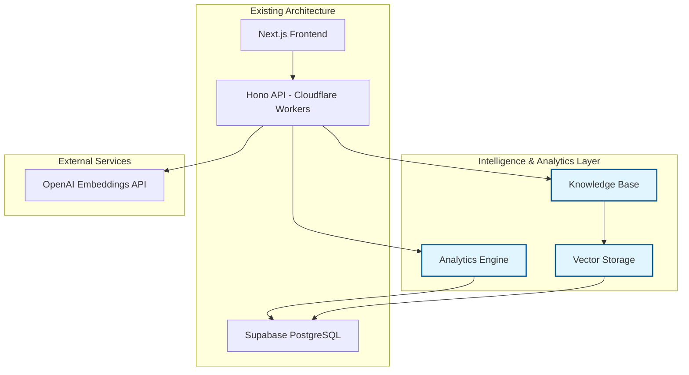
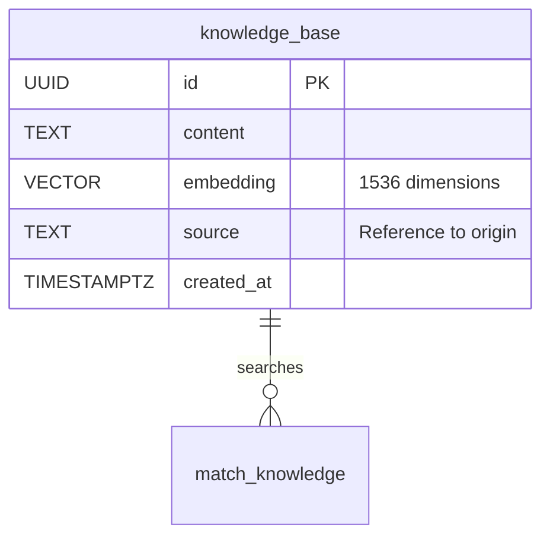
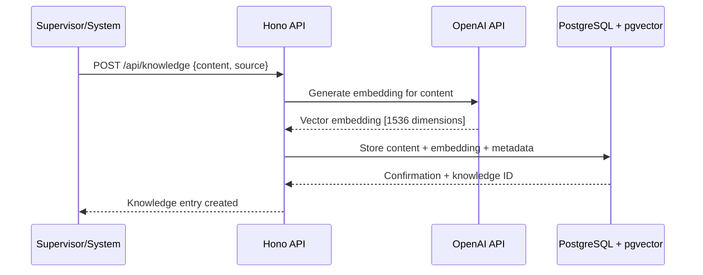
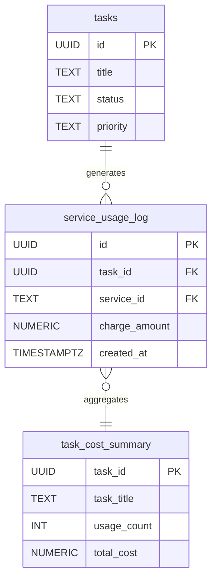
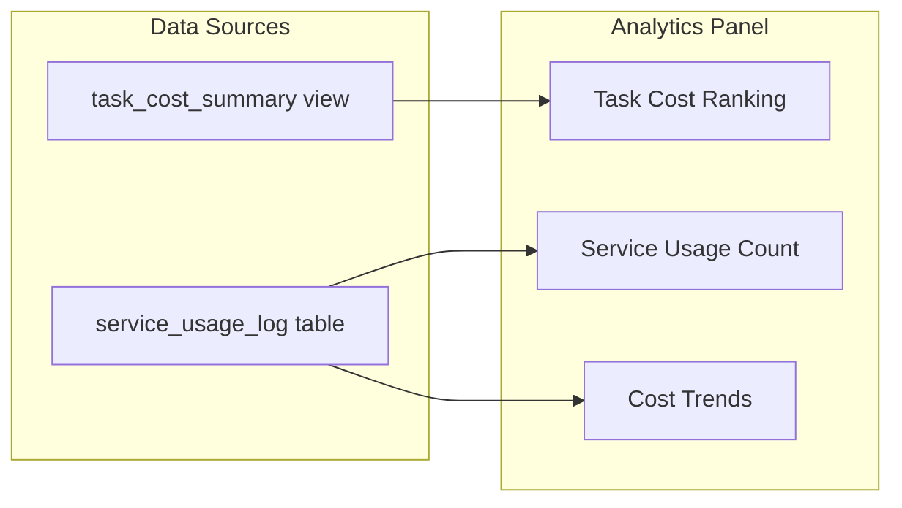
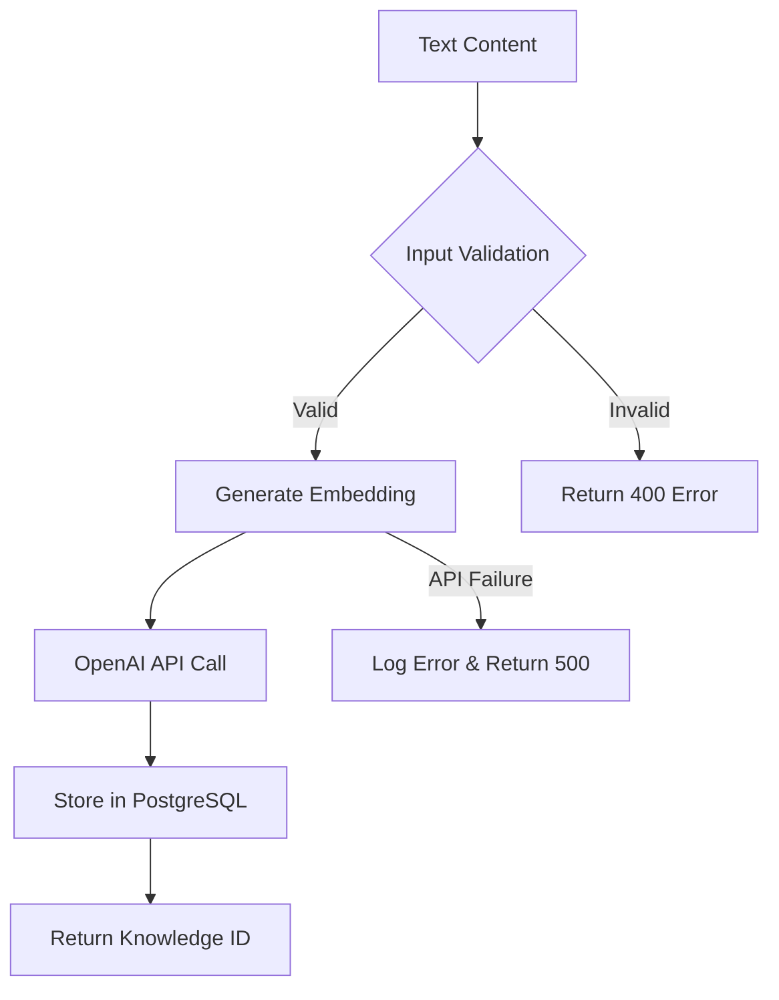
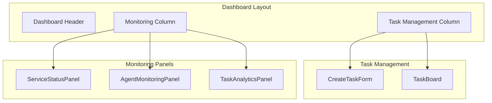
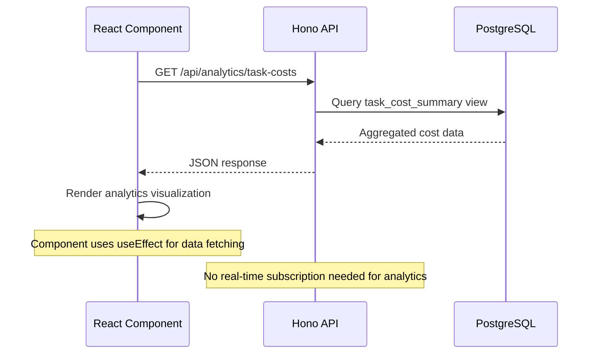

# Intelligence and Analytics Layer Design

## Overview

The Intelligence and Analytics Layer represents a strategic evolution of the devart.ai platform, transforming it from a task orchestrator into a context-aware, self-analyzing system. This layer adds two critical capabilities: **contextual knowledge retrieval** for agents and **performance analytics** for supervisors, enabling data-driven insights and informed decision-making.

### Strategic Objective
Transform the platform to provide:
- **Agent Intelligence**: Context-aware assistance through a vector-based knowledge retrieval system
- **Supervisor Analytics**: Performance insights and cost analysis for data-driven management
- **Self-Learning Capabilities**: Foundation for historical performance analysis and system optimization

### Core Value Proposition
- **Enhanced Agent Performance**: Agents can access relevant contextual information to make better decisions
- **Data-Driven Supervision**: Supervisors gain visibility into system performance and cost patterns
- **Scalable Intelligence**: Vector-based search enables semantic understanding of organizational knowledge

## Architecture

The Intelligence and Analytics Layer consists of three integrated components that extend the existing three-tier architecture:



### Component Responsibilities

| Component | Purpose | Technology |
|-----------|---------|------------|
| **Knowledge Base** | Stores and retrieves contextual information using semantic search | PostgreSQL + pgvector |
| **Analytics Engine** | Aggregates and presents performance metrics and cost analysis | PostgreSQL Views + REST API |
| **Vector Storage** | Enables semantic similarity search across knowledge content | pgvector extension |

## Knowledge Base System

### Data Model

The knowledge base uses a vector-embeddings approach for semantic search capabilities:



### Vector Storage Schema

```sql
-- Knowledge Base Table
CREATE TABLE knowledge_base (
  id UUID PRIMARY KEY DEFAULT gen_random_uuid(),
  content TEXT NOT NULL,
  embedding VECTOR(1536), -- OpenAI text-embedding-ada-002 dimensions
  source TEXT, -- Origin reference (e.g., 'ADR-001.md', 'auth_service/utils.py')
  created_at TIMESTAMPTZ DEFAULT NOW()
);
```

### Semantic Search Function

```sql
CREATE OR REPLACE FUNCTION match_knowledge (
  query_embedding VECTOR(1536),
  match_threshold FLOAT,
  match_count INT
)
RETURNS TABLE (
  id UUID,
  content TEXT,
  source TEXT,
  similarity FLOAT
)
```

### Knowledge Ingestion Workflow



## Analytics Engine

### Cost Analytics Data Model

The analytics engine leverages the existing `service_usage_log` table through aggregation views:



### Analytics Views

```sql
-- Task Cost Aggregation View
CREATE OR REPLACE VIEW task_cost_summary AS
  SELECT
    t.id AS task_id,
    t.title AS task_title,
    COUNT(sul.id) AS usage_count,
    SUM(sul.charge_amount) AS total_cost
  FROM tasks AS t
  JOIN service_usage_log AS sul ON t.id = sul.task_id
  GROUP BY t.id, t.title
  ORDER BY total_cost DESC;
```

### Analytics Dashboard Integration



## API Layer Extensions

### Knowledge Management Endpoints

| Endpoint | Method | Purpose | Input | Output |
|----------|--------|---------|-------|--------|
| `/api/knowledge` | POST | Ingest new knowledge | `{content, source?}` | Knowledge entry with ID |
| `/api/knowledge/search` | POST | Semantic search | `{query, threshold?, limit?}` | Ranked results with similarity |

### Analytics Endpoints

| Endpoint | Method | Purpose | Output |
|----------|--------|---------|--------|
| `/api/analytics/task-costs` | GET | Task cost summary | Ranked cost analysis |
| `/api/analytics/service-usage` | GET | Service utilization metrics | Usage patterns by service |
| `/api/analytics/performance-trends` | GET | Historical performance data | Time-series analytics |

### Knowledge Ingestion Service Architecture



## UI Component Integration

### Analytics Panel Component

The TaskAnalyticsPanel integrates into the existing dashboard layout:



### Real-time Data Integration Pattern



## Implementation Tasks Breakdown

### Task 1: Vector Database Foundation
**Objective**: Establish vector storage capability within PostgreSQL

**Technical Implementation**:
- Enable pgvector extension in Supabase dashboard
- Create `knowledge_base` table with vector column (1536 dimensions)
- Implement `match_knowledge` function for cosine similarity search
- Add appropriate indexes for vector operations

**Database Schema Changes**:
```sql
-- Enable vector extension (via Supabase dashboard)
CREATE EXTENSION IF NOT EXISTS vector;

-- Knowledge base table with vector support
CREATE TABLE knowledge_base (
  id UUID PRIMARY KEY DEFAULT gen_random_uuid(),
  content TEXT NOT NULL,
  embedding VECTOR(1536),
  source TEXT,
  created_at TIMESTAMPTZ DEFAULT NOW()
);

-- Semantic search function
CREATE OR REPLACE FUNCTION match_knowledge (
  query_embedding VECTOR(1536),
  match_threshold FLOAT,
  match_count INT
)
RETURNS TABLE (id UUID, content TEXT, source TEXT, similarity FLOAT)
```

### Task 2: Knowledge Ingestion API
**Objective**: Create endpoint for adding contextual knowledge

**API Implementation**:
- New embedding service module (`apps/api/src/services/embedding.ts`)
- OpenAI integration for text-to-vector conversion
- POST `/api/knowledge` endpoint for content ingestion
- Error handling for external API failures

**Service Architecture**:
```typescript
// Embedding service structure
interface EmbeddingService {
  generateEmbedding(text: string): Promise<number[] | null>;
}

// API endpoint flow
POST /api/knowledge → Generate Embedding → Store in DB → Return ID
```

### Task 3: Analytics Dashboard Panel
**Objective**: Provide cost insights through UI visualization

**UI Implementation**:
- `TaskAnalyticsPanel.tsx` component for cost visualization
- Database view `task_cost_summary` for efficient aggregation
- GET `/api/analytics/task-costs` endpoint
- Integration with existing dashboard layout

**Component Integration**:
```tsx
// Panel integration in main page
<div className="space-y-8">
  <ServiceStatusPanel />
  <AgentMonitoringPanel />
  <TaskAnalyticsPanel /> {/* New analytics panel */}
</div>
```

## Testing Strategy

### Unit Testing Requirements
- **Embedding Service**: Mock OpenAI API responses, test error handling
- **Database Functions**: Test vector search accuracy and performance
- **Analytics Views**: Validate cost aggregation correctness
- **UI Components**: Test data rendering and loading states

### Integration Testing Scenarios
- **End-to-End Knowledge Flow**: Content ingestion → embedding generation → storage → retrieval
- **Analytics Data Pipeline**: Service usage → cost aggregation → UI display
- **Error Handling**: External API failures, invalid inputs, database errors

### Performance Testing Considerations
- **Vector Search Performance**: Query response times with large knowledge bases
- **Analytics Query Optimization**: View performance with historical data
- **Concurrent Embedding Generation**: Multiple simultaneous knowledge ingestion requests

## Security and Privacy Considerations

### Data Protection
- **API Key Security**: OpenAI API keys stored as Cloudflare Worker secrets
- **Input Validation**: Sanitize content before embedding generation
- **Access Control**: Authenticate knowledge ingestion requests

### Privacy Measures
- **Content Filtering**: Avoid storing sensitive or personal information
- **Audit Logging**: Track knowledge ingestion and access patterns
- **Data Retention**: Implement policies for knowledge base cleanup

## Performance Characteristics

### Vector Search Performance
- **Query Response Time**: Sub-100ms for semantic search queries
- **Embedding Generation**: 1-3 seconds per content chunk via OpenAI API
- **Storage Efficiency**: Optimal vector indexing for large knowledge bases

### Analytics Performance
- **Dashboard Load Time**: Real-time cost analytics aggregation
- **Data Freshness**: Analytics reflect recent service usage within minutes
- **Scalability**: View-based aggregation handles growing usage logs efficiently

## Future Enhancement Opportunities

### Advanced Analytics
- **Trend Analysis**: Historical performance patterns and predictions
- **Cost Optimization**: Automated recommendations for service usage
- **Agent Performance Metrics**: Individual agent productivity analytics

### Enhanced Knowledge Capabilities
- **Document Chunking**: Intelligent text segmentation for better embeddings
- **Multi-modal Content**: Support for code, images, and structured data
- **Knowledge Graph**: Relationship mapping between knowledge entities

### AI-Powered Insights
- **Predictive Analytics**: Forecast task costs and completion times
- **Anomaly Detection**: Identify unusual usage patterns or performance issues
- **Automated Optimization**: Self-adjusting system parameters based on performance data