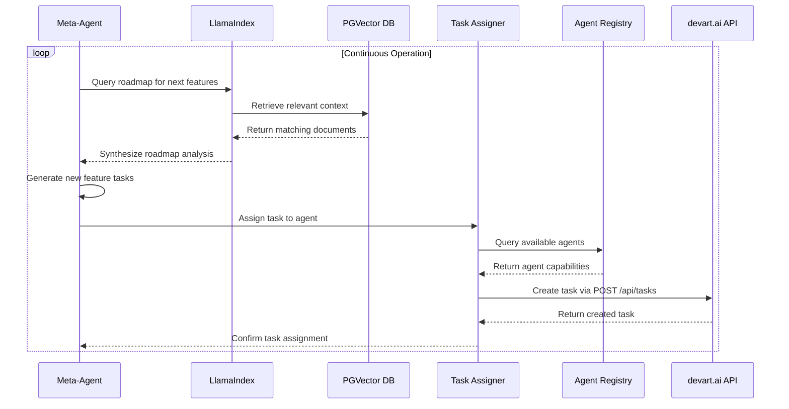

# Meta-Agent System Design Document

## 1. Overview

The Meta-Agent System is designed to create a fully self-evolving platform that can analyze its own roadmap, generate tasks for new features, and assign them to other agents. This system implements a hybrid approach using LlamaIndex for the "Analysis" layer and Langroid for the "Orchestration" layer.

The system builds upon the existing devart.ai platform architecture, extending its capabilities to enable autonomous platform evolution. By analyzing complex roadmap documents (PDFs with text, tables, and images), the meta-agent can generate new feature tasks and assign them to appropriate agents, creating a self-improving system.

### 1.1 Objectives

- Develop a meta-agent that can analyze complex roadmap documents (PDFs with text, tables, and images)
- Build a hybrid knowledge structure (Vector Store + Knowledge Graph) from roadmap documents
- Create a multi-agent system that can reason about the roadmap and generate actionable engineering tasks
- Enable automated evaluation and feedback loop for continuous improvement
- Integrate with the existing devart.ai platform for task creation and agent assignment

### 1.2 Key Technologies

- **LlamaIndex**: For best-in-class RAG and data ingestion capabilities
- **Langroid**: For robust multi-agent orchestration
- **Hybrid RAG & Knowledge Graph**: Combining semantic vector search with structured graph queries
- **Advanced Data Ingestion**: PDF parsing and OCR for handling images within documents
- **Multi-Agent Orchestration**: Team of specialized agents (Supervisor, Spec-Writer, Task-Generator)
- **Automated Evaluation**: Creating evaluation tasks to measure feature success

## 2. Architecture

The Meta-Agent System follows a two-phase architecture with clear separation between data analysis and task orchestration:

```mermaid
graph TD
    subgraph "Phase 1: Knowledge Core Ingestion (LlamaIndex)"
        A[Roadmap Documents <br/>(PDFs with text, tables and images)] --> B{Sophisticated Ingestion Pipeline};
        B --> C[PDF Parsing & OCR for Images];
        C --> D[Advanced Chunking <br/>(RecursiveCharacterTextSplitter)];
        D --> E[OpenAI & Cohere Embeddings];
        E --> F[PGVector Store];
        
        C --> G[Entity & Relationship Extraction <br/>(LLM Call)];
        G --> H[Knowledge Graph <br/>(Structured JSON in Postgres)];
    end

    subgraph "Phase 2: Multi-Agent Forge (Langroid)"
        I[Supervisor Agent (Meta-Agent)] -- "1. What is the next strategic priority?" --> J{Hybrid Query Engine (LlamaIndex)};
        J -- "2a. Semantic Search" --> F;
        J -- "2b. Structured Query" --> H;
        J -- "3. Synthesized Answer" --> I;
        
        I -- "4. 'Draft a technical spec for this feature'" --> K[Spec-Writer Agent];
        K -- "5. 'Break this spec into engineering tasks'" --> L[Task-Generator Agent];
        L -- "6. 'Create these tasks in devart.ai'" --> M[API Tool];
        M --> N[devart.ai Task Queue];
        
        I -- "7. 'Create an evaluation task to measure success'" --> L;
    end
```

### 2.1 Component Breakdown

#### 2.1.1 LlamaIndex Analysis Layer

The LlamaIndex Analysis Layer is responsible for ingesting and processing the platform's roadmap documents.

##### Document Ingestion Pipeline
- Supports multiple document formats (PDF, Markdown, plain text)
- Uses LlamaIndex Readers for robust document parsing
- Implements intelligent chunking strategies based on document structure
- Extracts metadata such as document type, version, and creation date
- Integrates OCR tools like pytesseract to extract text from images in PDFs
- Uses advanced chunking techniques such as RecursiveCharacterTextSplitter

##### Semantic Indexing
- Generates embeddings using OpenAI's text-embedding-ada-002 model
- Stores embeddings in PGVector database for efficient similarity search
- Implements RouterQueryEngine for deciding between vector search and structured queries
- Maintains up-to-date index as roadmap documents evolve

##### Knowledge Graph Construction
- Extracts entities (features, goals, dates) and relationships using LLM calls
- Stores structured relationships in a PostgreSQL table (roadmap_kg)
- Enables structured queries for contextual understanding

#### 2.1.2 Langroid Orchestration Layer

The Langroid Orchestration Layer is responsible for analyzing roadmap context, generating tasks, and assigning them to appropriate agents.

##### Meta-Agent (Supervisor Agent)
- Central agent that analyzes roadmap context and generates new tasks
- Uses LLM reasoning to break down complex features into manageable sub-tasks
- Prioritizes tasks based on roadmap positioning and dependencies
- Orchestrates communication between specialized agents

##### Spec-Writer Agent
- Receives high-level feature goals from the Supervisor
- Interacts with the LLM to produce detailed technical specifications
- Formats specifications for consumption by the Task-Generator Agent

##### Task-Generator Agent
- Receives technical specifications from the Spec-Writer
- Breaks specifications down into small, well-defined engineering tasks
- Formats tasks for the devart.ai system (title, description, priority, required_capabilities)
- Generates evaluation tasks to measure feature success

## 3. Data Models

### 3.1 Roadmap Knowledge Graph Schema

The Knowledge Graph stores structured relationships extracted from roadmap documents:

| Column | Type | Description |
|--------|------|-------------|
| id | UUID | Primary key |
| source_entity | TEXT | The source entity in the relationship |
| relationship | TEXT | The type of relationship |
| target_entity | TEXT | The target entity in the relationship |
| document_source | TEXT | The document where this relationship was extracted from |
| confidence_score | NUMERIC | Confidence score of the extraction |
| created_at | TIMESTAMPTZ | Timestamp of extraction |

### 3.2 Task Specification Model

The Task Specification model defines the structure of tasks generated by the meta-agent:

```python
class TaskSpecification:
    title: str
    description: str
    priority: str  # LOW, MEDIUM, HIGH, CRITICAL
    required_capabilities: List[str]
    estimated_effort: str  # SMALL, MEDIUM, LARGE
```

### 3.3 Evaluation Task Model

The Evaluation Task model defines the structure of evaluation tasks generated by the meta-agent:

```python
class EvaluationTask:
    title: str  # "Evaluate Feature: [Feature Name]"
    description: str  # Description with metrics to evaluate
    required_capabilities: List[str]  # ["testing", "analytics"]
    priority: str  # MEDIUM
```

## 4. API Endpoints Reference

### 4.1 Meta-Agent System Endpoints

| Endpoint | Method | Description |
|----------|--------|-------------|
| `/api/meta-agent/status` | GET | Get the current status of the meta-agent system |
| `/api/meta-agent/analyze-roadmap` | POST | Trigger roadmap analysis to identify upcoming features |
| `/api/meta-agent/generate-tasks` | POST | Generate tasks based on roadmap analysis |
| `/api/meta-agent/ingest-documents` | POST | Ingest new roadmap documents into the knowledge base |
| `/api/meta-agent/evaluation-result` | POST | Submit evaluation results for feedback loop |

### 4.2 Request/Response Examples

#### Analyze Roadmap
```http
POST /api/meta-agent/analyze-roadmap
Content-Type: application/json

{
  "query": "What are the next features to implement?",
  "similarity_threshold": 0.7
}
```

```http
HTTP/1.1 200 OK
Content-Type: application/json

{
  "status": "success",
  "query": "What are the next features to implement?",
  "results": [
    {
      "content": "Implement real-time collaboration features for agents",
      "source": "Q3_2025_Roadmap.pdf",
      "similarity": 0.85
    }
  ]
}
```

#### Generate Tasks
```http
POST /api/meta-agent/generate-tasks
Content-Type: application/json

{
  "roadmap_query": "What are the next features to implement?"
}
```

```http
HTTP/1.1 200 OK
Content-Type: application/json

{
  "status": "success",
  "created_tasks": ["task-id-1", "task-id-2"],
  "count": 2
}
```

#### Submit Evaluation Result
```http
POST /api/meta-agent/evaluation-result
Content-Type: application/json

{
  "task_id": "task-id-1",
  "feature_name": "Real-time Collaboration",
  "metrics": {
    "latency": 120,
    "cost": 5.75,
    "accuracy": 0.92
  },
  "summary": "Feature implementation successful with good performance metrics."
}
```

```http
HTTP/1.1 200 OK
Content-Type: application/json

{
  "status": "success",
  "message": "Evaluation result recorded successfully"
}
```

## 5. Integration with Existing System

### 5.1 Agent Registry Integration

The Meta-Agent System integrates with the existing devart.ai Agent Registry:

| Component | Integration Point | Purpose |
|-----------|-------------------|---------|
| Agent Capabilities | `agents.capabilities` JSONB column | Match tasks with qualified agents |
| Agent Status | `agents.status` field | Ensure agents are available for assignment |
| Agent API Keys | `agents.api_key_hash` field | Secure agent authentication |

The meta-agent will query the `/api/agents` endpoint to retrieve available agents and their capabilities. It will then use the capability-aware task dispatch system to match tasks with the most suitable agents.

### 5.2 Task Management Integration

The system leverages existing task management infrastructure:

| Component | Integration Point | Purpose |
|-----------|-------------------|---------|
| Task Creation | `POST /api/tasks` endpoint | Create new tasks generated by meta-agent |
| Task Capabilities | `tasks.required_capabilities` JSONB column | Define skills needed for each task |
| Task Assignment | `PUT /api/tasks/:taskId/capabilities` endpoint | Update task requirements as needed |

The meta-agent will create tasks using the existing `/api/tasks` endpoint, providing title, description, and priority. For tasks with specific capability requirements, it will use the `/api/tasks/:taskId/capabilities` endpoint to set the required capabilities.

### 5.3 Knowledge Base Integration

The system extends the existing knowledge base functionality:

| Component | Integration Point | Purpose |
|-----------|-------------------|---------|
| Vector Storage | `knowledge_base` table with PGVector | Store roadmap embeddings for semantic search |
| Semantic Search | `match_knowledge` function | Retrieve relevant roadmap context |
| Knowledge Ingestion | `generateEmbedding` service | Create embeddings for new roadmap content |

The meta-agent will store roadmap document chunks in the existing `knowledge_base` table and use the `match_knowledge` function for semantic search. The Knowledge Graph will be stored in a new `roadmap_kg` table.

## 6. Workflow and Data Flow

### 6.1 Meta-Agent Execution Cycle



### 6.2 Data Flow Diagram

```mermaid
graph LR
    A[Roadmap Documents] --> B[LlamaIndex Ingestion];
    B --> C[Embedding Generation];
    C --> D[PGVector Storage];
    D --> E[Semantic Search];
    E --> F[Meta-Agent Analysis];
    F --> G[Task Generation];
    G --> H[Agent Assignment];
    H --> I[devart.ai API];
    I --> J[Task Creation];
    J --> K[Agent Execution];
```



## 7. Implementation Plan

### 7.1 Task 01: Implement Hybrid Knowledge Core

**Objective**: Build a sophisticated data ingestion and querying pipeline that creates a hybrid knowledge structure (Vector Store + Knowledge Graph) from complex roadmap documents.

#### Requirements:
1. Set up the Ingestion Pipeline using LlamaIndex's IngestionPipeline
2. Use a SimpleDirectoryReader configured to handle PDFs
3. Integrate an OCR tool like pytesseract to extract text from any images found within the PDFs
4. Use an advanced NodeParser (e.g., SentenceWindowNodeParser) for intelligent chunking
5. Generate Embeddings using LlamaIndex's OpenAIEmbedding integration
6. Populate Vector Store in the existing PGVector database via the PGVectorStore adapter
7. Create the Knowledge Graph by making LLM calls to extract key entities and relationships
8. Store structured relationships in a new PostgreSQL table (e.g., roadmap_kg)
9. Build the Hybrid Query Engine using LlamaIndex's RouterQueryEngine

#### Implementation Details:
- Extend the existing `RoadmapDocumentIngestion` class in `apps/meta-agent/src/analysis/document_ingestion.py`
- Add OCR functionality using pytesseract for image processing in PDFs
- Implement entity and relationship extraction using GPT-4 or similar LLM
- Create a new `roadmap_kg` table in the PostgreSQL database with appropriate schema
- Enhance the query engine to support hybrid search (semantic + structured)

#### Expected Output:
- A robust data pipeline that can process complex PDFs with images
- A PGVector store populated with roadmap chunks
- A roadmap_kg table populated with the roadmap's structure
- A LlamaIndex query engine capable of performing hybrid searches

### 7.2 Task 02: Implement Multi-Agent Forge

**Objective**: Develop a multi-agent system using Langroid that can use the Knowledge Core to reason about the roadmap and generate actionable engineering tasks.

#### Requirements:
1. Define Agent Roles in Langroid:
   - SupervisorAgent (The Meta-Agent): Main orchestrator that determines the next feature to build
   - SpecWriterAgent: Produces detailed technical specifications from high-level goals
   - TaskGeneratorAgent: Breaks specs into engineering tasks for devart.ai
2. Implement the Orchestration Logic:
   - Create a main script that initializes these three agents
   - SupervisorAgent queries the Knowledge Core and orchestrates workflow
   - SpecWriterAgent receives findings and produces technical specs
   - TaskGeneratorAgent receives specs and generates engineering tasks
3. Create the Final Tool for TaskGeneratorAgent to call the POST /api/tasks endpoint

#### Implementation Details:
- Extend the existing `MetaAgent` class in `apps/meta-agent/src/orchestration/meta_agent.py`
- Implement specialized agents using Langroid framework
- Add capability matching logic to assign tasks to appropriate agents based on their capabilities
- Implement the task creation logic that integrates with the devart.ai API
- Add proper error handling and logging throughout the orchestration flow

#### Expected Output:
- A multi-agent system built with Langroid
- Clear, orchestrated flow from high-level strategy to actionable engineering tasks
- New tasks successfully created in the devart.ai platform

### 7.3 Task 03: Implement Evaluation Feedback Loop

**Objective**: Close the loop by enabling the meta-agent to create evaluation tasks, demonstrating a focus on optimizing for accuracy, cost, and performance.

#### Requirements:
1. Enhance the TaskGeneratorAgent to generate evaluation tasks after feature tasks
2. Create an Ingestion Endpoint for Evaluation Results: POST /api/knowledge/evaluation-result
3. Implement mechanism for evaluation results to be fed back into the Knowledge Base

#### Implementation Details:
- Modify the `TaskGeneratorAgent` to create evaluation tasks after generating feature tasks
- Implement a new API endpoint in the meta-agent system for receiving evaluation results
- Add functionality to update the knowledge base with evaluation results
- Implement logic to use evaluation results for future task prioritization and agent assignment

#### Expected Output:
- For every new feature planned, a corresponding evaluation task is automatically created
- A mechanism exists for evaluation results to be fed back into the system's knowledge

## 8. Testing Strategy

### 8.1 Unit Testing

Each component of the meta-agent system will have comprehensive unit tests:

1. **Document Ingestion Tests**:
   - Test PDF parsing with various document structures
   - Test OCR functionality with images in documents
   - Test chunking strategies with different document types
   - Test embedding generation and storage
   - Test integration with existing PGVector database

2. **Knowledge Graph Tests**:
   - Test entity and relationship extraction accuracy
   - Test Knowledge Graph storage and retrieval
   - Test hybrid query engine functionality
   - Test structured query performance

3. **Agent Tests**:
   - Test SupervisorAgent decision-making capabilities
   - Test SpecWriterAgent specification generation
   - Test TaskGeneratorAgent task creation
   - Test agent communication and orchestration
   - Test capability matching logic

### 8.2 Integration Testing

1. **End-to-End Workflow Tests**:
   - Test complete pipeline from document ingestion to task creation
   - Test integration with devart.ai API for task creation
   - Test agent assignment based on capabilities
   - Test evaluation task generation and feedback loop

2. **Performance Tests**:
   - Test processing time for large roadmap documents
   - Test query response times for hybrid search
   - Test scalability with multiple concurrent agents
   - Test memory usage and resource consumption

### 8.3 Test Data and Fixtures

- Create sample roadmap documents in various formats (PDF, Markdown)
- Include documents with embedded images to test OCR functionality
- Prepare test datasets for Knowledge Graph entity extraction
- Set up test agents with various capability profiles
- Create test scenarios for different task types and priorities

## 9. Security Considerations

### 9.1 API Security

1. **API Authentication**: All endpoints require valid API keys
2. **Rate Limiting**: Implement rate limiting to prevent abuse
3. **Input Validation**: Validate all inputs to prevent injection attacks
4. **Secure Communication**: Use HTTPS for all API communications

### 9.2 Data Security

1. **Data Privacy**: Ensure roadmap documents are processed securely
2. **Data Encryption**: Encrypt sensitive data at rest and in transit
3. **Access Controls**: Implement role-based access controls for sensitive operations
4. **Audit Logging**: Log all access to sensitive data and operations

### 9.3 Agent Security

1. **Agent Authentication**: Secure communication between agents and the devart.ai platform
2. **Capability Verification**: Verify agent capabilities before task assignment
3. **Sandboxing**: Isolate agent execution environments
4. **Resource Limits**: Implement resource limits for agent operations

## 10. Deployment

### 10.1 Deployment Architecture

The Meta-Agent System will be deployed as a separate service within the existing devart.ai infrastructure:

1. **Containerization**: Deploy as Docker containers
2. **Orchestration**: Use Kubernetes for container orchestration
3. **Load Balancing**: Implement load balancing for high availability
4. **Auto-scaling**: Configure auto-scaling based on workload

### 10.2 Environment Configuration

- **Database Connection**: Configure connection to existing PostgreSQL database
- **API Endpoints**: Configure connection to devart.ai API
- **LLM Integration**: Configure OpenAI API keys and endpoints
- **OCR Integration**: Configure pytesseract and related dependencies

### 10.3 Deployment Process

1. **CI/CD Pipeline**: Integrate with existing GitHub Actions pipeline
2. **Testing**: Run automated tests before deployment
3. **Rolling Updates**: Implement rolling updates for zero-downtime deployments
4. **Rollback**: Implement rollback procedures for failed deployments

## 11. Monitoring and Observability

1. **Logging**: Comprehensive logging of all operations
2. **Metrics**: Track processing times, success rates, and error rates
3. **Tracing**: Implement distributed tracing for complex workflows
4. **Alerting**: Set up alerts for system failures or performance degradation

### 11.1 Key Metrics to Monitor

- Document processing time
- Query response times
- Task creation success rate
- Agent assignment accuracy
- Knowledge Graph extraction accuracy
- Evaluation task completion rate

### 11.2 Logging Strategy

- Log all document ingestion operations
- Log query engine interactions
- Log agent communication and decisions
- Log task creation and assignment
- Log evaluation result submissions

### 11.3 Alerting Rules

- Document processing failures
- Query engine timeouts
- Task creation failures
- Agent assignment failures
- Evaluation result processing errors