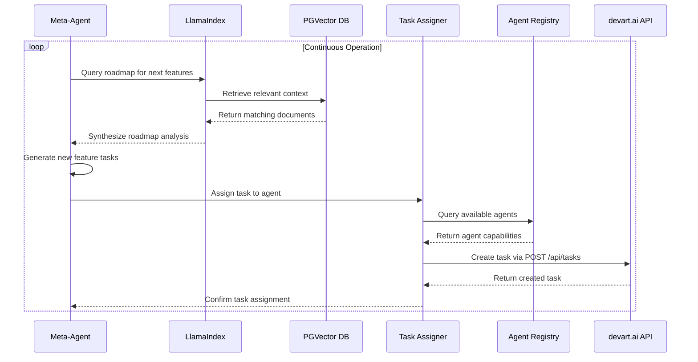

# Meta-Agent System Design for Autonomous Platform Evolution

## 1. Overview

The Meta-Agent System is designed to create a fully self-evolving platform that can analyze its own roadmap, generate tasks for new features, and assign them to other agents. This system implements a hybrid approach using LlamaIndex for the "Analysis" layer and Langroid for the "Orchestration" layer, enabling the platform to autonomously evolve and improve itself.

### 1.1 Purpose and Scope

The Meta-Agent System will:
- Analyze the platform's roadmap documents to identify upcoming features
- Generate new tasks based on roadmap analysis
- Assign tasks to appropriate agents based on their capabilities
- Monitor task completion and platform evolution
- Continuously improve its own analysis and decision-making capabilities

### 1.2 Key Benefits

- **Self-Evolving Platform**: The system can autonomously identify and implement new features
- **Best-in-Class RAG**: Leverages LlamaIndex's advanced parsing, indexing, and querying capabilities
- **Purpose-Built Orchestration**: Uses Langroid for managing complex, stateful conversations between agents
- **Clear Separation of Concerns**: Modular design with distinct data and orchestration layers

## 2. System Architecture

The Meta-Agent System follows a two-phase architecture with clear separation between data analysis and task orchestration:

```mermaid
graph TD
    subgraph "Phase 1: Data Ingestion (LlamaIndex)"
        A[Roadmap Documents <br/>(PDFs, Markdown, etc.)] --> B{LlamaIndex Ingestion Pipeline};
        B --> C[Chunking & Metadata Extraction];
        C --> D[OpenAI Embedding API];
        D --> E[PGVector Knowledge Base];
    end

    subgraph "Phase 2: Agentic Execution (Langroid)"
        F[Meta-Agent (Langroid)] -- "1. What's next on the roadmap?" --> G{Query Engine (LlamaIndex)};
        G -- "2. Retrieves relevant context" --> E;
        G -- "3. Synthesized answer" --> F;
        
        F -- "4. Analyzes answer, generates new feature tasks" --> F;
        
        F -- "5. 'Assign this task: ...'" --> H[Task Assigner Agent (Langroid)];
        H -- "6. Finds best agent for the job" --> I[devart.ai Agent Registry];
        H -- "7. Creates task via API" --> J[devart.ai API <br/>(POST /api/tasks)];
    end
```

### 2.1 Component Breakdown

#### 2.1.1 LlamaIndex Analysis Layer
- **Document Ingestion**: Processes roadmap documents in various formats (PDF, Markdown, etc.)
- **Chunking & Metadata Extraction**: Intelligently breaks down documents and extracts relevant metadata
- **Vector Embedding**: Uses OpenAI API to generate embeddings for semantic search
- **Knowledge Base**: Stores processed information in PGVector for efficient retrieval

#### 2.1.2 Langroid Orchestration Layer
- **Meta-Agent**: Central agent that analyzes roadmap context and generates new tasks
- **Query Engine**: Interfaces with LlamaIndex to retrieve relevant roadmap information
- **Task Assigner Agent**: Assigns generated tasks to appropriate agents based on capabilities
- **API Interface**: Communicates with devart.ai API to create and manage tasks

## 3. Core Components

### 3.1 Roadmap Analysis Module

The Roadmap Analysis Module is responsible for ingesting and processing the platform's roadmap documents.

#### 3.1.1 Document Ingestion Pipeline
- Supports multiple document formats (PDF, Markdown, plain text)
- Uses LlamaIndex Readers for robust document parsing
- Implements intelligent chunking strategies based on document structure
- Extracts metadata such as document type, version, and creation date

#### 3.1.2 Semantic Indexing
- Generates embeddings using OpenAI's text-embedding-ada-002 model
- Stores embeddings in PGVector database for efficient similarity search
- Implements RouterQueryEngine for deciding between vector search and structured queries
- Maintains up-to-date index as roadmap documents evolve

### 3.2 Task Generation Module

The Task Generation Module creates new tasks based on roadmap analysis.

#### 3.2.1 Feature Identification
- Analyzes roadmap context to identify upcoming features
- Prioritizes features based on roadmap positioning and dependencies
- Breaks down complex features into manageable sub-tasks
- Associates tasks with appropriate metadata and requirements

#### 3.2.2 Task Specification
- Generates detailed task descriptions with clear objectives
- Defines required capabilities for task completion
- Sets appropriate priority levels based on roadmap importance
- Establishes dependencies between related tasks

### 3.3 Agent Assignment Module

The Agent Assignment Module assigns tasks to appropriate agents based on their capabilities.

#### 3.3.1 Capability Matching
- Queries devart.ai Agent Registry to identify available agents
- Matches task requirements with agent capabilities using JSONB containment
- Considers agent workload and availability for optimal assignment
- Implements fallback mechanisms for tasks with specialized requirements

#### 3.3.2 Task Creation
- Interfaces with devart.ai API to create new tasks
- Assigns tasks to specific agents through the API
- Handles API errors and implements retry mechanisms
- Logs assignment decisions for audit and improvement

## 4. Integration with Existing System

### 4.1 Agent Registry Integration

The Meta-Agent System integrates with the existing devart.ai Agent Registry:

| Component | Integration Point | Purpose |
|-----------|-------------------|---------|
| Agent Capabilities | `agents.capabilities` JSONB column | Match tasks with qualified agents |
| Agent Status | `agents.status` field | Ensure agents are available for assignment |
| Agent API Keys | `agents.api_key_hash` field | Secure agent authentication |

### 4.2 Task Management Integration

The system leverages existing task management infrastructure:

| Component | Integration Point | Purpose |
|-----------|-------------------|---------|
| Task Creation | `POST /api/tasks` endpoint | Create new tasks based on roadmap analysis |
| Task Capabilities | `tasks.required_capabilities` JSONB column | Define skills needed for each task |
| Task Assignment | `PUT /api/tasks/:taskId/capabilities` endpoint | Update task requirements as needed |

### 4.3 Knowledge Base Integration

The system extends the existing knowledge base functionality:

| Component | Integration Point | Purpose |
|-----------|-------------------|---------|
| Vector Storage | `knowledge_base` table with PGVector | Store roadmap embeddings for semantic search |
| Semantic Search | `match_knowledge` function | Retrieve relevant roadmap context |
| Knowledge Ingestion | `generateEmbedding` service | Create embeddings for new roadmap content |

## 5. Workflow and Data Flow

### 5.1 Meta-Agent Execution Cycle



### 5.2 Data Flow Diagram


## 6. API Endpoints

### 6.1 Internal Meta-Agent Endpoints

| Endpoint | Method | Purpose |
|----------|--------|---------|
| `/api/meta-agent/analyze-roadmap` | POST | Trigger roadmap analysis and task generation |
| `/api/meta-agent/assign-tasks` | POST | Assign generated tasks to appropriate agents |
| `/api/meta-agent/status` | GET | Get current status of the meta-agent system |

### 6.2 Integration with Existing Endpoints

| Endpoint | Method | Purpose |
|----------|--------|---------|
| `POST /api/tasks` | POST | Create new tasks generated by meta-agent |
| `PUT /api/tasks/:taskId/capabilities` | PUT | Update task requirements if needed |
| `GET /api/agents` | GET | Retrieve agent capabilities for assignment |
| `POST /api/knowledge/search` | POST | Query knowledge base for context |

## 7. Security Considerations

### 7.1 Authentication and Authorization

- Meta-Agent will have a dedicated API key with appropriate permissions
- All API calls will be authenticated using the standard devart.ai authentication mechanism
- RBAC policies will control access to meta-agent functionality

### 7.2 Data Protection

- Roadmap documents will be processed in secure environments
- Embeddings will be stored in encrypted databases
- Access to the knowledge base will be controlled through RLS policies

### 7.3 Agent Security

- Agent assignments will be validated to prevent unauthorized task claiming
- Task creation will be logged for audit purposes
- Agent capabilities will be verified before task assignment

## 8. Monitoring and Observability

### 8.1 Metrics Collection

| Metric | Description | Purpose |
|--------|-------------|---------|
| Task Generation Rate | Number of tasks generated per hour | Measure system productivity |
| Assignment Success Rate | Percentage of tasks successfully assigned | Monitor assignment effectiveness |
| Agent Utilization | Percentage of agent capacity used | Optimize resource allocation |
| Roadmap Coverage | Percentage of roadmap features implemented | Track platform evolution |

### 8.2 Logging and Tracing

- All meta-agent decisions will be logged for audit and improvement
- OpenTelemetry will be used for distributed tracing
- Errors and exceptions will be logged with full context
- Performance metrics will be collected and reported

## 9. Deployment and Scalability

### 9.1 Deployment Architecture

The Meta-Agent System will be deployed as a dedicated service within the existing devart.ai infrastructure:

- **Containerization**: Deployed as a Docker container
- **Orchestration**: Managed through Kubernetes
- **Scaling**: Horizontally scalable based on workload
- **Resilience**: Implements retry mechanisms and circuit breakers

### 9.2 Resource Requirements

| Resource | Minimum | Recommended |
|----------|---------|-------------|
| CPU | 2 cores | 4 cores |
| Memory | 4 GB | 8 GB |
| Storage | 10 GB | 50 GB |
| Network | 100 Mbps | 1 Gbps |

## 10. Testing Strategy

### 10.1 Unit Testing

- Test document ingestion and chunking algorithms
- Validate embedding generation and storage
- Verify capability matching logic
- Test task generation and assignment workflows

### 10.2 Integration Testing

- Test integration with LlamaIndex and Langroid frameworks
- Validate API interactions with devart.ai backend
- Verify agent assignment and task creation
- Test error handling and recovery mechanisms

### 10.3 Performance Testing

- Load testing for concurrent roadmap analysis
- Stress testing for high-volume task generation
- Latency testing for agent assignment
- Scalability testing for increasing workloads

## 11. Future Enhancements

### 11.1 Advanced Roadmap Analysis

- Implement natural language understanding for complex roadmap documents
- Add support for visual roadmap formats
- Develop predictive analytics for feature prioritization

### 11.2 Intelligent Task Optimization

- Implement machine learning for better task-agent matching
- Add dynamic task reprioritization based on platform needs
- Develop cross-task dependency management

### 11.3 Self-Improvement Mechanisms

- Implement feedback loops for continuous learning
- Add A/B testing for different analysis approaches
- Develop automated optimization of system parameters