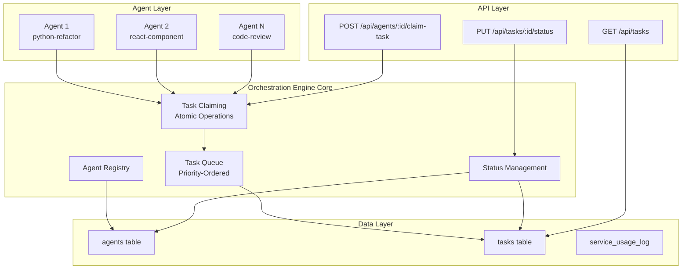
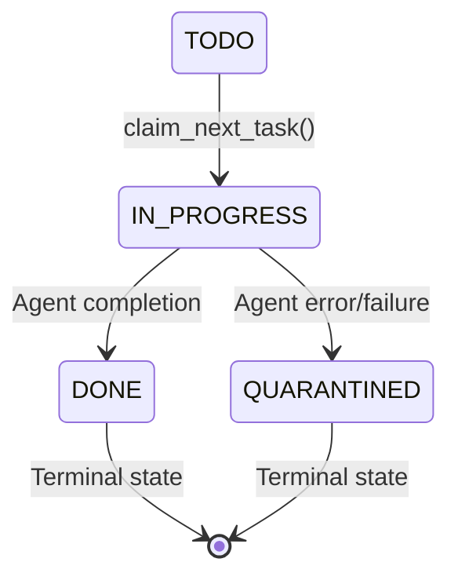
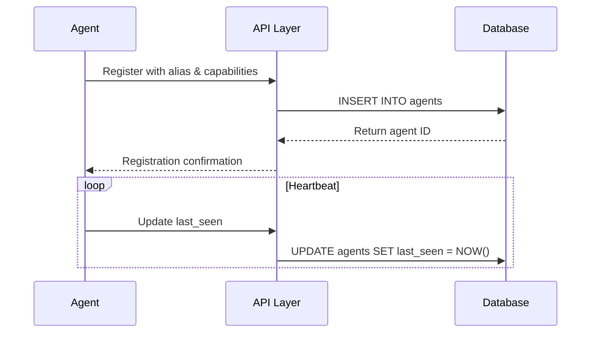
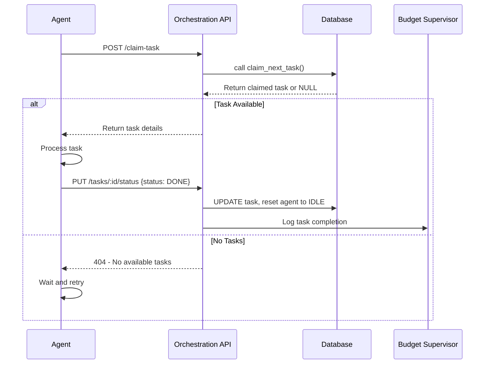
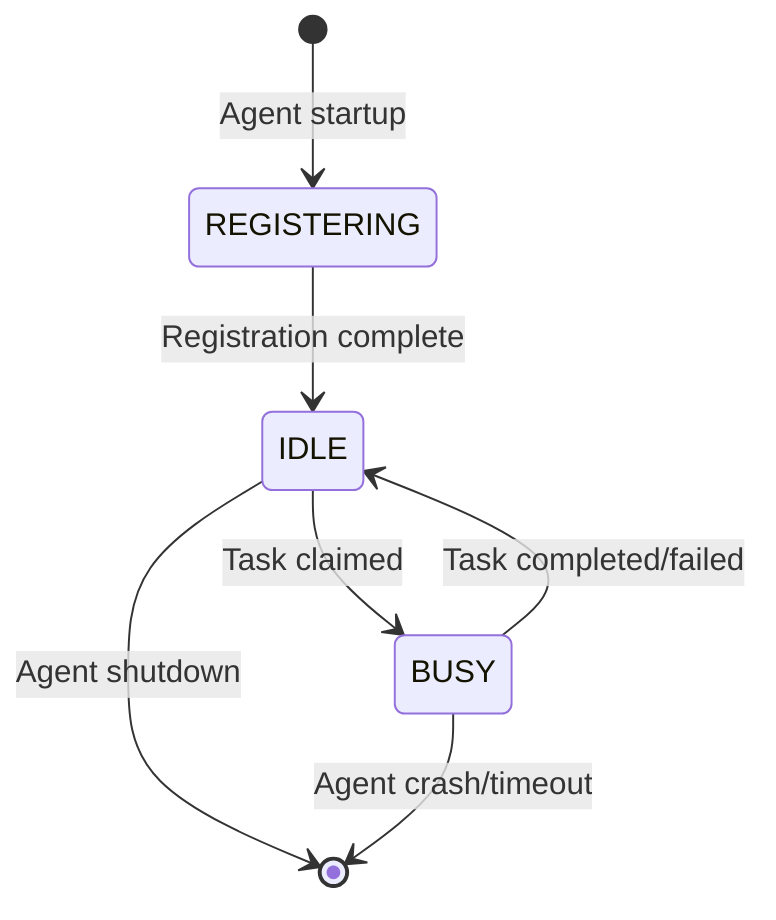
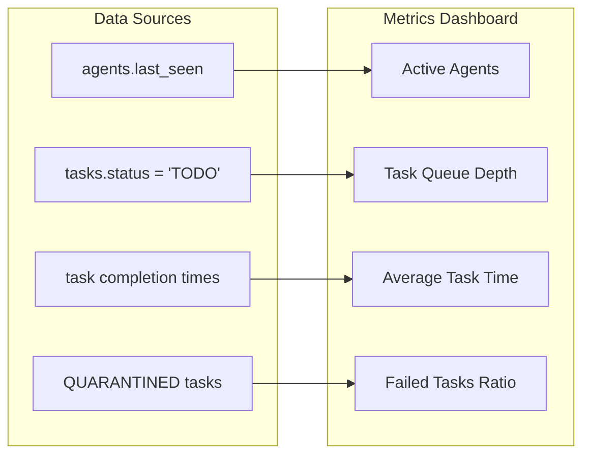

# Orchestration Engine Design

## Overview

The system evolution from a manual task tracking platform to a fully automated Orchestration Engine that manages the complete lifecycle of GenAI agents and their assigned tasks. This transformation introduces autonomous agent registration, atomic task claiming, and automated status management, enabling a distributed system where agents operate independently while maintaining data integrity and preventing race conditions.

## Architecture

### Current State Analysis
The existing system provides:
- Task storage and status tracking in PostgreSQL
- Real-time updates via Supabase subscriptions  
- Basic agent identification through TEXT field
- Manual task assignment workflow
- Budget supervision and audit logging

### Target Architecture



## Database Schema Evolution

### Agent Registry Table

```sql
CREATE TABLE agents (
  id UUID PRIMARY KEY DEFAULT gen_random_uuid(),
  alias TEXT NOT NULL UNIQUE,
  status TEXT NOT NULL DEFAULT 'IDLE',
  capabilities JSONB,
  last_seen TIMESTAMPTZ DEFAULT NOW(),
  created_at TIMESTAMPTZ DEFAULT NOW()
);
```

**Schema Design Rationale:**
- `alias`: Human-readable identifier for agent tracking and debugging
- `status`: Lifecycle state management ('IDLE', 'BUSY')  
- `capabilities`: JSONB array for skill-based task routing
- `last_seen`: Heartbeat mechanism for agent health monitoring
- `created_at`: Registration audit trail

### Tasks Table Modification

```sql
ALTER TABLE tasks
  DROP COLUMN IF EXISTS agent_id,
  ADD COLUMN agent_id UUID REFERENCES agents(id) ON DELETE SET NULL;
```

**Foreign Key Design:**
- Enforces referential integrity between tasks and agents
- `ON DELETE SET NULL` preserves task history when agents are deregistered
- Enables efficient JOIN operations for agent-task relationships

## Task Claiming Mechanism

### Atomic Task Assignment Function

```sql
CREATE OR REPLACE FUNCTION claim_next_task(requesting_agent_id UUID)
RETURNS tasks AS $$
DECLARE
  claimed_task tasks;
BEGIN
  UPDATE tasks
  SET
    status = 'IN_PROGRESS',
    agent_id = requesting_agent_id
  WHERE id = (
    SELECT id FROM tasks
    WHERE status = 'TODO'
    ORDER BY priority, created_at
    LIMIT 1
    FOR UPDATE SKIP LOCKED
  )
  RETURNING * INTO claimed_task;

  IF claimed_task IS NOT NULL THEN
    UPDATE agents SET status = 'BUSY', last_seen = NOW() WHERE id = requesting_agent_id;
  END IF;

  RETURN claimed_task;
END;
$$ LANGUAGE plpgsql;
```

**Concurrency Control Strategy:**
- `FOR UPDATE SKIP LOCKED`: Prevents deadlocks in high-concurrency scenarios
- Atomic transaction ensures consistency between tasks and agents tables
- Priority-based ordering with creation time tiebreaker
- Agent status synchronization within same transaction

### Task Priority Resolution

| Priority Level | Numeric Weight | Processing Order |
|---------------|----------------|------------------|
| CRITICAL      | 1              | First            |
| HIGH          | 2              | Second           |
| MEDIUM        | 3              | Third            |
| LOW           | 4              | Last             |

Within same priority: FIFO based on `created_at` timestamp.

## API Endpoints Architecture

### Task Claiming Endpoint

```
POST /api/agents/:agentId/claim-task
```

**Request Flow:**
1. Validate agent UUID format
2. Execute atomic `claim_next_task()` function
3. Return claimed task or 404 if queue empty
4. Update agent status to BUSY

**Response Schema:**
```json
{
  "id": "uuid",
  "title": "string",
  "description": "string", 
  "status": "IN_PROGRESS",
  "priority": "HIGH|MEDIUM|LOW|CRITICAL",
  "agent_id": "uuid",
  "created_at": "timestamp",
  "updated_at": "timestamp"
}
```

### Task Status Update Endpoint

```
PUT /api/tasks/:taskId/status
```

**Authorization Model:**
- Ownership verification: `agent_id` must match requesting agent
- Prevents cross-agent task interference
- Maintains audit trail of status changes

**Status Transition Rules:**



**Agent Lifecycle Integration:**
- Terminal states (DONE, QUARANTINED) trigger agent status reset to IDLE
- Enables automatic re-availability for new task claiming
- Fire-and-forget semantics for agent status updates

## Data Models & ORM Mapping

### Agent Entity Model

```typescript
interface Agent {
  id: string;
  alias: string;
  status: 'IDLE' | 'BUSY';
  capabilities: string[];
  lastSeen: Date;
  createdAt: Date;
}
```

### Enhanced Task Entity Model

```typescript
interface Task {
  id: string;
  title: string;
  description?: string;
  status: 'TODO' | 'IN_PROGRESS' | 'DONE' | 'QUARANTINED' | 'PENDING_BUDGET_APPROVAL';
  priority: 'LOW' | 'MEDIUM' | 'HIGH' | 'CRITICAL';
  agentId?: string;
  createdAt: Date;
  updatedAt: Date;
}
```

### Task-Agent Relationship Mapping

```typescript
interface TaskAssignment {
  task: Task;
  agent?: Agent;
  assignedAt?: Date;
  completedAt?: Date;
}
```

## Business Logic Layer

### Agent Registration Flow



### Task Lifecycle Management



### Distributed Agent Coordination

**Preventing Race Conditions:**
- Database-level locking prevents multiple agents claiming same task
- Agent status tracking ensures workload distribution
- Heartbeat mechanism enables dead agent detection

**Load Balancing Strategy:**
- Round-robin task distribution through FIFO queue
- Priority-based preemption for critical tasks
- Agent capability matching for future enhancements

## State Management Architecture

### Agent State Transitions



### Task State Persistence

**Database Constraints:**
- NOT NULL constraints on critical fields (title, status, priority)
- CHECK constraints for valid status values
- Foreign key constraints maintain referential integrity
- Unique constraints prevent duplicate agent aliases

**Real-time Synchronization:**
- Supabase subscriptions broadcast task state changes
- UI components receive automatic updates
- Agent dashboards reflect current system state

## API Integration Layer

### Client SDK Design

```typescript
class OrchestrationClient {
  constructor(private apiUrl: string, private agentId: string) {}
  
  async claimNextTask(): Promise<Task | null> {
    const response = await fetch(`${this.apiUrl}/agents/${this.agentId}/claim-task`, {
      method: 'POST'
    });
    return response.status === 404 ? null : response.json();
  }
  
  async updateTaskStatus(taskId: string, status: TaskStatus): Promise<Task> {
    const response = await fetch(`${this.apiUrl}/tasks/${taskId}/status`, {
      method: 'PUT',
      body: JSON.stringify({ agentId: this.agentId, newStatus: status })
    });
    return response.json();
  }
}
```

### Error Handling Strategy

**HTTP Status Code Mapping:**
- 200: Successful operation
- 404: No available tasks or unauthorized access
- 400: Invalid request parameters
- 500: Internal server error
- 403: Agent not authorized for task

**Retry Logic:**
- Exponential backoff for task claiming
- Circuit breaker pattern for degraded service handling
- Graceful degradation when orchestration unavailable

## Testing Strategy

### Unit Testing Approach

**Database Function Testing:**
```sql
-- Test concurrent task claiming
BEGIN;
SELECT claim_next_task('agent-1-uuid');
SELECT claim_next_task('agent-2-uuid'); 
-- Verify no task conflicts
ROLLBACK;
```

**API Endpoint Testing:**
```typescript
describe('Task Claiming API', () => {
  test('should claim highest priority task', async () => {
    const task = await claimNextTask(agentId);
    expect(task.priority).toBe('CRITICAL');
  });
  
  test('should prevent unauthorized task updates', async () => {
    const response = await updateTaskStatus(taskId, wrongAgentId, 'DONE');
    expect(response.status).toBe(404);
  });
});
```

### Integration Testing Framework

**End-to-End Agent Workflow:**
1. Agent registration and heartbeat
2. Task claiming under concurrent load
3. Status updates and agent lifecycle
4. Error recovery and timeout handling

**Performance Testing Scenarios:**
- 100 concurrent agents claiming tasks
- Database connection pool exhaustion
- Network partition handling
- Agent crash recovery

## Monitoring and Observability

### Agent Health Metrics



### Alerting Strategies
- Agent timeout detection (last_seen > 5 minutes)
- Task queue overflow (>100 pending tasks)
- High failure rate (>10% quarantined tasks)
- Database performance degradation

## Migration Strategy

### Phase 1: Schema Evolution
1. Deploy agent registry table
2. Migrate existing tasks to use UUID foreign keys
3. Update existing API endpoints to be backward compatible

### Phase 2: Agent Integration
1. Deploy task claiming endpoint
2. Enable agent registration workflow
3. Migrate manual task assignment to automated claiming

### Phase 3: Full Automation
1. Deploy status update endpoint with ownership verification
2. Enable real-time agent lifecycle management
3. Retire manual task management interfaces

### Rollback Plan
- Maintain original agent_id TEXT column during transition
- Feature flags for old vs new claiming mechanisms
- Database constraints can be dropped if rollback required

## Security Considerations

### Agent Authentication
- UUID-based agent identification
- Capability-based access control for future enhancements
- Rate limiting on task claiming endpoints

### Data Integrity
- Foreign key constraints prevent orphaned records
- Transaction isolation prevents race conditions
- Audit logging tracks all agent-task interactions

### Network Security
- HTTPS enforcement for all API communications
- CORS configuration for authorized origins only
- Input validation and sanitization on all endpoints