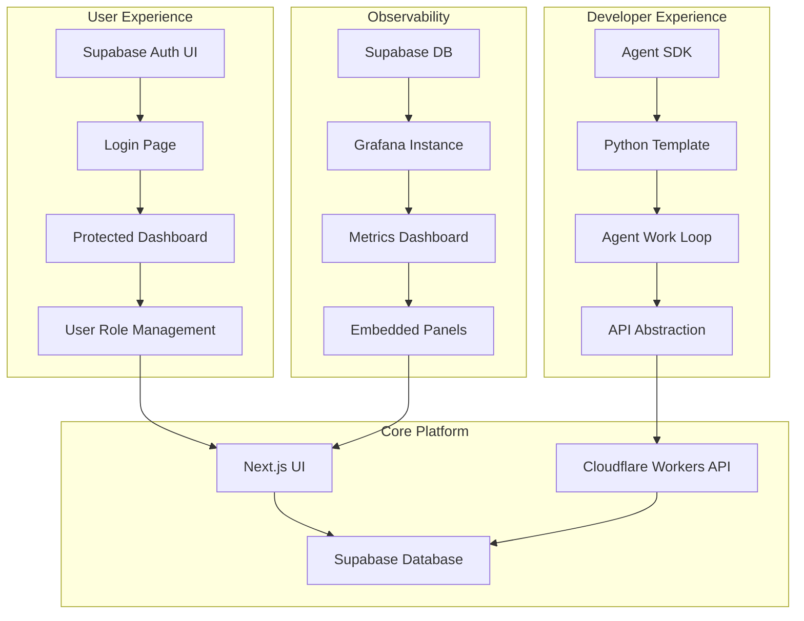

# Platform Productization Suite Design

## Overview

The Platform Productization Suite is a strategic initiative to transform devart.ai from a powerful engine into a polished, intuitive, and maintainable product. This suite addresses three key areas: User Experience (UX), Developer Experience (DX), and Observability. The goal is to enhance the platform's usability, simplify agent development, and provide advanced monitoring capabilities.

## Architecture

The Platform Productization Suite consists of three independent but complementary components:

1. **User Authentication & Onboarding System** - Enhances security and user management
2. **Agent SDK & Template Repository** - Simplifies agent development
3. **Advanced Observability with Grafana** - Provides deep system insights

## 1. User Experience Enhancement

### Component Definition

The User Experience Enhancement component implements a complete, professional user authentication flow using Supabase Auth UI and automates the user role creation process upon sign-up.

### Authentication Flow

1. **User Registration/Login**: Users access a dedicated login page with professional UI
2. **Automatic Onboarding**: New users are automatically assigned a default role
3. **Session Management**: Authenticated sessions are managed securely
4. **Access Control**: Dashboard access is protected and role-based

### Implementation Details

#### Database Schema Extensions

The implementation requires adding a PostgreSQL function and trigger to the database schema:

- A function `public.handle_new_user()` that will be called after a new user signs up
- The function inserts a new entry into the `public.user_roles` table with a default 'viewer' role
- A trigger `on_auth_user_created` that calls the function when a new user is inserted into `auth.users`

#### Login Page Component

A new login page component will be created with the following features:

- Professional UI using Supabase Auth UI components
- Dark theme styling consistent with the existing application
- GitHub OAuth provider integration
- Proper redirect configuration after authentication

#### Protected Dashboard

The main dashboard page will be modified to:

- Check for authenticated sessions using Next.js server components
- Redirect unauthenticated users to the login page
- Maintain existing dashboard functionality for authenticated users

### Dependencies

- `@supabase/auth-ui-react`
- `@supabase/auth-ui-shared`
- `@supabase/auth-helpers-nextjs`

## 2. Developer Experience Enhancement

### Component Definition

The Developer Experience Enhancement component creates a dedicated Python SDK and a template repository to standardize and dramatically simplify the process of developing, testing, and deploying new GenAI agents.

### SDK Architecture

The Agent SDK abstracts all API interactions, handling basic API requests and error handling, allowing agent developers to focus purely on their business logic.

### SDK Implementation

The SDK implementation includes:

- An `AgentSDK` class that encapsulates all API interactions
- Methods for claiming tasks from the queue
- Methods for updating task status
- Error handling for network requests
- Authentication using API keys

### Agent Template Implementation

The agent template provides:

- A standardized work loop pattern (claim → process → update)
- Environment variable configuration loading
- Example implementation of core agent logic
- Proper error handling and logging
- Sleep intervals for polling when no tasks are available

### Template Repository Structure

The template repository follows this structure:

- `sdk/` directory containing the Agent SDK implementation
- `main.py` with the example agent work loop
- `README.md` with comprehensive documentation
- `requirements.txt` for Python dependencies
- `.gitignore` for proper version control

### Dependencies

- Python 3.8+
- `requests` library

## 3. Advanced Observability with Grafana

### Component Definition

The Advanced Observability component integrates Grafana with the Supabase database to create advanced, time-series dashboards for monitoring system health and performance trends, and embeds these panels into the main UI.

### Grafana Integration Architecture

1. **Grafana Instance**: Standalone Grafana service connected to Supabase
2. **Data Source**: PostgreSQL connection to Supabase database
3. **Dashboards**: Custom panels for key system metrics
4. **UI Embedding**: Grafana panels embedded in Next.js application

### Implementation Details

#### Grafana Setup

The Grafana instance can be set up using Docker or a cloud-hosted service. The setup involves:

- Running a Grafana container with appropriate port mapping
- Configuring the Supabase PostgreSQL connection as a data source
- Creating dashboards with custom panels

#### Grafana Panel Queries

The implementation includes three key panels:

1. **Task Throughput Panel**: Shows the number of tasks completed per day using time-series data
2. **Agent Status Panel**: Displays the current distribution of IDLE vs. BUSY agents using a pie chart
3. **Average Task Cost Panel**: Shows the average cost of all tasks that have usage logs

#### Embedded Grafana Panel Component

The UI integration involves:

- Creating a dedicated GrafanaPanel component
- Configuring iframe embedding with proper URLs
- Styling the panel to match the existing UI
- Adding the panel to the main dashboard

### Dependencies

- Grafana instance
- Supabase PostgreSQL connection
- Docker (for local development)

## Testing Strategy

### Unit Testing

1. **Authentication Component Testing**
   - Test user registration flow
   - Test automatic role assignment
   - Test session management
   - Test protected route access

2. **Agent SDK Testing**
   - Test API endpoint interactions
   - Test error handling scenarios
   - Test authentication token handling
   - Test task claiming and status updates

3. **Observability Component Testing**
   - Test Grafana data source connection
   - Test dashboard panel queries
   - Test embedded panel rendering
   - Test cross-origin resource sharing

### Integration Testing

1. **End-to-End Authentication Flow**
   - User registration through UI
   - Automatic role assignment verification
   - Dashboard access control
   - Session timeout handling

2. **Agent Development Workflow**
   - SDK initialization
   - Task claiming process
   - Status update flow
   - Error recovery scenarios

3. **Observability Integration**
   - Data flow from Supabase to Grafana
   - Panel rendering in UI
   - Real-time metric updates
   - Alerting mechanisms

## Deployment Considerations

### User Authentication & Onboarding

1. **Supabase Configuration**
   - Enable Authentication in Supabase project
   - Configure GitHub OAuth provider
   - Set up email templates
   - Configure session timeouts

2. **Database Migration**
   - Apply the PostgreSQL trigger function
   - Verify trigger activation
   - Test user role creation

3. **Frontend Deployment**
   - Install Supabase Auth UI dependencies
   - Deploy login page
   - Configure protected routes
   - Test authentication flow

### Agent SDK & Template

1. **Repository Creation**
   - Create new GitHub repository
   - Set up as template repository
   - Add SDK implementation
   - Include example agent

2. **Documentation**
   - Create comprehensive README
   - Document configuration options
   - Provide usage examples
   - Include troubleshooting guide

3. **Distribution**
   - Publish to package registry (optional)
   - Create release tags
   - Document version compatibility

### Observability with Grafana

1. **Grafana Setup**
   - Deploy Grafana instance
   - Configure Supabase data source
   - Create dashboards with provided queries
   - Configure embedding settings

2. **UI Integration**
   - Implement GrafanaPanel component
   - Configure panel IDs and URLs
   - Test embedded panel rendering
   - Optimize iframe sizing

3. **Security Configuration**
   - Configure Grafana authentication
   - Set up dashboard permissions
   - Enable embedding settings
   - Test cross-origin access