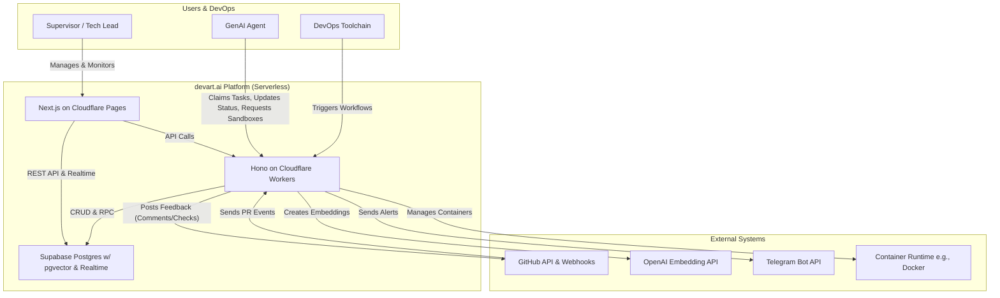
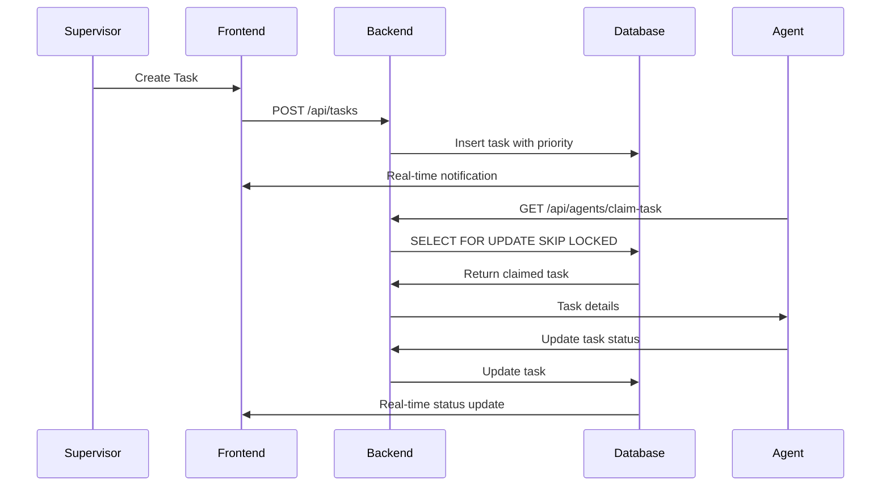
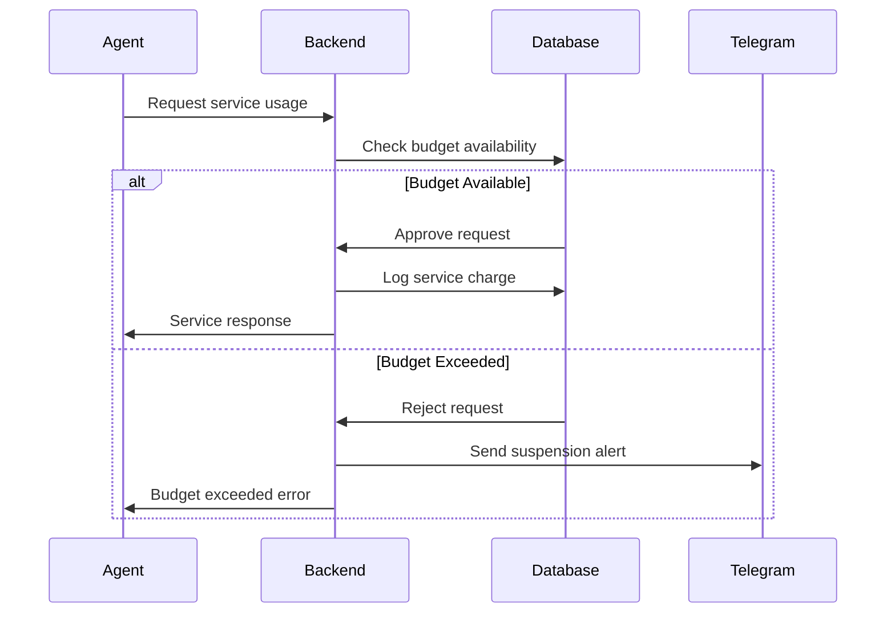

# devart.ai - The Autonomous DevOps Platform

**A serverless, enterprise-ready control plane for orchestrating, supervising, and analyzing a team of autonomous GenAI agents.**

devart.ai functions as a deeply integrated partner in the modern software development lifecycle, transforming AI from a simple tool into a collaborative team member that can build, test, review, and deploy code.



## ✨ Core Features

### Advanced DevOps Integration
- **Interactive GitHub Integration**: Agents can post comments and pass/fail status checks directly to Pull Requests, acting as automated code reviewers
- **Workflow Engine**: Define, manage, and trigger multi-stage, reusable workflows (e.g., build → test → review) from the UI or via API
- **Agent Execution Sandboxing**: Provide agents with clean, isolated, and containerized environments for executing tasks securely and reproducibly

### Governance & Security
- **Role-Based Access Control (RBAC)**: Secure the platform with admin, supervisor, and viewer roles, enforced at the database level with RLS
- **Secure Agent Management**: Onboard agents with secure, hashed API keys and toggle their activation status from the UI
- **Dynamic System Configuration**: Tune system parameters, like performance thresholds, from a live settings panel without redeploying

### Orchestration & Collaboration
- **Autonomous Agent Lifecycle**: Agents can register, claim tasks from a priority queue, and report their status
- **Atomic Task Claiming**: A race-condition-free queue system (FOR UPDATE SKIP LOCKED) ensures tasks are never worked on by multiple agents
- **Task Chaining**: Agents can create successor tasks, enabling complex, multi-step workflows

### Intelligence & Analytics
- **Knowledge Base**: A pgvector-powered knowledge base allows agents to perform semantic searches for contextual information
- **Performance Analytics**: A dedicated dashboard panel provides insights into task costs and service usage patterns
- **Outlier Detection**: The system automatically flags tasks with unusually high costs for supervisor review

### Supervision & Control
- **Real-Time Dashboards**: Live, streaming updates for tasks, agents, and service budgets using Supabase Realtime
- **Interactive Task Management**: Supervisors can create, prioritize, update, and delete tasks from the UI
- **Budget Supervisor**: Set monthly spending limits on external services (e.g., LLM APIs), with automatic suspension, delegation to cheaper alternatives, and proactive Telegram alerts

## 🚀 Getting Started

### 1. Prerequisites
- Git, Node.js (v18+), pnpm, Docker (for local sandboxing)
- Accounts: Cloudflare, Supabase, GitHub, OpenAI, Telegram

### 2. Setup

**Clone & Install:**
```bash
git clone https://github.com/YOUR_USERNAME/devart.ai.git
cd devart.ai
pnpm install
```

**Supabase:**
1. Create a new project on Supabase
2. In the SQL Editor, run the entire `supabase/schema.sql` script
3. Enable the vector extension under Database → Extensions
4. Enable Realtime for all tables under Database → Replication

**Environment Variables:**
1. Copy `.env.example` to `.env` in `apps/api`
2. Copy `.env.local.example` to `.env.local` in `apps/ui`
3. Fill in all required keys from Supabase, OpenAI, Telegram, and your GitHub App

**GitHub App:**
1. Create a GitHub App with `pull_request:write` and `checks:write` permissions
2. Install the App on your target repository
3. Configure a webhook for `pull_request` events, pointing to your deployed API endpoint (`https://<your-worker>/api/webhooks/github`)
4. Set a secure webhook secret and add all App credentials to your `apps/api/.env`

### 3. Running Locally

```bash
# From the project root
pnpm dev
```
- UI: http://localhost:3000
- API: http://localhost:8787

### 4. Deployment

**API to Cloudflare Workers:**
```bash
cd apps/api
wrangler secret put SUPABASE_URL
wrangler secret put SUPABASE_SERVICE_KEY
wrangler secret put OPENAI_API_KEY
wrangler secret put TELEGRAM_BOT_TOKEN
wrangler secret put TELEGRAM_CHAT_ID
wrangler secret put GITHUB_WEBHOOK_SECRET
wrangler secret put GITHUB_APP_ID
wrangler secret put GITHUB_PRIVATE_KEY
wrangler secret put GITHUB_INSTALLATION_ID
pnpm deploy
```

**UI to Cloudflare Pages:**
1. Push code to GitHub
2. In Cloudflare dashboard: Workers & Pages → Create application → Pages → Connect to Git
3. Select repository, set root directory to `apps/ui`
4. Add environment variables:
   - `NEXT_PUBLIC_SUPABASE_URL`
   - `NEXT_PUBLIC_SUPABASE_ANON_KEY`

## 🧠 System Concepts

### Core Entities

**Agents**: Autonomous workers that register with the platform, claim tasks, and execute them. Managed via secure API keys with hashed storage and activation controls.

**Tasks**: Discrete units of work with title, description, priority, and status. Support chaining for complex workflows and automatic creation from GitHub webhooks.

**Services**: External APIs (OpenAI, Groq, etc.) with budget limits, usage tracking, and automatic suspension when limits exceeded.

**Knowledge Base**: Vector store of documents (ADRs, code snippets, documentation) that agents query for context using semantic search.

**Workflows**: Reusable, multi-stage templates for common CI/CD processes (e.g., Build → Test → Deploy). Supervisors can trigger these with specific context.

**Sandboxes**: Ephemeral, isolated Docker containers provisioned on-demand for agents to perform their work, ensuring a clean and secure execution environment.

### Key Workflows

**Task Dispatch Flow:**


**Budget Supervision Flow:**


## 📊 Component Architecture

### Frontend Components

**ServiceStatusPanel**: Real-time monitoring of service budgets with visual indicators and budget increase controls.

**TaskBoard**: Interactive task management with drag-drop, status updates, and real-time synchronization.

**AgentMonitoringPanel**: Live agent status, capability display, and activation controls.

**TaskAnalyticsPanel**: Performance insights, cost analysis, and outlier detection with interactive charts.

**SettingsPanel**: System configuration management with validation and real-time updates.

**WorkflowManagementPanel**: Define and manage multi-stage workflows with templating support.

### Backend Services

**Budget Service**: Enforces spending limits, manages service suspension/activation, and handles budget increases with atomic operations.

**Embedding Service**: Integrates with OpenAI Embedding API for knowledge base semantic search functionality.

**Telegram Service**: Handles alert notifications with markdown formatting and error handling.

**GitHub Service**: Manages GitHub App authentication and API interactions for PR comments and status checks.

**Task Orchestrator**: Manages task lifecycle, implements atomic claiming, and handles chain creation.

### Database Layer

**Row Level Security (RLS)**: Enforces role-based access at database level with policies for admin, supervisor, and viewer roles.

**Stored Procedures**: Atomic operations for budget checks, task claiming, and service usage logging.

**Real-time Subscriptions**: Live updates for tasks, agents, and service status using Supabase Realtime.

**Vector Search**: pgvector extension enables semantic search across knowledge base documents.

## 🔧 API Reference

### Core Endpoints

**Tasks**
- `GET /api/tasks` - List all tasks with filtering
- `POST /api/tasks` - Create new task
- `PUT /api/tasks/:id` - Update task
- `DELETE /api/tasks/:id` - Delete task
- `POST /api/agents/claim-task` - Claim task (agents only)
- `PUT /api/tasks/:id/status` - Update task status

**Agents**
- `GET /api/agents` - List all agents
- `POST /api/agents/register` - Register new agent
- `PUT /api/agents/:id/activation` - Toggle activation
- `PUT /api/agents/heartbeat` - Update agent heartbeat

**Services**
- `GET /api/services` - List services
- `POST /api/services/:id/increase-budget` - Increase budget
- `GET /api/services/status` - Real-time status check

**Knowledge**
- `GET /api/knowledge/search` - Semantic search
- `POST /api/knowledge` - Add document

**Workflows**
- `GET /api/workflows` - List workflows
- `POST /api/workflows` - Create workflow
- `GET /api/workflows/:id/templates` - Get workflow templates
- `POST /api/workflows/:id/trigger` - Trigger workflow

**Webhooks**
- `POST /api/webhooks/github` - GitHub pull request events

### Authentication

All API endpoints require authentication via Supabase JWT tokens or agent API keys. Role-based permissions are enforced at both API and database levels.

## 🔐 Security Model

### Authentication & Authorization
- Supabase Auth for human users with JWT tokens
- Hashed API keys for agent authentication
- Role-based access control (admin, supervisor, viewer)
- Row Level Security policies in database

### Data Protection
- All sensitive data encrypted at rest
- API keys stored as secure hashes
- CORS policies restrict frontend origins
- Rate limiting on critical endpoints

### Audit Trail
- Complete service charge logging
- Task lifecycle tracking
- Agent activity monitoring
- Budget modification history

## 📈 Performance & Monitoring

### Analytics Dashboard
- Task completion rates and average times
- Service usage patterns and cost trends
- Agent performance metrics
- Budget utilization tracking

### Real-time Monitoring
- Live service status indicators
- Active agent monitoring
- Task queue depth tracking
- Budget threshold alerts

### Outlier Detection
- Automatic flagging of high-cost tasks
- Performance anomaly identification
- Budget overrun predictions
- Agent efficiency analysis

## 🔄 Deployment & Operations

### Development Workflow
```bash
# Local development
pnpm dev

# Run tests
pnpm test

# Build for production
pnpm build

# Deploy API
cd apps/api && pnpm deploy

# Deploy UI (automatic via GitHub)
git push origin main
```

### Production Monitoring
- Cloudflare analytics for API performance
- Supabase database metrics
- Real-time error tracking
- Budget alert notifications

### Backup & Recovery
- Automated Supabase backups
- Knowledge base export capabilities
- Configuration backup procedures
- Disaster recovery protocols

## 🛣️ Future Roadmap

While the core platform is feature-complete, potential enhancements include:

**Scalability & Performance:**
- Migrate the conceptual sandbox provisioner to a robust Kubernetes or Nomad integration
- Implement materialized views for high-performance analytics on very large datasets
- Introduce a more sophisticated job queue backend like RabbitMQ for advanced routing and retries

**Advanced AI & ML:**
- Develop self-healing agents that can debug and fix their own errors
- Implement a predictive cost analysis model to estimate task costs before execution
- Create a "meta-agent" that can optimize workflows based on historical performance data

**Ecosystem & Extensibility:**
- Develop a formal plugin architecture for adding new tools and integrations
- Create a "marketplace" for sharing and discovering pre-built agents and workflows
- Implement full multi-tenancy to offer devart.ai as a SaaS product

## 📚 System Documentation

### Architecture Decision Records (ADRs)
- Serverless architecture choice rationale
- Database schema design decisions
- Real-time update implementation
- Security model considerations

### Operational Runbooks
- Deployment procedures
- Incident response protocols
- Budget management guidelines
- Agent onboarding processes

### Development Guidelines
- Code style and standards
- Testing strategies
- Performance optimization
- Security best practices

## 🤝 Contributing

### Development Setup
1. Follow the Getting Started guide
2. Create feature branch: `git checkout -b feature/your-feature`
3. Make changes with tests
4. Submit pull request

### Code Standards
- TypeScript strict mode required
- ESLint and Prettier configured
- Test coverage >80% for new features
- Documentation for all public APIs

### Review Process
- Automated CI/CD checks
- Peer code review required
- Security review for auth changes
- Performance testing for critical paths

## ⚖️ License

This project is licensed under the MIT License. See the [LICENSE](LICENSE) file for details.

---

**devart.ai represents the culmination of iterative development through strategic phases, resulting in a mature, enterprise-ready platform for autonomous AI development teams. The system balances powerful automation with human oversight, providing the tools necessary for safe, effective, and cost-controlled AI-driven software development.**