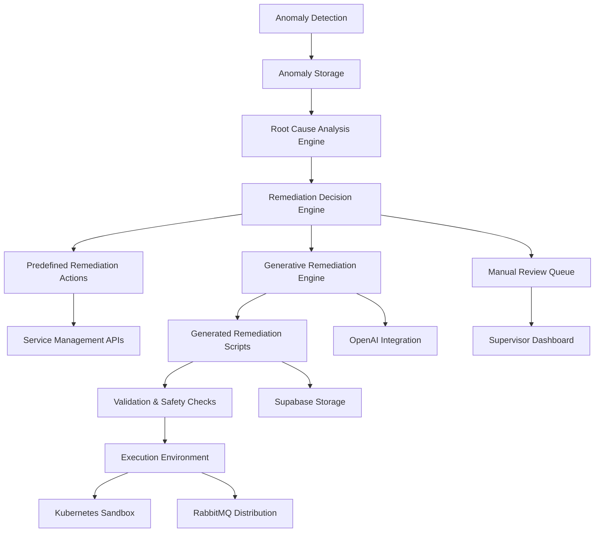

# Generative Remediation Script Generator Design

## Overview

The Generative Remediation Script Generator is a system that enables agents to create novel remediation scripts or configuration patches based on Root Cause Analysis (RCA) findings, rather than simply executing predefined actions. This system extends the existing Automated Remediation capabilities by incorporating generative AI to produce custom remediation solutions for complex or novel issues.

Building on the devart.ai platform's existing infrastructure, this feature leverages the Hono API on Cloudflare Workers for backend services, Supabase PostgreSQL for persistence, and integrates with the existing agent SDK and task orchestration systems.

## Architecture

The Generative Remediation system builds upon the existing remediation architecture but introduces generative capabilities:



The system integrates with devart.ai's existing technology stack:
- **Hono API** on Cloudflare Workers for service endpoints
- **Supabase PostgreSQL** with pgvector for script storage and semantic search
- **OpenAI API** for generative script creation
- **Kubernetes** for sandboxed script execution
- **RabbitMQ** for task distribution and execution coordination

## Components

### 1. Database Tables

#### generative_remediation_scripts
Stores generated remediation scripts for audit and potential reuse. Integrates with existing Supabase RLS policies.

| Column | Type | Description |
|--------|------|-------------|
| id | UUID | Primary key |
| anomaly_id | UUID | Reference to the anomaly that triggered generation |
| root_cause_analysis | JSONB | The RCA findings that informed script generation |
| generated_script | TEXT | The generated remediation script |
| script_language | TEXT | Language/runtime of the script (bash, python, etc.) |
| target_system | TEXT | System the script targets (kubernetes, database, etc.) |
| confidence_score | NUMERIC | Confidence score of the generation (0.0-1.0) |
| validation_status | TEXT | Status of validation checks (PENDING, PASSED, FAILED) |
| execution_status | TEXT | Status of script execution (PENDING, RUNNING, SUCCESS, FAILED) |
| approval_status | TEXT | Supervisor approval status (REQUIRED, APPROVED, REJECTED) |
| created_at | TIMESTAMPTZ | Timestamp when script was generated |
| validated_at | TIMESTAMPTZ | Timestamp when script was validated |
| executed_at | TIMESTAMPTZ | Timestamp when script was executed |
| approved_at | TIMESTAMPTZ | Timestamp when script was approved |

#### generative_remediation_templates
Stores templates used for generating remediation scripts. Integrated with existing capability-aware dispatch system.

| Column | Type | Description |
|--------|------|-------------|
| id | UUID | Primary key |
| root_cause_category | TEXT | Category of root cause this template addresses |
| template_content | TEXT | Template for script generation with variable placeholders |
| target_systems | TEXT[] | Systems this template can target |
| required_capabilities | TEXT[] | Agent capabilities required to execute (JSONB for GIN indexing) |
| safety_checks | JSONB | Required safety checks before execution |
| template_variables | JSONB | Definition of variables used in template |
| created_at | TIMESTAMPTZ | Timestamp when template was created |
| updated_at | TIMESTAMPTZ | Timestamp when template was updated |

### 2. Backend Services

#### Generative Remediation Service (`apps/api/src/services/generativeRemediation.ts`)
Implements the core logic for:
- Generating remediation scripts from RCA findings using OpenAI
- Validating generated scripts for safety
- Managing script templates
- Executing generated scripts in sandboxed environments

#### Script Validation Service
Validates generated scripts against safety and security criteria:
- Syntax validation using appropriate parsers
- Forbidden command checks based on target system
- Resource limit enforcement
- Access control verification using existing RBAC

#### Script Execution Service
Executes validated scripts in controlled environments:
- Kubernetes sandboxed execution contexts
- Resource monitoring with limits
- Result collection and logging to Supabase
- Integration with existing tracing via OpenTelemetry

### 3. API Endpoints

Following devart.ai REST API conventions:

- `POST /api/generative-remediation/generate` - Generate a remediation script from RCA findings
- `GET /api/generative-remediation/scripts` - Retrieve generated scripts with filtering
- `GET /api/generative-remediation/scripts/:id` - Retrieve a specific generated script
- `POST /api/generative-remediation/scripts/:id/validate` - Validate a generated script
- `POST /api/generative-remediation/scripts/:id/approve` - Approve a script for execution
- `POST /api/generative-remediation/scripts/:id/execute` - Execute a validated script
- `GET /api/generative-remediation/templates` - Retrieve script templates
- `POST /api/generative-remediation/templates` - Create a new script template (supervisor role required)
- `PUT /api/generative-remediation/templates/:id` - Update a script template (supervisor role required)
- `DELETE /api/generative-remediation/templates/:id` - Delete a script template (supervisor role required)

### 4. Agent Integration

#### Enhanced Agent SDK (`devart-agent-template/sdk/generative_remediation.py`)
Extends the existing Python agent SDK with capabilities for:
- Requesting generative remediation from the Hono API
- Validating received scripts locally using language-specific validators
- Executing scripts in sandboxed environments with resource limits
- Reporting execution results back to the API
- Handling script approval workflows for supervisor review

#### Agent Workflow for Generative Remediation
1. Agent detects task failure and reports to API using existing error reporting
2. API performs RCA using `rootCauseAnalysis.ts` and determines need for generative remediation
3. API requests script generation from generative remediation service
4. Generated script is stored in Supabase and awaits approval based on confidence score
5. Supervisor reviews and approves script through dashboard (if required)
6. Agent polls API for approved scripts
7. Agent validates script locally using language-specific validators
8. Agent executes script in sandboxed environment with resource limits
9. Agent reports execution results back to API
10. API updates task status and logs execution results

## Script Generation Process

### 1. Input Analysis
The system analyzes the RCA findings to determine:
- Root cause category and details from existing `rootCauseAnalysis.ts`
- Affected systems and components identified in the trace data
- Severity and impact assessment based on existing anomaly severity levels
- Required remediation approach based on service configurations
- Available agent capabilities from the capability-aware dispatch system

### 2. Template Selection
Based on the root cause category, the system selects an appropriate template from the `generative_remediation_templates` table using PostgreSQL JSONB queries similar to the capability-aware dispatch system:
- Match root cause category with template
- Verify agent capabilities match template requirements
- Check template compatibility with target systems
- Rank templates by historical success rates

### 3. Script Generation
Using the selected template and RCA details, the system generates a customized remediation script via OpenAI API:
- Fills template variables with specific values from the RCA
- Adapts the script to the target environment using service registry information
- Incorporates safety checks and validation steps
- Applies appropriate telemetry instrumentation
- Includes rollback procedures based on target system capabilities

### 4. Validation
The generated script undergoes multiple validation steps:
- Syntax checking for the target language using appropriate parsers
- Security scanning for dangerous operations (rm -rf, etc.)
- Resource limit verification based on service budgets
- Access control validation using existing RBAC mechanisms
- Semantic analysis for potential side effects
- Environment-specific validation based on target system

### 5. Approval Workflow
Before execution, scripts go through an approval workflow:
- HIGH confidence scripts (80-100%) require supervisor notification
- MEDIUM confidence scripts (50-79%) require explicit supervisor approval
- LOW confidence scripts (1-49%) require detailed review and modification

### 6. Execution
Once validated and approved, the script can be executed:
- In a Kubernetes sandboxed environment for testing
- In the target environment for actual remediation
- With appropriate monitoring and rollback capabilities via existing tracing infrastructure
- With resource limits based on service budgets

## Supported Script Types

### 1. Bash Scripts
For system-level operations and configuration changes.

### 2. Python Scripts
For complex logic and integration with Python libraries.

### 3. Kubernetes Manifests
For cluster configuration and resource management.

### 4. SQL Scripts
For database schema and data corrections.

### 5. Configuration Patches
For updating application configuration files.

## Safety and Security Measures

### 1. Script Validation
- Syntax validation before execution using language-specific parsers
- Forbidden command detection based on target system (bash, python, etc.)
- Resource limit enforcement tied to service budgets in `service_registry`
- Access control verification using existing RBAC mechanisms
- Semantic analysis for potential destructive operations

### 2. Sandboxed Execution
- Kubernetes-based isolated execution environments
- Resource consumption monitoring with limits from service budgets
- Network access restrictions via Kubernetes Network Policies
- File system access controls using Kubernetes Volumes
- Time limit enforcement based on script complexity

### 3. Audit Trail
- Complete logging of script generation in `generative_remediation_scripts`
- Execution monitoring and result tracking via OpenTelemetry
- Change impact assessment using trace comparison
- Supervisor approval logging with timestamps

### 4. Rollback Capabilities
- Automatic snapshot creation before execution using Kubernetes Volume Snapshots
- One-click rollback mechanisms via Kubernetes Deployments
- State restoration procedures using existing backup systems
- Service health monitoring post-execution via existing status checks

## Confidence-Based Execution

The system evaluates the quality of generated scripts based on multiple factors:

| Confidence Level | Criteria | Execution Approach |
|------------------|----------|-------------------|
| HIGH (80-100%) | Template match, simple changes, validated, high RCA confidence | Automatic execution with supervisor notification |
| MEDIUM (50-79%) | Template match, complex changes, medium RCA confidence | Supervisor review required |
| LOW (1-49%) | No template match, novel solution, low RCA confidence | Manual review and approval |

### Confidence Calculation Factors
- RCA confidence score from `rootCauseAnalysis.ts`
- Template match quality and completeness
- Complexity of required changes
- Validation results and safety checks
- Historical success rate of similar templates

### Error Handling and Retry Logic
- Failed script executions are logged with detailed error information
- Retry logic with exponential backoff for transient failures
- Fallback to predefined remediation actions when generation consistently fails
- Quarantine mechanism for repeatedly failing templates

## Integration with Existing Systems

### 1. Anomaly Detection System
- Receives anomaly details as input for script generation from `anomalyDetection.ts`
- Stores generated scripts with anomaly references in Supabase
- Leverages existing Telegram alerting for generation notifications

### 2. Root Cause Analysis Engine
- Provides detailed RCA findings from `rootCauseAnalysis.ts` to inform script generation
- Supplies confidence scores for generation quality
- Integrates with existing root cause patterns for improved generation

### 3. Automated Remediation System
- Can fall back to predefined actions in `remediation.ts` when generation fails
- Shares execution infrastructure and monitoring via Kubernetes and RabbitMQ
- Uses existing remediation logging tables for audit trails

### 4. Supervisor Dashboard
- Displays generated scripts for review and approval in new UI components
- Shows execution results and audit trails via Supabase Realtime
- Allows manual intervention when needed through existing role-based access controls
- Integrates with existing AnomalyDashboard and RemediationDashboard components

## Testing Strategy

Following devart.ai testing conventions from `remediation.test.ts`:

### 1. Unit Tests
- Script generation from various RCA inputs using mock OpenAI responses
- Template selection logic with different root cause categories
- Validation rule enforcement for multiple script types
- Execution environment setup and teardown

### 2. Integration Tests
- End-to-end script generation and execution flows with Supabase
- Integration with anomaly detection and RCA systems from `anomalyDetection.ts` and `rootCauseAnalysis.ts`
- Supervisor dashboard interactions with role-based access controls
- Kubernetes sandbox execution with resource limits

### 3. Security Tests
- Validation of safety checks against known dangerous operations
- Penetration testing of execution environments
- Access control verification using existing RBAC from `remediation.ts`
- Environment variable security for OpenAI API keys

### 4. Performance Tests
- Script generation time under load with concurrent RCA findings
- Execution environment resource usage with monitoring
- Validation overhead measurement for different script types
- Integration with existing tracing via OpenTelemetry

## Frontend Components

New UI components integrated with existing Next.js dashboard from `apps/ui`:

### 1. GenerativeRemediationDashboard
- Overview of generated scripts with status indicators
- Filtering by service, root cause category, and confidence score
- Quick actions for script approval and execution
- Integration with existing real-time updates via Supabase

### 2. ScriptReviewPanel
- Detailed view of generated scripts with syntax highlighting
- Side-by-side comparison of RCA findings and generated solution
- Inline commenting for supervisor collaboration
- Approval/rejection workflow with justification requirements

### 3. ScriptExecutionMonitor
- Real-time execution status and resource usage
- Live log streaming from Kubernetes execution environments
- Manual intervention controls for running scripts
- Rollback initiation for failed executions

### 4. TemplateManagementPanel
- CRUD operations for script templates
- Template testing with sample RCA data
- Version history and rollback capabilities
- Usage statistics and effectiveness metrics

## Monitoring and Observability

Integrated with existing devart.ai observability from `opentelemetry.ts`:

### 1. Metrics Collection
- Script generation success/failure rates via Prometheus metrics
- Execution time and resource consumption via Kubernetes metrics
- Validation pass/fail statistics in Supabase
- Confidence score distributions with histogram tracking
- Template usage patterns for optimization

### 2. Alerting
- Failed script generation attempts via existing Telegram integration
- Unsafe script detection with security team notifications
- Execution environment issues via Kubernetes health checks
- Resource limit violations with service budget integration
- Supervisor action requirements with dashboard notifications

### 3. Dashboard
- Real-time script generation and execution status in new dashboard components
- Historical performance trends via Grafana integration
- Security and safety metrics with anomaly detection
- Supervisor action requirements with priority-based notifications
- Template effectiveness tracking for continuous improvement

## Agent Implementation Details

### Sandbox Execution Environment
The agent executes generated scripts in a controlled sandbox environment:
- Resource limits based on service budgets
- Time limits based on script complexity
- Network restrictions to prevent unauthorized access
- File system isolation to protect host systems
- Result collection and error reporting

### Local Validation
Before execution, agents validate scripts locally:
- Syntax checking using language-specific parsers
- Forbidden command detection
- Resource requirement validation
- Access scope verification

## Deployment Considerations

Following devart.ai deployment patterns from `wrangler.toml` and Cloudflare integration:

### 1. Prerequisites
- Updated Supabase schema with generative remediation tables
- Configuration of script templates in `generative_remediation_templates`
- Setup of Kubernetes sandbox environments
- RBAC configuration for new capabilities using existing roles
- OpenAI API key configuration via Cloudflare secrets

### 2. Environment Variables
```bash
# Generative remediation configuration
SCRIPT_GENERATION_MODEL=gpt-4 # AI model for script generation
MAX_SCRIPT_EXECUTION_TIME=300 # Maximum execution time in seconds
SCRIPT_EXECUTION_MEMORY_LIMIT=512MB # Memory limit for execution environments
VALIDATION_STRICTNESS=HIGH # Strictness level for script validation
OPENAI_API_KEY= # API key for script generation (stored as Cloudflare secret)
KUBERNETES_SANDBOX_CONFIG= # Configuration for sandbox environments
```

### 3. Infrastructure Requirements
- Kubernetes cluster for sandboxed execution environments
- Supabase storage for generated scripts and templates with RLS
- Monitoring and alerting via existing OpenTelemetry and Telegram integration
- Backup and recovery for script artifacts using existing backup systems
- Network policies for secure execution environments

### 4. CI/CD Integration
- Automated testing with existing test frameworks
- Database migration for new tables
- Template validation in pull requests
- Security scanning for execution environment configurations

## Conclusion

The Generative Remediation Script Generator represents a significant advancement in the devart.ai platform's autonomous capabilities. By enabling agents to create novel remediation scripts based on RCA findings, the system moves beyond predefined actions to address complex and novel issues. The design leverages existing devart.ai infrastructure while adding new capabilities for script generation, validation, and secure execution. The confidence-based approach ensures appropriate human oversight while maximizing automation for well-understood issues. Integration with existing systems ensures a cohesive user experience and operational consistency.