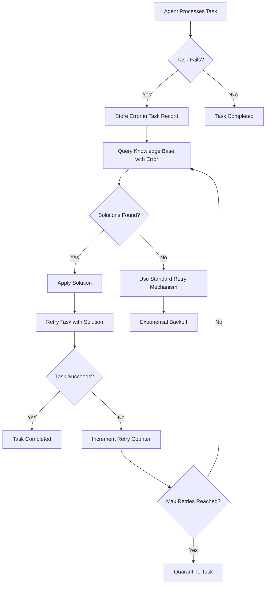

# Self-Healing Agents: Knowledge Base Error Query Enhancement

## 1. Overview

This design document outlines the enhancement of Self-Healing Agents to query the knowledge base with their last_error to find potential solutions before retrying. This feature will enable agents to learn from previous failures and apply known solutions to resolve issues, reducing manual intervention and improving system autonomy.

The enhancement leverages the existing knowledge base infrastructure with vector embeddings to semantically search for solutions based on error messages. When an agent encounters an error, it will automatically query the knowledge base for potential solutions before entering the standard retry cycle.

## 2. Architecture

### 2.1 Current System Components

- **Agent SDK**: Python-based SDK that agents use to communicate with the devart.ai platform
- **Knowledge Base**: PostgreSQL `knowledge_base` table with vector embeddings for semantic search
- **API Layer**: Hono-based API that provides knowledge base search functionality through `/api/knowledge/search` endpoint
- **Task Management**: System for tracking task status, retries, and errors with `retry_count`, `max_retries`, and `last_error` fields

### 2.2 Enhanced Flow

The enhanced flow adds a knowledge base query step after error detection. If solutions are found, they are applied before retrying the task. This approach allows agents to learn from previous failures and apply known solutions, potentially reducing retry cycles and improving success rates.

## 3. API Endpoints Reference

### 3.1 Knowledge Base Search Endpoint

**Endpoint**: `POST /api/knowledge/search`
**Description**: Search the knowledge base for solutions based on error text
**Authentication**: Requires agent API key in Authorization header
**Rate Limiting**: 10 requests per minute per agent

**Request Body**:
The request body for the knowledge base search endpoint includes the query text and optional parameters for threshold and limit. The response contains an array of matching knowledge base entries with their similarity scores.

### 3.2 Task Error Update Endpoint

**Endpoint**: `PUT /api/tasks/{taskId}/error`
**Description**: Update task with error information
**Authentication**: Requires agent API key in Authorization header

**Request Body**:
The request body for the task error update endpoint includes the agent ID and error message. The response contains the updated task information including retry count and status.

## 4. Data Models

### 4.1 Knowledge Base Entry
The KnowledgeBaseEntry interface defines the structure of knowledge base entries, including the content, embedding vector, and metadata.

The TaskWithError interface extends the existing task structure with error tracking fields including retry counts and last error information.

The SolutionApplicationResult interface defines the structure for tracking the outcome of applying solutions to tasks.

## 5. Business Logic Layer

### 5.1 Agent SDK Enhancement

The Agent SDK will be enhanced with new functionality to:

1. Capture and report errors to the API
2. Query the knowledge base for solutions
3. Apply solutions before retrying tasks
4. Track solution effectiveness

#### 5.1.1 New Methods in AgentSDK Class

The AgentSDK class will be enhanced with these new methods to support knowledge base querying and solution application.

### 5.2 Error Handling and Solution Application Flow

1. When a task fails, the agent calls `report_error` to store the error
2. The agent then calls `query_knowledge_base` with the error message
3. If solutions are found (similarity > threshold), the agent applies the most relevant solution
4. The agent retries the task with the applied solution
5. The agent calls `track_solution_effectiveness` to report whether the solution worked
6. If no solutions are found or solutions fail, the standard retry mechanism is used

### 5.3 Solution Application Strategies

1. **Configuration Updates**: Modify agent configuration based on solution
2. **Parameter Adjustment**: Adjust task parameters for better success
3. **Alternative Approaches**: Switch to alternative methods or services
4. **Dependency Management**: Install or update required dependencies
5. **Timeout Adjustments**: Increase timeout values for network operations
6. **Retry Strategy Modifications**: Change retry count or backoff strategy

### 5.4 Solution Ranking and Selection

Solutions will be ranked by:
1. Similarity score (higher is better)
2. Success rate of solution in past applications
3. Recency of solution creation

The agent will select the top solution that exceeds the minimum similarity threshold.

## 6. Middleware & Interceptors

### 6.1 Knowledge Base Query Middleware

A middleware component in the API will:

1. Validate knowledge base search requests
2. Log search queries for analytics
3. Apply rate limiting to prevent abuse (10 requests/minute per agent)
4. Cache frequent queries for performance
5. Enforce authentication and authorization
6. Sanitize input to prevent injection attacks

### 6.2 Solution Application Interceptor

An interceptor in the agent will:

1. Validate solution applicability to current task
2. Log solution application attempts
3. Track solution effectiveness
4. Report solution outcomes to the platform
5. Prevent application of low-confidence solutions
6. Rollback solution changes if they cause additional errors

### 6.3 Analytics Middleware

An analytics middleware will collect metrics on:

1. Knowledge base query frequency
2. Solution success rates
3. Reduction in retry cycles
4. Overall task completion improvement

## 7. Testing Strategy

### 7.1 Unit Tests

1. **Knowledge Base Query Tests**:
   - Test query with various error messages
   - Test similarity threshold handling
   - Test result ranking and filtering
   - Test empty result handling
   - Test API error handling

2. **Solution Application Tests**:
   - Test solution validation
   - Test configuration updates
   - Test parameter adjustments
   - Test rollback on failed application
   - Test multiple solution application

3. **Error Reporting Tests**:
   - Test error storage in task records
   - Test retry counter updates
   - Test task quarantine logic
   - Test error message sanitization

### 7.2 Integration Tests

1. **End-to-End Flow Tests**:
   - Simulate task failure with known error
   - Verify knowledge base query is performed
   - Verify solution is applied correctly
   - Verify task is retried with solution
   - Verify solution effectiveness tracking

2. **Performance Tests**:
   - Test knowledge base query response times
   - Test solution application overhead
   - Test system behavior under high load
   - Test cache effectiveness

3. **Security Tests**:
   - Test authentication enforcement
   - Test input sanitization
   - Test rate limiting
   - Test error information leakage

### 7.3 Mock Data for Testing

Sample test data includes error messages and corresponding solutions with similarity scores, representing typical scenarios for testing the knowledge base querying functionality.

### 7.4 Test Metrics

1. **Solution Success Rate**: Percentage of applied solutions that lead to task completion
2. **Retry Reduction**: Average reduction in retry cycles when solutions are applied
3. **Query Accuracy**: Percentage of relevant solutions returned for error queries
4. **Performance Impact**: Additional latency introduced by knowledge base queries