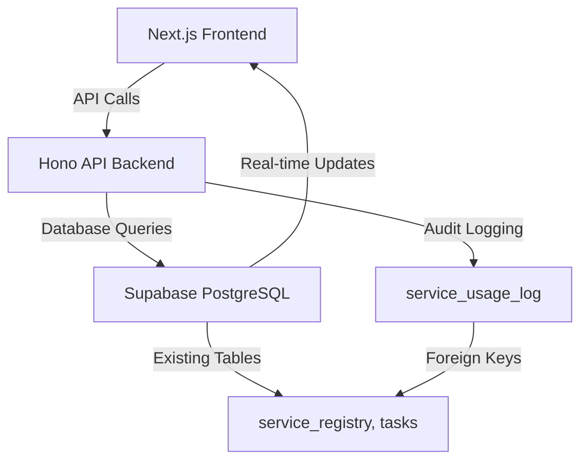
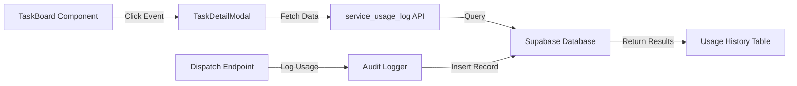
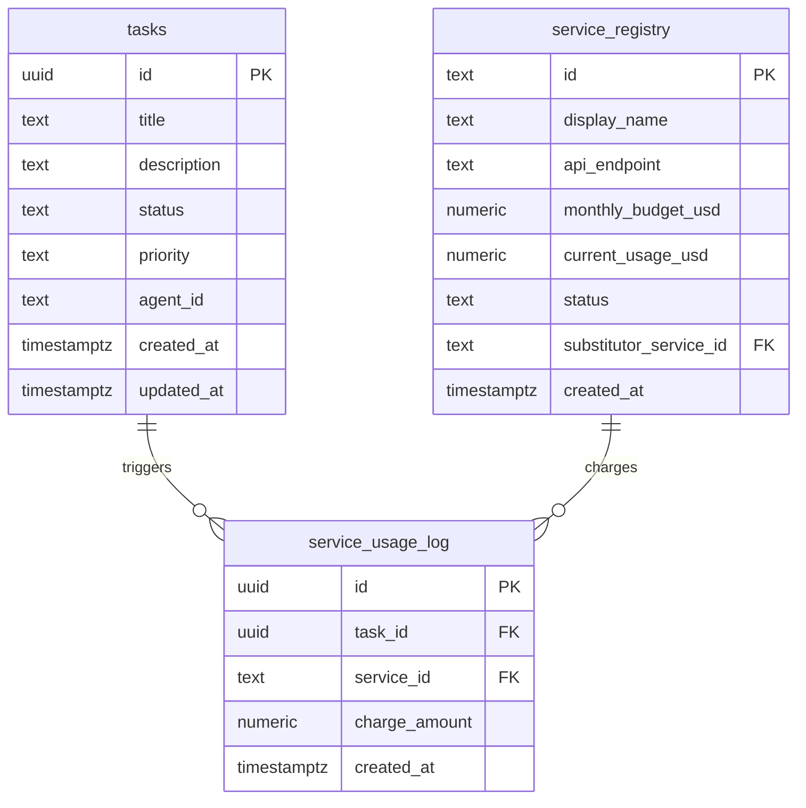
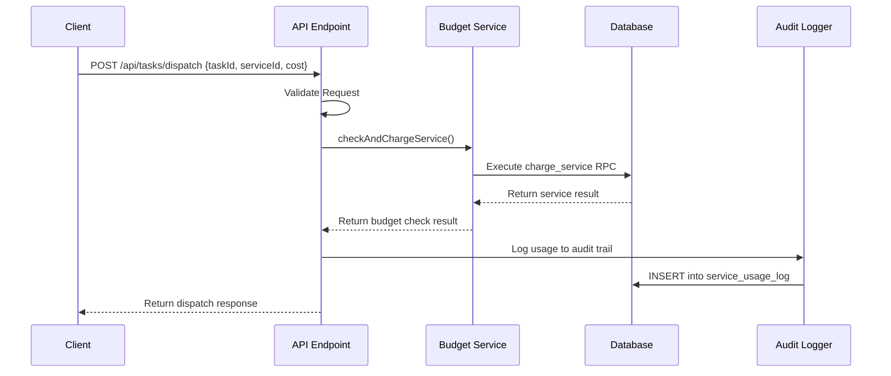
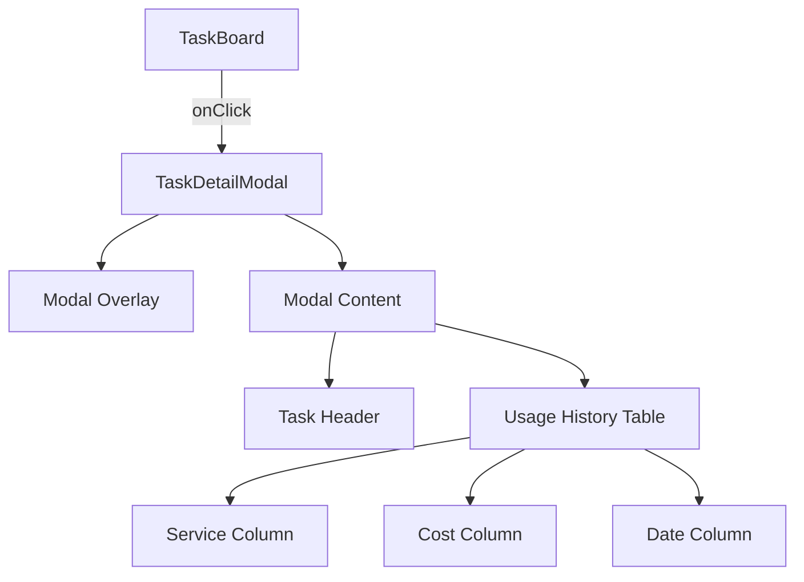

# Service Usage Audit System - Design Document

## Overview

The Service Usage Audit System transforms the existing budget supervisor platform from a simple state monitoring tool into a comprehensive analytical and auditable platform. This evolution addresses the critical gap of historical traceability by implementing an immutable audit trail that connects tasks directly to their resource consumption.

### Current State Assessment
- ✅ Budget monitoring and service suspension capabilities
- ✅ Real-time dashboard with task and service status
- ✅ Automatic service delegation when budgets are exceeded
- ❌ No historical data tracking
- ❌ Cannot answer questions like "How much did Task X cost?"
- ❌ No service usage analytics

### Target State Goals
- ✅ Complete audit trail for all service charges
- ✅ Task-to-resource consumption mapping
- ✅ Historical cost analysis capabilities
- ✅ Enhanced UI with detailed usage history

## Architecture

### System Context



### Technology Stack
- **Frontend**: Next.js 14.2.3 with React and Tailwind CSS
- **Backend**: Hono 4.4.0 framework on Cloudflare Workers
- **Database**: Supabase PostgreSQL with real-time capabilities
- **State Management**: Real-time subscriptions with client-side state

### Component Architecture



## Data Models & Schema

### New Table: service_usage_log

```sql
CREATE TABLE service_usage_log (
  id UUID PRIMARY KEY DEFAULT gen_random_uuid(),
  task_id UUID NOT NULL REFERENCES tasks(id) ON DELETE CASCADE,
  service_id TEXT NOT NULL REFERENCES service_registry(id),
  charge_amount NUMERIC NOT NULL CHECK (charge_amount >= 0),
  created_at TIMESTAMPTZ DEFAULT NOW()
);
```

#### Field Specifications
- **id**: Unique identifier for each audit log entry
- **task_id**: Foreign key linking to the specific task that triggered the charge
- **service_id**: References the actual service used (may differ from requested due to delegation)
- **charge_amount**: Cost in USD for this specific transaction (non-negative constraint)
- **created_at**: Timestamp for chronological ordering and analysis

#### Indexing Strategy
```sql
CREATE INDEX idx_service_usage_log_task_id ON service_usage_log(task_id);
```

#### Security Model
```sql
ALTER TABLE service_usage_log ENABLE ROW LEVEL SECURITY;
CREATE POLICY "Allow authenticated users to read all logs"
  ON service_usage_log FOR SELECT
  TO authenticated
  USING (true);
```

### Relationship Diagram



## API Endpoints

### Modified Endpoint: POST /api/tasks/dispatch

#### Enhanced Request Schema
```typescript
interface DispatchRequest {
  taskId: string;     // NEW: Required task identifier
  serviceId: string;  // Existing: Service to charge
  cost: number;      // Existing: Amount to charge
}
```

#### Response Schema
```typescript
interface DispatchResponse {
  message: string;
  serviceUsed: string;
  wasDelegated: boolean;
  wasSuspended?: boolean;
}
```

#### Implementation Flow



#### Data Flow Validation
1. **Input Validation**: Ensure taskId, serviceId, and cost are present and valid
2. **Budget Processing**: Execute existing budget check logic
3. **Audit Logging**: Record actual service used (critical for delegation scenarios)
4. **Error Handling**: Graceful degradation if audit logging fails
5. **Response Construction**: Include all relevant status information

## Frontend Component Design

### TaskDetailModal Component

#### Component Hierarchy


#### State Management
```typescript
interface ModalState {
  logs: UsageLog[];
  loading: boolean;
  error: string | null;
}

interface UsageLog {
  id: string;
  charge_amount: number;
  created_at: string;
  service_registry: { display_name: string } | null;
}
```

#### Data Fetching Strategy
```typescript
// Real-time query with join to service_registry
const query = supabase
  .from('service_usage_log')
  .select(`
    id,
    charge_amount,
    created_at,
    service_registry ( display_name )
  `)
  .eq('task_id', taskId)
  .order('created_at', { ascending: false });
```

### Enhanced TaskBoard Component

#### Interaction Design
- **Click Target**: Entire task card becomes clickable
- **Visual Feedback**: Hover states and cursor changes
- **Modal Trigger**: Click sets selectedTaskId state
- **Accessibility**: Proper ARIA labels and keyboard navigation

#### State Integration
```typescript
const [selectedTaskId, setSelectedTaskId] = useState<string | null>(null);

// Event handler
const handleTaskClick = (taskId: string) => {
  setSelectedTaskId(taskId);
};

// Modal close handler
const handleModalClose = () => {
  setSelectedTaskId(null);
};
```

## Business Logic Layer

### Audit Trail Integration

#### Critical Design Decisions
1. **Logging Order**: Audit logging occurs AFTER successful budget processing
2. **Service Attribution**: Log the actual service used, not the requested service
3. **Error Handling**: Audit failures do not block task dispatch
4. **Atomicity**: Budget operations remain atomic; auditing is supplementary

#### Fire-and-Forget Pattern
```typescript
// Fire-and-forget audit logging
const logError = await supabase.from('service_usage_log').insert({
  task_id: taskId,
  service_id: serviceToUse.id, // Critical: actual service used
  charge_amount: cost,
});

if (logError) {
  console.error('Failed to write to audit log:', logError);
  // Continue with dispatch - do not fail the request
}
```

### Data Integrity Considerations

#### Foreign Key Constraints
- **ON DELETE CASCADE**: When tasks are deleted, audit logs are automatically cleaned
- **Service Reference**: Ensures audit logs only reference valid services
- **Data Validation**: CHECK constraints prevent negative amounts

#### Consistency Guarantees
- **Eventually Consistent**: Audit logs may lag behind service charges during high load
- **Reconciliation**: Periodic validation between service_registry.current_usage_usd and audit log sums
- **Immutability**: Audit logs are insert-only for historical accuracy

## Testing Strategy

### Unit Testing

#### API Endpoint Tests
```typescript
describe('POST /api/tasks/dispatch', () => {
  test('should log usage after successful charge', async () => {
    // Test audit logging integration
  });
  
  test('should handle audit logging failures gracefully', async () => {
    // Test error resilience
  });
  
  test('should log actual service used in delegation scenarios', async () => {
    // Test delegation logging accuracy
  });
});
```

#### Component Tests
```typescript
describe('TaskDetailModal', () => {
  test('should fetch and display usage history', async () => {
    // Test data fetching and display
  });
  
  test('should handle empty usage history', async () => {
    // Test empty state handling
  });
  
  test('should close modal on background click', async () => {
    // Test interaction behavior
  });
});
```

### Integration Testing

#### End-to-End Scenarios
1. **Complete Task Lifecycle**: Create task → Dispatch → View audit history
2. **Service Delegation**: Request premium service → Get free alternative → Verify correct logging
3. **Real-time Updates**: Dispatch task → Verify UI updates → Check audit trail
4. **Error Scenarios**: Network failures, invalid data, concurrent modifications

#### Database Testing
```sql
-- Test foreign key constraints
INSERT INTO service_usage_log (task_id, service_id, charge_amount) 
VALUES ('invalid-uuid', 'premium_llm', 10.00);
-- Should fail with foreign key violation

-- Test check constraints
INSERT INTO service_usage_log (task_id, service_id, charge_amount) 
VALUES ((SELECT id FROM tasks LIMIT 1), 'premium_llm', -5.00);
-- Should fail with check constraint violation
```

## Migration & Deployment

### Database Migration Steps
1. **Schema Application**: Execute CREATE TABLE statement in Supabase SQL Editor
2. **Index Creation**: Apply performance indexes
3. **RLS Configuration**: Enable row-level security policies
4. **Verification**: Confirm table structure and constraints

### API Deployment Process
1. **Code Updates**: Deploy enhanced dispatch endpoint
2. **Environment Variables**: Ensure Supabase credentials are configured
3. **Health Checks**: Verify endpoint functionality
4. **Rollback Plan**: Maintain previous endpoint version for quick recovery

### Frontend Deployment Steps
1. **Component Integration**: Deploy new modal and enhanced TaskBoard
2. **Build Validation**: Ensure no TypeScript errors
3. **Performance Testing**: Verify real-time subscriptions work correctly
4. **User Acceptance**: Confirm modal interactions function as expected

## Performance Considerations

### Database Optimization
- **Index Strategy**: Primary index on task_id for efficient history queries
- **Query Optimization**: Use Supabase joins to minimize round trips
- **Data Retention**: Consider archival strategy for long-term audit logs

### Frontend Performance
- **Lazy Loading**: Modal content loads only when opened
- **Caching Strategy**: Cache usage history for recently viewed tasks
- **Real-time Efficiency**: Minimize subscription overhead

### API Scalability
- **Async Logging**: Non-blocking audit trail writes
- **Error Tolerance**: Graceful degradation when audit system is unavailable
- **Resource Management**: Efficient database connection pooling

## Security Considerations

### Data Access Control
- **Row-Level Security**: Prepared for future multi-tenant scenarios
- **API Authentication**: Leverage existing Supabase authentication
- **Audit Trail Integrity**: Immutable logging prevents data tampering

### Input Validation
- **Parameter Sanitization**: Validate all task IDs and numeric values
- **SQL Injection Prevention**: Use parameterized queries exclusively
- **Type Safety**: TypeScript interfaces enforce data structure compliance

### Privacy Compliance
- **Data Minimization**: Log only essential transaction details
- **Retention Policy**: Define clear data lifecycle management
- **Access Logging**: Track who accesses audit information

## Monitoring & Observability

### Key Metrics
- **Audit Success Rate**: Percentage of successful audit log writes
- **Query Performance**: Response times for usage history requests
- **Modal Usage**: Frequency of task detail modal interactions
- **Data Consistency**: Periodic reconciliation between budgets and audit logs

### Error Tracking
- **Audit Failures**: Monitor and alert on logging system issues
- **Query Timeouts**: Track database performance degradation
- **Frontend Errors**: Monitor modal loading and interaction failures

### Dashboard Analytics
- **Cost Attribution**: Task-level cost breakdown reports
- **Service Utilization**: Historical usage patterns across services
- **Budget Efficiency**: Analysis of delegation patterns and cost optimization