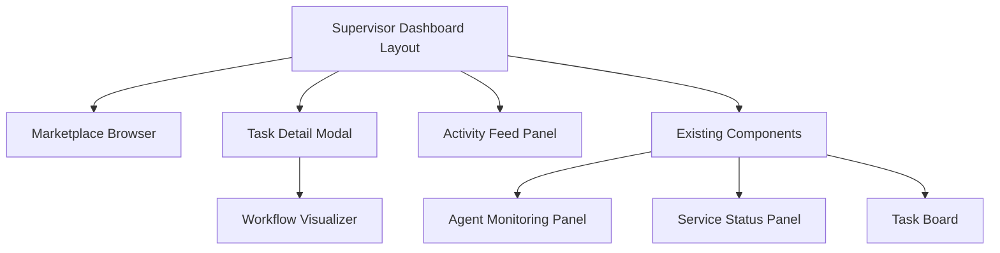
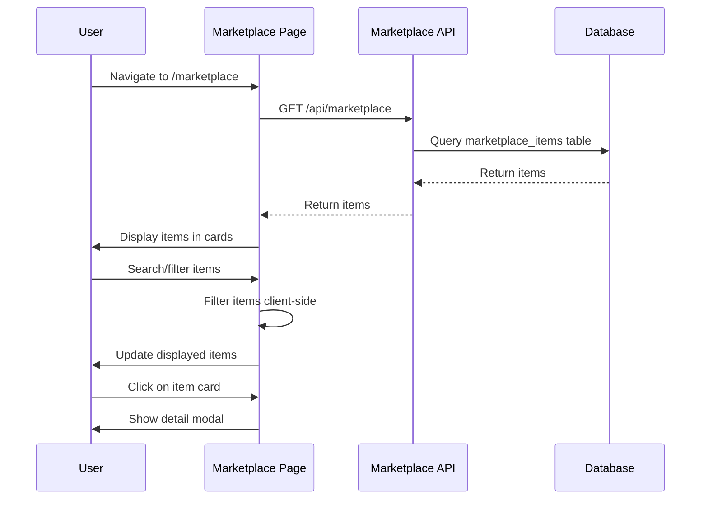
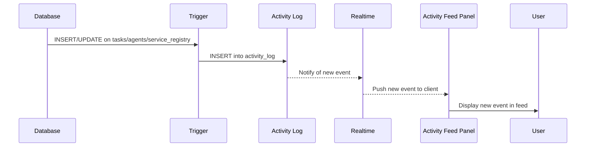

# Advanced Supervisor UX & Intelligibility Layer Design

## 1. Overview

This design document outlines the implementation of the Advanced Supervisor UX & Intelligibility Layer for the devart.ai platform. The goal is to transform the existing UI from a collection of data panels into a true "cockpit" that provides deep situational awareness and makes the platform's complex capabilities easy to understand and manage.

The design consists of three major components:
1. Marketplace Browser - A UI for browsing and searching shared automation assets
2. Visual Workflow Monitor - A graphical representation of task chains and workflows
3. Centralized Activity Feed - A real-time streaming log of all important system events

## 2. Frontend Architecture

### 2.1 Technology Stack

The frontend is built with:
- Next.js 14.2.3 (React)
- TypeScript
- Tailwind CSS for styling
- Supabase client for real-time subscriptions
- React Flow for workflow visualization

### 2.2 Component Hierarchy



### 2.3 State Management

The application uses:
- React useState for local component state
- Supabase Realtime for server state synchronization
- React Context for global state when needed

### 2.4 Routing Structure

- `/` - Main dashboard with existing panels
- `/marketplace` - Marketplace browser page
- All other routes remain unchanged

## 3. Backend Architecture

### 3.1 API Endpoints

The backend uses Hono framework deployed on Cloudflare Workers with the following new endpoints:

| Endpoint | Method | Description |
|----------|--------|-------------|
| `/api/marketplace` | GET | List all marketplace items |
| `/api/marketplace` | POST | Publish new marketplace items |
| `/api/tasks/:taskId/lineage` | GET | Get task lineage for visualization |

### 3.2 Database Schema

#### 3.2.1 Marketplace Items Table

The existing `marketplace_items` table stores metadata for shared agents and workflows:

```sql
CREATE TABLE marketplace_items (
  id UUID PRIMARY KEY DEFAULT gen_random_uuid(),
  item_type TEXT NOT NULL, -- 'agent' or 'workflow'
  name TEXT NOT NULL,
  description TEXT,
  version TEXT NOT NULL,
  publisher_id UUID REFERENCES auth.users(id),
  tags JSONB, -- For search and categorization
  repository_url TEXT, -- Link to the source code
  created_at TIMESTAMPTZ DEFAULT NOW(),
  UNIQUE (name, version)
);
```

#### 3.2.2 Activity Log Table

A new `activity_log` table will be added to store system events:

```sql
CREATE TABLE activity_log (
  id BIGSERIAL PRIMARY KEY,
  timestamp TIMESTAMPTZ DEFAULT NOW(),
  event_type TEXT NOT NULL, -- e.g., 'TASK_CREATED', 'AGENT_CLAIMED_TASK', 'SERVICE_SUSPENDED'
  details JSONB,
  severity TEXT DEFAULT 'INFO' -- 'INFO', 'WARN', 'ERROR'
);

COMMENT ON TABLE activity_log IS 'A real-time, append-only log of all significant system events.';
```

### 3.3 Database Triggers

A PostgreSQL trigger function will automatically populate the activity log:

```sql
CREATE OR REPLACE FUNCTION log_activity()
RETURNS TRIGGER AS $$
DECLARE
  event_type_text TEXT;
  details_jsonb JSONB;
BEGIN
  IF (TG_OP = 'INSERT' AND TG_TABLE_NAME = 'tasks') THEN
    event_type_text := 'TASK_CREATED';
    details_jsonb := jsonb_build_object('taskId', NEW.id, 'title', NEW.title);
  ELSIF (TG_OP = 'UPDATE' AND TG_TABLE_NAME = 'tasks') THEN
    IF OLD.status <> NEW.status THEN
      event_type_text := 'TASK_STATUS_CHANGED';
      details_jsonb := jsonb_build_object('taskId', NEW.id, 'title', NEW.title, 'from', OLD.status, 'to', NEW.status);
    END IF;
  -- Add more conditions for other tables and operations
  END IF;

  IF event_type_text IS NOT NULL THEN
    INSERT INTO activity_log (event_type, details) VALUES (event_type_text, details_jsonb);
  END IF;

  RETURN NEW;
END;
$$ LANGUAGE plpgsql;
```

## 4. Feature 1: Marketplace Browser

### 4.1 Requirements

- Create a new page/route for the marketplace at `apps/ui/src/app/marketplace/page.tsx`
- Develop a reusable `MarketplaceItemCard` component at `apps/ui/src/components/MarketplaceItemCard.tsx`
- Implement client-side search and filtering functionality
- Create a detail modal for viewing full item information

### 4.2 UI Components

#### 4.2.1 Marketplace Page (`/apps/ui/src/app/marketplace/page.tsx`)

The main marketplace page will:
- Fetch all items from the GET `/api/marketplace` endpoint on component mount
- Provide a search bar to filter items by name
- Include checkboxes or buttons to filter by item_type ('agent' or 'workflow')
- Display items using the `MarketplaceItemCard` component in a responsive grid
- Handle loading and error states appropriately

#### 4.2.2 Marketplace Item Card (`/apps/ui/src/components/MarketplaceItemCard.tsx`)

Each card will display:
- Item name (prominently displayed)
- Item type (agent/workflow) with distinctive styling
- Version information
- Tags for quick categorization
- Creation date
- Click handler to open detail modal

#### 4.2.3 Detail Modal

When a user clicks on a card, a modal will appear showing:
- Full item description
- Repository URL with direct link
- Publisher information
- Version history
- Close button and/or click-outside-to-close functionality

### 4.3 Data Flow



### 4.4 API Integration

The marketplace browser will integrate with the existing marketplace API endpoints:

| Endpoint | Method | Description |
|----------|--------|-------------|
| `/api/marketplace` | GET | List all marketplace items |
| `/api/marketplace` | POST | Publish new marketplace items (used in future tasks) |

## 5. Feature 2: Visual Workflow Monitor

### 5.1 Requirements

- Install React Flow library for graph visualization
- Create a new API endpoint: GET `/api/tasks/:taskId/lineage`
- Develop a `WorkflowVisualizer` component
- Integrate the visualizer into the `TaskDetailModal`

### 5.2 API Endpoint: Task Lineage

The new `/api/tasks/:taskId/lineage` endpoint will:
- Receive a taskId parameter
- Traverse the `parent_task_id` relationships both upward (ancestors) and downward (descendants)
- Return a complete graph of all connected tasks (the entire workflow instance)
- Include safeguards such as depth limits to prevent infinite loops in case of data corruption
- Return data in a format suitable for React Flow visualization

### 5.3 UI Component: WorkflowVisualizer

The `WorkflowVisualizer` component will:
- Accept a taskId as a prop
- Fetch the task graph data from the new `/lineage` endpoint
- Transform this data into the nodes and edges format required by React Flow
- Render the visual graph with automatic layout for clarity
- Highlight the currently selected task
- Handle loading and error states

### 5.4 Integration with Task Detail Modal

The existing `TaskDetailModal` component will be enhanced to include:
- A new tab or section containing the visual representation of the task's workflow
- Toggle between the existing audit log view and the new workflow visualization view
- Proper state management for the visualization data

### 5.5 Data Model

```typescript
interface MarketplaceItem {
  id: string;
  item_type: 'agent' | 'workflow';
  name: string;
  description: string;
  version: string;
  publisher_id: string;
  tags: string[];
  repository_url: string;
  created_at: string;
}

interface TaskNode {
  id: string;
  title: string;
  status: string;
  priority: string;
  type: 'task';
}

interface TaskEdge {
  id: string;
  source: string;
  target: string;
  type: 'parent-child';
}

interface TaskLineage {
  nodes: TaskNode[];
  edges: TaskEdge[];
  selectedTaskId: string;
}
```

## 6. Feature 3: Centralized Activity Feed

### 6.1 Requirements

- Create an `activity_log` table in `supabase/schema.sql`
- Implement a PostgreSQL trigger function to automatically populate this log
- Create a new `ActivityFeedPanel` UI component
- Integrate the new panel into the main dashboard

### 6.2 UI Component: ActivityFeedPanel

The `ActivityFeedPanel` component will:
- Be a client component that subscribes to INSERT events on the `activity_log` table using Supabase Realtime
- Maintain a stateful list of recent events (last 50 to avoid performance issues)
- Display events in a live "ticker" format with timestamps and severity indicators
- Format events in a clear, human-readable way that provides immediate insight
- Handle loading and error states

### 6.3 Event Types

The activity feed will capture these key system events:

| Event Type | Description | Trigger Condition |
|------------|-------------|-------------------|
| TASK_CREATED | A new task was created | INSERT on tasks table |
| TASK_STATUS_CHANGED | A task's status was updated | UPDATE on tasks table when status changes |
| TASK_ASSIGNED | A task was assigned to an agent | UPDATE on tasks table when agent_id changes |
| AGENT_REGISTERED | A new agent was registered | INSERT on agents table |
| AGENT_STATUS_CHANGED | An agent's status was updated | UPDATE on agents table when status changes |
| SERVICE_SUSPENDED | A service was suspended due to budget | UPDATE on service_registry when status changes to SUSPENDED |
| SERVICE_REACTIVATED | A service was reactivated | UPDATE on service_registry when status changes to ACTIVE |
| BUDGET_INCREASED | A service's budget was increased | UPDATE on service_registry when monthly_budget_usd increases |

### 6.4 Data Flow



## 7. Data Models & ORM Mapping

### 7.1 Marketplace Item

```typescript
interface MarketplaceItem {
  id: string; // UUID
  item_type: 'agent' | 'workflow';
  name: string;
  description: string;
  version: string;
  publisher_id: string; // UUID reference to auth.users
  tags: string[]; // JSONB array
  repository_url: string;
  created_at: string; // ISO timestamp
}
```

### 7.2 Activity Event

```typescript
interface ActivityEvent {
  id: number; // BIGSERIAL
  timestamp: string; // ISO timestamp
  event_type: string; // Predefined event types
  details: Record<string, any>; // JSONB with event-specific data
  severity: 'INFO' | 'WARN' | 'ERROR';
}
```

### 7.3 Task Lineage

```typescript
interface TaskNode {
  id: string; // UUID
  title: string;
  status: 'TODO' | 'IN_PROGRESS' | 'DONE' | 'QUARANTINED' | 'PENDING_BUDGET_APPROVAL';
  priority: 'LOW' | 'MEDIUM' | 'HIGH' | 'CRITICAL';
  type: 'task';
}

interface TaskEdge {
  id: string; // Generated ID for the edge
  source: string; // Parent task ID
  target: string; // Child task ID
  type: 'parent-child';
}

interface TaskLineage {
  nodes: TaskNode[];
  edges: TaskEdge[];
  selectedTaskId: string; // ID of the task being viewed
}
```

## 8. Business Logic Layer

### 8.1 Marketplace Filtering Logic

Client-side filtering will be implemented with the following logic:
- Text search: Case-insensitive partial match on item name
- Type filtering: Exact match on item_type ('agent' or 'workflow')
- Combined filtering: AND logic between search and type filters

### 8.2 Task Lineage Traversal

The task lineage API endpoint will traverse the task relationships:
- Start with the provided taskId
- Recursively find parent tasks (using parent_task_id)
- Recursively find child tasks (where parent_task_id equals the taskId)
- Apply a depth limit (e.g., 10 levels) to prevent infinite loops
- Return a structured graph representation

### 8.3 Activity Logging

Database triggers will capture events with this logic:
- For each INSERT/UPDATE operation on key tables
- Determine the event type based on the operation and table
- Extract relevant details from the new/old records
- Insert a structured log entry into activity_log

## 9. Testing Strategy

### 9.1 Unit Tests

- Marketplace item filtering functions
- Task lineage traversal algorithm
- Activity event formatting functions
- React component rendering tests

### 9.2 Integration Tests

- API endpoint responses for marketplace and lineage
- Database trigger functionality for activity logging
- Real-time subscription behavior for activity feed
- Component integration tests

### 9.3 UI Tests

- Component rendering and user interactions
- Responsive design across device sizes
- Search and filtering functionality
- Modal display and interaction

## 10. Security Considerations

- All new API endpoints will enforce existing RBAC controls
- Database triggers will operate with appropriate privileges
- UI components will only display data users are authorized to see
- Marketplace publishing will be restricted to supervisor/admin roles
- Proper input validation on all API endpoints
- Protection against SQL injection in lineage queries

## 11. Performance Considerations

- Client-side filtering for marketplace will be sufficient for initial implementation
- Activity feed will limit displayed events to prevent browser performance issues
- Workflow visualization will include depth limits to prevent infinite loops
- Real-time subscriptions will be properly cleaned up to prevent memory leaks
- Pagination or virtualization for large marketplace listings
- Caching strategies for frequently accessed data

## 12. Deployment Considerations

### 12.1 Database Migrations

- Create `activity_log` table
- Add logging trigger functions
- Update existing RLS policies as needed

### 12.2 API Deployments

- Deploy new marketplace endpoints
- Deploy task lineage endpoint
- Update existing endpoints if needed for integration

### 12.3 UI Deployments

- Deploy new marketplace page
- Update task detail modal
- Add activity feed panel to dashboard

## 13. Future Enhancements

### 13.1 Marketplace Enhancements

- Server-side filtering and pagination for large marketplaces
- Rating and review system for marketplace items
- Categories and featured items
- Advanced search capabilities

### 13.2 Workflow Visualization Improvements

- Interactive node editing
- Performance metrics overlay
- Export functionality for workflow diagrams
- Timeline view for workflow execution

### 13.3 Activity Feed Enhancements

- Filtering by event type and severity
- User-specific activity views
- Export capabilities for audit purposes
- Configurable retention policies
