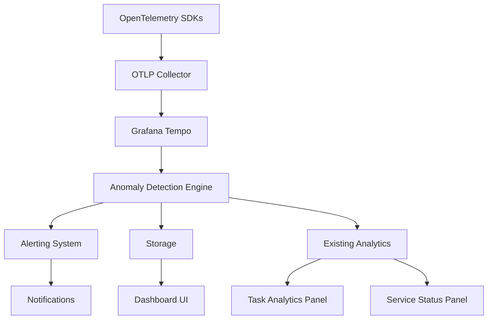

# Advanced Trace Anomaly Detection System Design

## 1. Overview

This document outlines the design for an advanced anomaly detection system that will proactively identify performance regressions and security issues in the devart.ai platform by analyzing trace data collected through OpenTelemetry. The system will build upon the existing observability infrastructure to provide intelligent alerts and automated flagging of anomalous behavior patterns.

### 1.1 Problem Statement

The current system has basic outlier detection for task costs using a statistical approach (average + 2 standard deviations), but lacks comprehensive anomaly detection capabilities for:
- Performance regressions (increased latency, error rates)
- Security issues (unusual access patterns, unauthorized operations)
- Resource consumption anomalies (CPU, memory, I/O spikes)
- Behavioral anomalies in agent operations

### 1.2 Objectives

1. Implement statistical and machine learning-based anomaly detection on trace data
2. Proactively identify performance regressions before they impact users
3. Detect potential security threats through unusual trace patterns
4. Integrate with existing alerting and monitoring infrastructure
5. Provide actionable insights for system operators and developers

## 2. Architecture

### 2.1 System Components

The anomaly detection system will consist of the following components:

1. **Trace Data Collector** - Gathers trace data from Grafana Tempo
2. **Anomaly Detection Engine** - Processes trace data and identifies anomalies
3. **Alerting System** - Generates alerts for detected anomalies
4. **Storage Layer** - Stores anomaly detection results and metadata
5. **Dashboard UI** - Provides visualization of anomalies and system health

The system will integrate with existing components:
- Leverage the current OpenTelemetry infrastructure
- Extend the existing Grafana dashboards
- Integrate with the Telegram notification system
- Use the same Supabase database and real-time subscription patterns

### 2.2 Data Flow



## 3. Anomaly Detection Methods

### 3.1 Statistical Anomaly Detection

#### 3.1.1 Performance Metrics Anomalies
- **Latency Anomalies**: Detect when operation latency exceeds expected thresholds using:
  - Statistical process control (SPC) with control charts
  - Z-score analysis (values beyond 3 standard deviations)
  - Exponentially weighted moving average (EWMA) for trend detection
  - Building upon the existing task cost outlier detection approach (average + 2 standard deviations)

#### 3.1.2 Error Rate Anomalies
- **Error Spike Detection**: Identify sudden increases in error rates using:
  - Moving averages with standard deviation thresholds
  - Cumulative sum (CUSUM) control charts
  - Seasonal decomposition for periodic patterns

#### 3.1.3 Throughput Anomalies
- **Traffic Spike Detection**: Detect unusual traffic patterns using:
  - Seasonal-trend decomposition
  - AutoRegressive Integrated Moving Average (ARIMA) models
  - Threshold-based alerting with dynamic baselines

#### 3.1.4 Resource Consumption Anomalies
- **Resource Usage Spikes**: Detect unusual CPU, memory, or I/O usage patterns:
  - Rate of change analysis for resource metrics
  - Correlation analysis between resource usage and performance metrics
  - Baseline comparison with historical resource usage patterns

### 3.2 Machine Learning-Based Detection

#### 3.2.1 Unsupervised Learning
- **Clustering-based Anomaly Detection**: Group similar traces and identify outliers
- **Isolation Forests**: Effective for high-dimensional trace data
- **Autoencoders**: Neural networks for detecting anomalous trace patterns
- **Principal Component Analysis (PCA)**: Dimensionality reduction for efficient anomaly detection

#### 3.2.2 Supervised Learning
- **Classification Models**: Train models to distinguish between normal and anomalous traces
- **Ensemble Methods**: Combine multiple models for improved accuracy
- **Time Series Forecasting**: Predict future metric values and detect deviations

#### 3.2.3 Implementation Approach
- Start with lightweight statistical methods for initial implementation
- Gradually introduce machine learning models as system complexity grows
- Use existing Python libraries compatible with the agent template environment
- Implement model serving through Cloudflare Worker compatibility

### 3.3 Security Anomaly Detection

#### 3.3.1 Access Pattern Anomalies
- Detect unusual access patterns that may indicate security threats:
  - Unauthorized service interactions
  - Suspicious data access patterns
  - Abnormal authentication attempts
  - Geographic anomalies in access patterns

#### 3.3.2 Behavioral Anomalies
- Identify deviations from normal operational behavior:
  - Unusual sequence of operations
  - Unexpected data flows
  - Resource usage anomalies
  - Timing-based anomalies (operations at unusual hours)

#### 3.3.3 Implementation Considerations
- Ensure compliance with data protection policies defined in `OTEL_SECURITY.md`
- Exclude sensitive information from analysis as per existing tracing security practices
- Implement role-based access controls for security anomaly investigations
- Integrate with existing activity logging in the `activity_log` table

## 4. Implementation Plan

### 4.1 Backend Implementation

#### 4.1.1 Anomaly Detection Service
Create a new service in the backend to handle anomaly detection:

```
apps/api/src/services/anomalyDetection.ts
```

Key functions:
- `collectTraceData()`: Retrieve trace data from Grafana Tempo
- `detectAnomalies()`: Apply detection algorithms to trace data
- `generateAlerts()`: Create alerts for detected anomalies
- `storeResults()`: Save detection results for analysis

The service will integrate with the existing Hono API framework and follow the same patterns as other services in `apps/api/src/services/`.

#### 4.1.2 Database Schema
Add tables for storing anomaly detection results:

```sql
-- Anomaly detection results
CREATE TABLE trace_anomalies (
  id UUID PRIMARY KEY DEFAULT gen_random_uuid(),
  trace_id TEXT NOT NULL,
  span_id TEXT,
  anomaly_type TEXT NOT NULL, -- 'PERFORMANCE', 'SECURITY', 'RESOURCE'
  anomaly_subtype TEXT, -- Specific type of anomaly
  severity TEXT NOT NULL, -- 'LOW', 'MEDIUM', 'HIGH', 'CRITICAL'
  description TEXT,
  detected_at TIMESTAMPTZ DEFAULT NOW(),
  resolved BOOLEAN DEFAULT FALSE,
  resolution_notes TEXT
);

-- Anomaly detection configuration
CREATE TABLE anomaly_detection_config (
  id UUID PRIMARY KEY DEFAULT gen_random_uuid(),
  config_key TEXT NOT NULL UNIQUE,
  config_value JSONB,
  description TEXT
);

-- Add indexes for efficient querying
CREATE INDEX idx_trace_anomalies_type ON trace_anomalies(anomaly_type);
CREATE INDEX idx_trace_anomalies_severity ON trace_anomalies(severity);
CREATE INDEX idx_trace_anomalies_detected ON trace_anomalies(detected_at);
```

These tables will be added to the existing schema in `supabase/schema.sql` and will follow the same RLS policies as other system tables.

### 4.2 Frontend Implementation

#### 4.2.1 Anomaly Dashboard
Create a new dashboard component to visualize anomalies:

```
apps/ui/src/components/AnomalyDashboard.tsx
```

Features:
- Real-time anomaly visualization
- Filtering by anomaly type, severity, and time range
- Drill-down capabilities for detailed analysis
- Integration with existing Grafana panels
- Connection to Supabase real-time subscriptions for live updates

The dashboard will follow the same design patterns as existing components like `TaskBoard.tsx` and `ServiceStatusPanel.tsx`, using Tailwind CSS for styling and Supabase for data access.

#### 4.2.2 Alert Panel
Add an alert panel to the supervisor dashboard:

```
apps/ui/src/components/AnomalyAlertPanel.tsx
```

Features:
- Summary of active anomalies
- Severity-based alert prioritization
- Quick resolution actions
- Integration with Telegram notifications for critical alerts

This component will be added to the main supervisor dashboard alongside existing panels like `ServiceStatusPanel.tsx` and `AgentMonitoringPanel.tsx`.

## 5. Integration Points

### 5.1 OpenTelemetry Integration
- Extend existing tracing instrumentation to capture additional metadata useful for anomaly detection
- Ensure trace context propagation between services for end-to-end analysis
- Leverage existing OTLP collector configuration from `otel-collector-config.yaml`
- Use the same environment variables for configuration as defined in `OTEL_ENVIRONMENT_VARIABLES.md`

### 5.2 Grafana Integration
- Create new dashboards for anomaly visualization based on the existing `grafana-dashboard-traces.json` structure
- Integrate with existing Grafana alerting mechanisms defined in `OTEL_MONITORING_ALERTING.md`
- Use Grafana Tempo as a data source for trace analysis
- Extend the setup scripts in `setup-grafana-dashboards.js` and `setup-grafana-datasource.js` to configure anomaly detection dashboards

### 5.3 Alerting Integration
- Extend existing alerting system with new anomaly detection rules
- Integrate with Telegram notifications using the existing `telegram.ts` service
- Provide webhook support for external alerting systems
- Implement alert deduplication to avoid notification spam

## 6. Performance Considerations

### 6.1 Scalability
- Implement efficient data processing pipelines to handle large volumes of trace data
- Use streaming analytics for real-time anomaly detection
- Employ sampling strategies to reduce processing overhead

### 6.2 Resource Usage
- Optimize machine learning models for inference speed
- Implement caching mechanisms for frequently accessed data
- Use incremental processing to avoid reprocessing historical data

## 7. Security Considerations

### 7.1 Data Protection
- Ensure sensitive information is excluded from trace data used for anomaly detection following the same practices as the existing tracing implementation
- Implement access controls for anomaly detection results using the same RBAC patterns as other system components
- Encrypt data at rest and in transit
- Follow the security guidelines documented in `OTEL_SECURITY.md`

### 7.2 Model Security
- Protect machine learning models from adversarial attacks
- Implement model validation to detect tampering
- Regularly update models to address new threat patterns
- Implement model explainability features to help security analysts understand anomaly detections

## 8. Testing Strategy

### 8.1 Unit Testing
- Test individual anomaly detection algorithms
- Validate statistical calculations and thresholds
- Verify alert generation logic
- Follow the same testing patterns as existing services in `apps/api/src/services/`

### 8.2 Integration Testing
- Test integration with OpenTelemetry collector
- Validate data flow from Tempo to anomaly detection engine
- Verify alerting system integration
- Test integration with Supabase real-time subscriptions
- Validate Telegram notification delivery

### 8.3 Performance Testing
- Evaluate processing latency for real-time anomaly detection
- Test scalability with increasing trace data volumes
- Validate resource usage under normal and peak loads
- Test alerting system performance under high anomaly load

### 8.4 Testing Data
- Create synthetic trace data that simulates various anomaly scenarios
- Use existing trace data from development environments for baseline testing
- Implement test scripts similar to `test-auth-flow.js` and `test-user-onboarding.js`

## 9. Deployment Considerations

### 9.1 Infrastructure
- Deploy anomaly detection service as a separate Cloudflare Worker following the same patterns as the main API
- Configure appropriate resource limits and scaling policies
- Implement health checks and monitoring for the service
- Use the same environment variable patterns as defined in `.env.example`

### 9.2 Configuration
- Provide flexible configuration options for anomaly detection parameters
- Support environment-specific configurations
- Implement configuration validation and error handling
- Store configuration in the `system_settings` table similar to the existing `outlier_detection_stddev` setting
- Provide API endpoints for configuration management following the same patterns as other system APIs

## 10. Monitoring and Maintenance

### 10.1 System Health Monitoring
- Monitor anomaly detection service performance using the same OpenTelemetry instrumentation as other services
- Track detection accuracy and false positive rates
- Measure alert response times
- Implement the same health check patterns as the main API service

### 10.2 Model Maintenance
- Implement model versioning and rollback capabilities
- Schedule regular model retraining with new data
- Monitor model drift and performance degradation
- Log model performance metrics to the existing `activity_log` table
- Provide dashboard visualizations for model performance trends