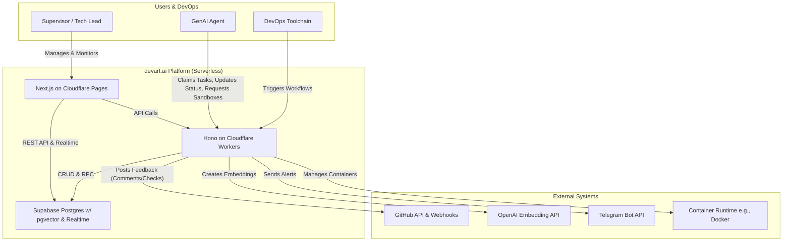
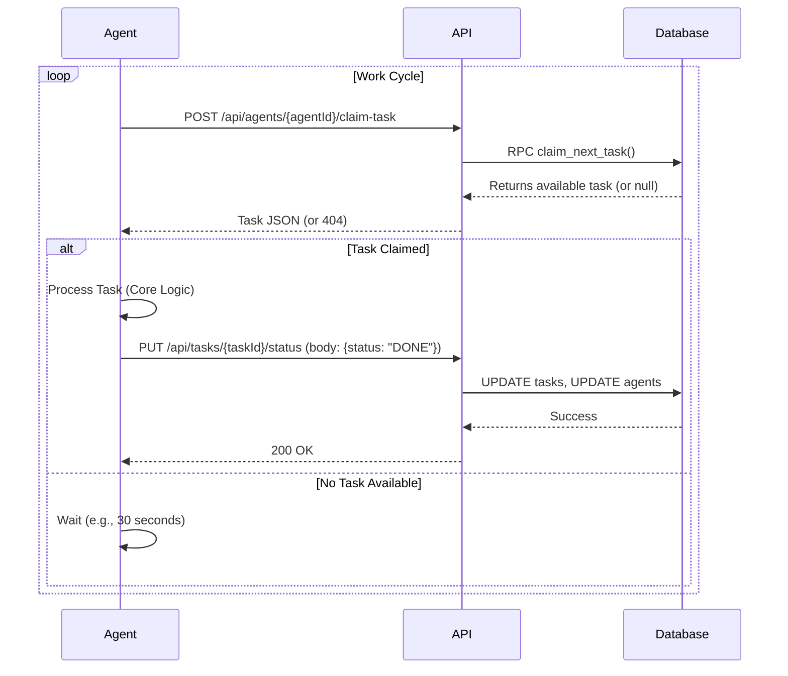

# README.md Update Design Documentation

## Overview

This document contains the final, updated content for the README.md file to align with the platform's final, mature state as "The Autonomous DevOps Platform". The changes include updating the title, replacing the architecture diagram, restructuring core features, enhancing system concepts, adding a task lifecycle diagram, expanding the future roadmap, and enhancing setup instructions.

## Final README.md Content

# devart.ai - The Autonomous DevOps Platform

devart.ai is a serverless, enterprise-ready control plane for orchestrating, supervising, and analyzing a team of autonomous GenAI agents. It functions as a deeply integrated partner in the modern software development lifecycle, transforming AI from a simple tool into a collaborative team member that can build, test, review, and deploy code.

## 🏛️ Architecture



## ✨ Core Features

### Advanced DevOps Integration
- **Interactive GitHub Integration**: Agents can post comments and pass/fail status checks directly to Pull Requests, acting as automated code reviewers.
- **Workflow Engine**: Define, manage, and trigger multi-stage, reusable workflows (e.g., build -> test -> review) from the UI or via API.
- **Agent Execution Sandboxing**: Provide agents with clean, isolated, and containerized environments for executing tasks securely and reproducibly.

### Governance & Security
- **Role-Based Access Control (RBAC)**: Secure the platform with admin, supervisor, and viewer roles, enforced at the database level with RLS.
- **Secure Agent Management**: Onboard agents with secure, hashed API keys and toggle their activation status from the UI.
- **Dynamic System Configuration**: Tune system parameters, like performance thresholds, from a live settings panel without redeploying.

### Orchestration & Collaboration
- **Autonomous Agent Lifecycle**: Agents can register, claim tasks from a priority queue, and report their status.
- **Atomic Task Claiming**: A race-condition-free queue system (FOR UPDATE SKIP LOCKED) ensures tasks are never worked on by multiple agents.
- **Task Chaining**: Agents can create successor tasks, enabling complex, multi-step workflows.

### Intelligence & Analytics
- **Knowledge Base**: A pgvector-powered knowledge base allows agents to perform semantic searches for contextual information.
- **Performance Analytics**: A dedicated dashboard panel provides insights into task costs and service usage patterns.
- **Outlier Detection**: The system automatically flags tasks with unusually high costs for supervisor review.

### Supervision & Control
- **Real-Time Dashboards**: Live, streaming updates for tasks, agents, and service budgets using Supabase Realtime.
- **Interactive Task Management**: Supervisors can create, prioritize, update, and delete tasks from the UI.
- **Budget Supervisor**: Set monthly spending limits on external services (e.g., LLM APIs), with automatic suspension, delegation to cheaper alternatives, and proactive Telegram alerts.

## 🚀 Getting Started

### 1. Prerequisites
- Git, Node.js (v18+), pnpm, Docker (for local sandboxing)
- Accounts: Cloudflare, Supabase, GitHub, OpenAI, Telegram

### 2. Setup

**Clone & Install:**
```bash
git clone https://github.com/YOUR_USERNAME/devart.ai.git
cd devart.ai
pnpm install
```

**Supabase:**
- Create a new project on Supabase.
- In the SQL Editor, run the entire `supabase/schema.sql` script.
- Enable the vector extension under Database -> Extensions.
- Enable Realtime for all tables under Database -> Replication.

**Environment Variables:**
- Copy `.env.example` to `.env` in `apps/api`.
- Copy `.env.local.example` to `.env.local` in `apps/ui`.
- Fill in all required keys from Supabase, OpenAI, and Telegram.

**GitHub App:**
- Go to your GitHub profile Settings -> Developer settings -> GitHub Apps -> New GitHub App.
- Give it a name (e.g., "DevArt.ai Reviewer").
- Set the Webhook URL to your deployed API endpoint (e.g., `https://<your-worker>/api/webhooks/github`).
- Generate and store a Webhook secret. Add this to your `.env` as `GITHUB_WEBHOOK_SECRET`.
- Under Repository permissions, grant Read & write access for Checks and Pull requests.
- Create the App. On the next page, generate a private key and save the `.pem` file.
- Note the App ID. Add the App ID and the content of the `.pem` file to your `.env`.
- Finally, Install the App on your target repository and note the Installation ID. Add this to your `.env`.

### 3. Running Locally

```bash
# From the project root
pnpm dev
```
- UI: http://localhost:3000
- API: http://localhost:8787

### 4. Deployment
Follow the detailed instructions in the initial project setup to deploy the API to Cloudflare Workers and the UI to Cloudflare Pages. Remember to set all production secrets using `wrangler secret put`.

## 🧠 System Concepts

### Workflows
Reusable, multi-stage templates for common CI/CD processes (e.g., Build -> Test -> Deploy). Supervisors can trigger these with specific context.

### Sandboxes
Ephemeral, isolated Docker containers provisioned on-demand for agents to perform their work, ensuring a clean and secure execution environment.

### Agents
Autonomous workers that register with the platform, claim tasks, and execute them using a secure API key. A starter template is available at `devart-agent-template`.

### Tasks
Discrete units of work that can be created by supervisors, other agents (chaining), or external systems (webhooks).

## Agent Task Lifecycle

The core agent loop is a simple, robust process facilitated by the API.



## 🗺️ Future Roadmap

The platform is now a mature, end-to-end solution. Future work will focus on enterprise-scale, advanced AI, and ecosystem growth.

### Scalability & Performance
- **Production Sandbox Orchestrator**: Migrate the conceptual sandbox provisioner to a robust Kubernetes or Nomad integration.
- **Materialized Views**: Implement materialized views for high-performance analytics on very large datasets.
- **Advanced Job Queue**: Introduce a dedicated job queue backend like RabbitMQ for advanced routing, retries, and dead-letter queues.

### Advanced AI & ML
- **Self-Healing Agents**: Develop agents that can analyze their own errors, query the knowledge base for solutions, and retry tasks with modified approaches.
- **Predictive Cost Analysis**: Implement a machine learning model to estimate task costs before execution based on historical data.
- **Workflow Optimization**: Create a "meta-agent" that analyzes workflow performance and suggests optimizations, such as reordering stages or using different services.

### Ecosystem & Extensibility
- **Plugin Architecture**: Develop a formal plugin system for adding new tools, integrations, and agent capabilities without modifying the core platform.
- **Agent & Workflow Marketplace**: Create a shared repository for discovering and importing pre-built agents and workflows for common tasks.
- **Multi-Tenancy**: Architect the platform to support multiple isolated organizations, enabling a potential SaaS offering.

## ⚖️ License

This project is licensed under the MIT License. See the LICENSE file for details.

## Caveats & Nuances:

The developer should ensure that all Mermaid diagrams render correctly in their target environment (e.g., GitHub, GitLab).
A final check for any broken links or formatting inconsistencies is recommended after replacing the file content.

## Validation Checklist

- [ ] Main title updated to "The Autonomous DevOps Platform"
- [ ] New architecture diagram with DevOps toolchain and container runtime included
- [ ] Core Features reorganized into five specified categories
- [ ] System Concepts section defines Workflows and Sandboxes
- [ ] Agent Task Lifecycle sequence diagram included and accurate
- [ ] Future Roadmap reflects the three detailed categories
- [ ] GitHub App setup instructions are clear and comprehensive
- [ ] All Mermaid diagrams render correctly
- [ ] No broken links or formatting inconsistencies

## Validation Checklist

- [ ] Main title updated to "The Autonomous DevOps Platform"
- [ ] New architecture diagram with DevOps toolchain and container runtime included
- [ ] Core Features reorganized into five specified categories
- [ ] System Concepts section defines Workflows and Sandboxes
- [ ] Agent Task Lifecycle sequence diagram included and accurate
- [ ] Future Roadmap reflects the three detailed categories
- [ ] GitHub App setup instructions are clear and comprehensive
- [ ] All Mermaid diagrams render correctly
- [ ] No broken links or formatting inconsistencies