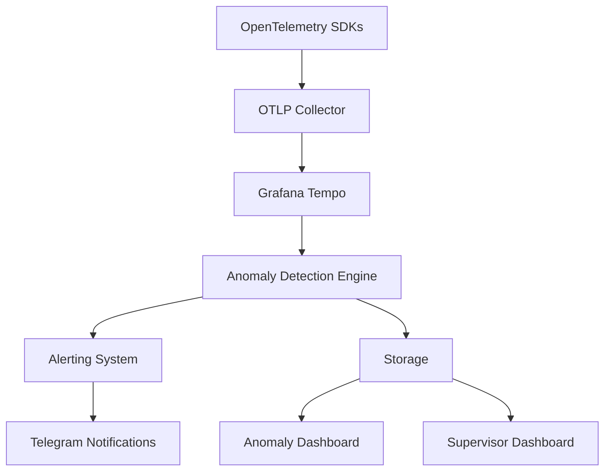

# Advanced Trace Anomaly Detection System

## Overview

The Advanced Trace Anomaly Detection System is a comprehensive solution for proactively identifying performance regressions and security issues in the devart.ai platform by analyzing trace data collected through OpenTelemetry. This system builds upon the existing observability infrastructure to provide intelligent alerts and automated flagging of anomalous behavior patterns.

## Features

### Statistical Anomaly Detection
- **Latency Anomalies**: Detect when operation latency exceeds expected thresholds using Z-score analysis
- **Error Rate Anomalies**: Identify sudden increases in error rates using threshold-based detection
- **Throughput Anomalies**: Detect unusual traffic patterns using time windowing and statistical analysis
- **Security Anomalies**: Identify unusual access patterns that may indicate security threats

### Alerting and Notification
- **Telegram Integration**: Critical and high-severity anomalies trigger Telegram notifications
- **Dashboard Alerts**: Real-time visualization of detected anomalies in the supervisor dashboard
- **Configurable Thresholds**: Adjustable sensitivity for different anomaly types

### User Interface
- **Anomaly Dashboard**: Comprehensive view of all detected anomalies with filtering capabilities
- **Alert Panel**: Real-time display of critical anomalies in the supervisor dashboard
- **Navigation**: Easy access to anomaly detection features through the main navigation

## Architecture



## Components

### Backend Services
- **Anomaly Detection Service**: Core service implementing statistical detection algorithms
- **API Endpoints**: REST endpoints for anomaly management and configuration
- **Database Schema**: Tables for storing anomalies and configuration

### Frontend Components
- **AnomalyDashboard**: Comprehensive dashboard for viewing all anomalies
- **AnomalyAlertPanel**: Real-time alert panel for the supervisor dashboard
- **Navigation**: Updated navigation with link to anomalies page

## API Endpoints

### Anomaly Management
- `GET /api/anomalies` - Retrieve all detected anomalies
- `GET /api/anomalies/:id` - Retrieve specific anomaly by ID
- `PUT /api/anomalies/:id/resolve` - Mark anomaly as resolved

### Configuration
- `GET /api/anomaly-config` - Retrieve anomaly detection configuration
- `PUT /api/anomaly-config` - Update anomaly detection configuration

### Manual Trigger
- `POST /api/anomaly-detection/run` - Manually trigger anomaly detection

## Database Schema

### trace_anomalies
```sql
CREATE TABLE trace_anomalies (
  id UUID PRIMARY KEY DEFAULT gen_random_uuid(),
  trace_id TEXT NOT NULL,
  span_id TEXT,
  anomaly_type TEXT NOT NULL, -- 'PERFORMANCE', 'SECURITY', 'RESOURCE'
  anomaly_subtype TEXT, -- Specific type of anomaly
  severity TEXT NOT NULL, -- 'LOW', 'MEDIUM', 'HIGH', 'CRITICAL'
  description TEXT,
  detected_at TIMESTAMPTZ DEFAULT NOW(),
  resolved BOOLEAN DEFAULT FALSE,
  resolution_notes TEXT
);
```

### anomaly_detection_config
```sql
CREATE TABLE anomaly_detection_config (
  id UUID PRIMARY KEY DEFAULT gen_random_uuid(),
  config_key TEXT NOT NULL UNIQUE,
  config_value JSONB,
  description TEXT
);
```

## Configuration

The anomaly detection system can be configured through the `anomaly_detection_config` table:

| Config Key | Default Value | Description |
|------------|---------------|-------------|
| `latency_threshold_stddev` | 3.0 | Number of standard deviations above average latency to flag as anomaly |
| `error_rate_threshold` | 0.05 | Error rate threshold (5%) to flag as anomaly |
| `throughput_spike_threshold` | 3.0 | Z-score threshold for traffic spike detection |
| `sampling_enabled` | true | Whether to enable sampling for anomaly detection |
| `sampling_ratio` | 0.1 | Ratio of traces to sample for anomaly detection (10%) |

## Deployment

### Prerequisites
1. Grafana Tempo instance for trace storage
2. Telegram bot for alert notifications (optional)
3. Supabase database with updated schema

### Environment Variables
```bash
# API (Cloudflare Workers)
TEMPO_ENDPOINT=http://tempo:3100  # Grafana Tempo endpoint
TELEGRAM_BOT_TOKEN=your-bot-token # Telegram bot token (optional)
TELEGRAM_CHAT_ID=your-chat-id     # Telegram chat ID (optional)
```

### Deployment Steps
1. Apply the updated database schema
2. Deploy the updated backend API
3. Deploy the updated frontend application
4. Configure environment variables
5. Test the system with sample data

## Testing

To test the anomaly detection system:

1. Trigger the anomaly detection pipeline manually:
   ```bash
   curl -X POST http://localhost:8787/api/anomaly-detection/run
   ```

2. View detected anomalies in the dashboard:
   - Navigate to the Anomalies page
   - Check the Anomaly Alert Panel on the supervisor dashboard

3. Verify Telegram notifications (if configured):
   - Critical anomalies should trigger Telegram messages
   - High severity anomalies should trigger Telegram messages

4. Run the test scripts:
   ```bash
   node test-anomaly-detection.ts
   node test-anomaly-detection-full.ts
   ```

## Monitoring

The system includes built-in monitoring through OpenTelemetry instrumentation. Key metrics to monitor include:

- Anomaly detection processing time
- Number of anomalies detected
- Alert generation success rate
- Database query performance

## Security

The system follows the security guidelines documented in `OTEL_SECURITY.md`:

- Sensitive information is excluded from trace data used for anomaly detection
- Access controls are implemented using the same RBAC patterns as other system components
- Data is encrypted at rest and in transit

## Maintenance

Regular maintenance tasks include:

- Reviewing and resolving detected anomalies
- Updating configuration parameters based on system performance
- Monitoring alert accuracy and adjusting thresholds as needed
- Reviewing Telegram notification effectiveness