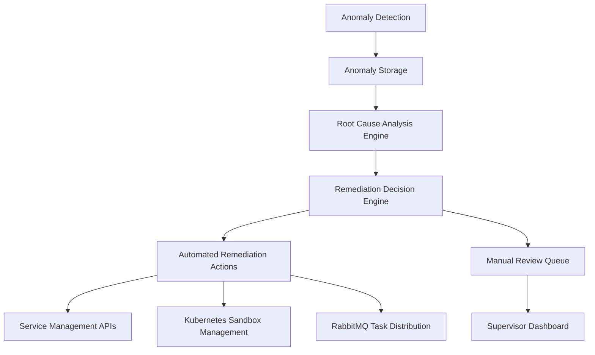

# Automated Remediation System

## Overview

The Automated Remediation System enables agents to act on high-confidence Root Cause Analysis (RCA) findings to perform automated remediation actions. This system extends the existing anomaly detection and root cause analysis capabilities by adding automated response mechanisms for specific, well-understood issues.

## Architecture

The Automated Remediation system follows a modular architecture that integrates with the existing anomaly detection and root cause analysis pipeline:



## Components

### 1. Database Tables

#### remediation_actions
Stores predefined remediation actions for automated response to RCA findings.

| Column | Type | Description |
|--------|------|-------------|
| id | UUID | Primary key |
| root_cause_category | TEXT | The category of root cause this action applies to |
| root_cause_details | TEXT | Specific details about the root cause pattern |
| action_type | TEXT | The type of remediation action to execute |
| action_parameters | JSONB | Parameters for the remediation action |
| confidence_threshold | TEXT | Minimum confidence level required to execute automatically |
| is_active | BOOLEAN | Whether this remediation action is currently active |
| created_at | TIMESTAMPTZ | Timestamp when the action was created |
| updated_at | TIMESTAMPTZ | Timestamp when the action was last updated |

#### remediation_logs
Tracks executed remediation actions for audit purposes.

| Column | Type | Description |
|--------|------|-------------|
| id | UUID | Primary key |
| anomaly_id | UUID | Reference to the anomaly that triggered this remediation |
| action_id | UUID | Reference to the remediation action that was executed |
| execution_status | TEXT | Status of the remediation execution |
| execution_result | JSONB | Detailed results of the remediation execution |
| executed_at | TIMESTAMPTZ | Timestamp when the remediation was executed |
| executed_by | TEXT | Whether the action was executed automatically or manually |

### 2. Backend Service

The remediation service (`apps/api/src/services/remediation.ts`) implements the core logic for:

- Managing remediation actions
- Executing remediation actions
- Logging remediation executions
- Determining automatic execution based on confidence scores

### 3. API Endpoints

- `GET /api/remediation-actions` - Retrieve all remediation actions
- `POST /api/remediation-actions` - Create a new remediation action
- `PUT /api/remediation-actions/:id` - Update a remediation action
- `DELETE /api/remediation-actions/:id` - Delete a remediation action
- `GET /api/remediation-logs` - Retrieve remediation execution logs
- `POST /api/remediation/execute` - Manually trigger a remediation action

### 4. Frontend Components

#### RemediationDashboard
Displays automated remediation actions and their status, shows remediation logs and execution results, and allows supervisors to manually trigger remediation actions.

#### AnomalyDashboard (Enhanced)
Shows remediation status in anomaly details, suggests remediation actions for high-confidence RCAs, and provides quick action buttons for manual remediation.

## Supported Remediation Actions

### 1. Configuration Rollback (ROLLBACK)
Reverts a configuration change to a previous known good state.

Parameters:
- `config_key`: The configuration key to rollback
- `previous_value`: The previous value to restore
- `service_id`: The service affected by the configuration

### 2. Service Restart (RESTART)
Restarts a faulty service to resolve transient issues.

Parameters:
- `service_id`: The service to restart
- `container_id`: Specific container instance (optional)
- `grace_period`: Time to wait before force restart (optional)

### 3. Resource Scaling (SCALE)
Adjusts compute resources allocated to a service.

Parameters:
- `service_id`: The service to scale
- `resource_type`: CPU, memory, or instances
- `scale_direction`: UP or DOWN
- `scale_amount`: Amount to scale by

### 4. Notification (NOTIFY)
Sends notifications to specified recipients.

Parameters:
- `message`: The notification message
- `recipients`: Array of recipient identifiers

### 5. Task Requeuing (REQUEUE)
Places a failed task back in the processing queue with appropriate delay.

Parameters:
- `task_id`: The task to requeue
- `delay_ms`: Delay before task should be processed again

## Remediation Decision Logic

The system evaluates RCA findings based on confidence scores to determine appropriate actions:

| Confidence Score | Action |
|------------------|--------|
| HIGH (80-100%) | Execute automated remediation if predefined action exists |
| MEDIUM (50-79%) | Queue for supervisor review with suggested action |
| LOW (1-49%) | Queue for supervisor review without automated suggestion |

## Security Considerations

1. All remediation actions must be logged with detailed audit trails
2. Only high-confidence actions should be executed automatically
3. Role-based access control for remediation action configuration
4. Rate limiting on automated remediation to prevent cascading failures
5. Dry-run capability for testing remediation actions before execution

## Testing

The system includes unit tests for all remediation service functions, covering:
- Fetching remediation actions
- Creating and updating remediation actions
- Executing remediation actions
- Logging remediation executions
- Confidence threshold evaluation

## Monitoring and Observability

1. Track remediation action success/failure rates
2. Monitor performance impact of remediation actions
3. Log all remediation decisions for audit purposes
4. Alert on failed remediation attempts
5. Dashboard metrics for remediation effectiveness

## Deployment

### Prerequisites

1. Updated database schema with remediation tables
2. Configuration of remediation actions in the database
3. Proper RBAC setup for remediation controls

### Environment Variables

```bash
# Remediation service configuration
MAX_AUTOMATED_REMEDIATION_RATE=5 # Maximum automated actions per minute
REMEDIATION_DRY_RUN=false # Enable dry-run mode for testing
```