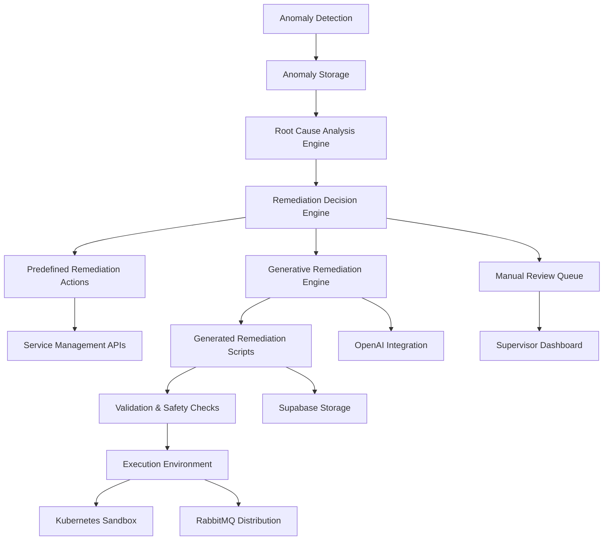

# Generative Remediation Script Generator

## Overview

The Generative Remediation Script Generator is a system that enables agents to create novel remediation scripts or configuration patches based on Root Cause Analysis (RCA) findings, rather than simply executing predefined actions. This system extends the existing Automated Remediation capabilities by incorporating generative AI to produce custom remediation solutions for complex or novel issues.

## Architecture

The Generative Remediation system builds upon the existing remediation architecture but introduces generative capabilities:



## Components

### 1. Database Tables

#### generative_remediation_scripts
Stores generated remediation scripts for audit and potential reuse.

#### generative_remediation_templates
Stores templates used for generating remediation scripts.

### 2. Backend Services

#### Generative Remediation Service (`apps/api/src/services/generativeRemediation.ts`)
Implements the core logic for:
- Generating remediation scripts from RCA findings using OpenAI
- Validating generated scripts for safety
- Managing script templates
- Executing generated scripts in sandboxed environments

### 3. API Endpoints

- `POST /api/generative-remediation/generate` - Generate a remediation script from RCA findings
- `GET /api/generative-remediation/scripts` - Retrieve generated scripts with filtering
- `GET /api/generative-remediation/scripts/:id` - Retrieve a specific generated script
- `POST /api/generative-remediation/scripts/:id/validate` - Validate a generated script
- `POST /api/generative-remediation/scripts/:id/approve` - Approve a script for execution
- `POST /api/generative-remediation/scripts/:id/execute` - Execute a validated script
- `GET /api/generative-remediation/templates` - Retrieve script templates
- `POST /api/generative-remediation/templates` - Create a new script template (supervisor role required)
- `PUT /api/generative-remediation/templates/:id` - Update a script template (supervisor role required)
- `DELETE /api/generative-remediation/templates/:id` - Delete a script template (supervisor role required)

### 4. Agent Integration

#### Enhanced Agent SDK (`devart-agent-template/sdk/generative_remediation.py`)
Extends the existing Python agent SDK with capabilities for:
- Requesting generative remediation from the Hono API
- Validating received scripts locally using language-specific validators
- Executing scripts in sandboxed environments with resource limits
- Reporting execution results back to the API
- Handling script approval workflows for supervisor review

## Script Generation Process

1. **Input Analysis**: The system analyzes the RCA findings to determine root cause category, affected systems, severity, and required remediation approach.
2. **Template Selection**: Based on the root cause category, the system selects an appropriate template from the `generative_remediation_templates` table.
3. **Script Generation**: Using the selected template and RCA details, the system generates a customized remediation script via OpenAI API.
4. **Validation**: The generated script undergoes multiple validation steps for syntax, security, and safety.
5. **Approval Workflow**: Before execution, scripts go through an approval workflow based on confidence scores.
6. **Execution**: Once validated and approved, the script can be executed in sandboxed environments.

## Supported Script Types

1. **Bash Scripts**: For system-level operations and configuration changes.
2. **Python Scripts**: For complex logic and integration with Python libraries.
3. **Kubernetes Manifests**: For cluster configuration and resource management.
4. **SQL Scripts**: For database schema and data corrections.
5. **Configuration Patches**: For updating application configuration files.

## Safety and Security Measures

1. **Script Validation**: Syntax validation, forbidden command detection, resource limit enforcement, and access control verification.
2. **Sandboxed Execution**: Kubernetes-based isolated execution environments with resource monitoring and network restrictions.
3. **Audit Trail**: Complete logging of script generation, execution monitoring, and supervisor approval logging.
4. **Rollback Capabilities**: Automatic snapshot creation and one-click rollback mechanisms.

## Confidence-Based Execution

The system evaluates the quality of generated scripts based on multiple factors and uses a confidence-based execution approach:

| Confidence Level | Criteria | Execution Approach |
|------------------|----------|-------------------|
| HIGH (80-100%) | Template match, simple changes, validated, high RCA confidence | Automatic execution with supervisor notification |
| MEDIUM (50-79%) | Template match, complex changes, medium RCA confidence | Supervisor review required |
| LOW (1-49%) | No template match, novel solution, low RCA confidence | Manual review and approval |

## Integration with Existing Systems

1. **Anomaly Detection System**: Receives anomaly details as input for script generation.
2. **Root Cause Analysis Engine**: Provides detailed RCA findings to inform script generation.
3. **Automated Remediation System**: Can fall back to predefined actions when generation fails.
4. **Supervisor Dashboard**: Displays generated scripts for review and approval.

## Usage Examples

### Requesting Generative Remediation

```python
from agent_sdk import AgentSDK

# Initialize the agent
agent = AgentSDK(agent_id, api_key, api_base_url)

# RCA findings
anomaly_id = "anomaly-123"
root_cause_analysis = {
    "root_cause_category": "Configuration",
    "root_cause_details": "Missing configuration file for database connection",
    "confidence_score": "HIGH",
    "suggested_actions": [
        "Create missing configuration file",
        "Verify database connection parameters"
    ]
}

# Request generative remediation
script_response = agent.request_generative_remediation(anomaly_id, root_cause_analysis)
script_id = script_response.get('id')
```

### Validating and Executing a Script

```python
# Validate the script
validation_result = agent.validate_script(script_id)

if validation_result.get('validation', {}).get('isValid'):
    # Execute the script
    execution_result = agent.execute_script(script_id)
    
    if execution_result.get('status') == 'SUCCESS':
        print("Script executed successfully!")
    else:
        print(f"Script execution failed: {execution_result.get('result', {}).get('error')}")
```

## Testing

The generative remediation functionality includes comprehensive tests:
- Unit tests for the API service functions
- Integration tests for the agent SDK
- Validation tests for script safety checks

Run tests with:
```bash
cd devart-agent-template
python run_tests.py
```

## Monitoring and Observability

The system integrates with existing devart.ai observability:
- Metrics collection for script generation success/failure rates
- Alerting for failed script generation attempts and unsafe script detection
- Dashboard for real-time script generation and execution status