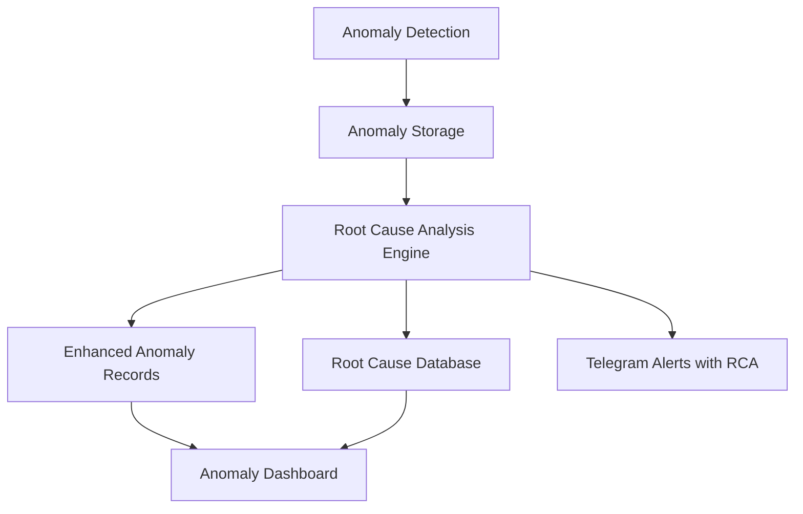

# Root Cause Analysis System for Anomaly Detection

## Overview

This document describes the implementation of the Root Cause Analysis (RCA) feature for the anomaly detection system in devart.ai. The system now not only detects anomalies but also suggests likely root causes and provides actionable recommendations to help supervisors quickly identify and resolve issues.

## Architecture

The Root Cause Analysis system extends the existing anomaly detection pipeline with the following components:



### Key Components

1. **Root Cause Analysis Engine**: Core service that analyzes anomalies and determines likely causes
2. **Root Cause Database**: Storage for root cause patterns and historical analysis
3. **Enhanced Anomaly Records**: Updated anomaly records with root cause information
4. **Anomaly Dashboard Integration**: UI components to display root cause information
5. **Alerting System Integration**: Enhanced alerts with root cause information

## Data Models

### Enhanced Anomaly Record

The existing `trace_anomalies` table has been extended with root cause information:

```sql
ALTER TABLE trace_anomalies 
  ADD COLUMN root_cause JSONB,
  ADD COLUMN root_cause_confidence TEXT, -- 'LOW', 'MEDIUM', 'HIGH'
  ADD COLUMN suggested_actions JSONB;
```

### Root Cause Patterns Table

A new table stores root cause patterns for learning and improvement:

```sql
CREATE TABLE root_cause_patterns (
  id UUID PRIMARY KEY DEFAULT gen_random_uuid(),
  anomaly_type TEXT NOT NULL,
  anomaly_subtype TEXT,
  root_cause_category TEXT NOT NULL,
  root_cause_details TEXT,
  pattern_identifiers JSONB,
  confidence_score NUMERIC,
  created_at TIMESTAMPTZ DEFAULT NOW()
);
```

## Root Cause Analysis Logic

### Performance Anomalies

For performance-related anomalies, the system analyzes:

1. **High Latency Anomalies**
   - Database performance issues
   - External API dependency problems
   - Application-level performance bottlenecks

2. **Error Rate Anomalies**
   - Application bugs and integration failures
   - Input validation issues
   - Deployment-related problems

3. **Throughput Anomalies**
   - Traffic spikes and scaling issues
   - Resource constraints
   - Infrastructure bottlenecks

### Security Anomalies

For security-related anomalies, the system analyzes:

1. **Unusual Access Patterns**
   - Unauthorized access attempts
   - Compromised credentials
   - Privilege escalation attempts

2. **Data Access Anomalies**
   - Data exfiltration attempts
   - Unauthorized data queries
   - Permission issues

### Resource Anomalies

For resource-related anomalies, the system analyzes:

1. **Memory Leaks**
   - Application memory management issues
   - Resource allocation problems
   - Garbage collection issues

2. **CPU Saturation**
   - High CPU consuming processes
   - Resource-intensive operations
   - Compute resource constraints

## Root Cause Categories

The system categorizes root causes into the following types:

| Category | Description | Example |
|----------|-------------|---------|
| Infrastructure | Issues with underlying infrastructure | Server overload, network latency |
| Application | Problems in application code or logic | Memory leaks, inefficient algorithms |
| Configuration | Incorrect system configurations | Wrong environment variables, misconfigured services |
| External Dependencies | Issues with third-party services | API downtime, rate limiting |
| Security | Security-related issues | Unauthorized access, credential leaks |
| Data | Issues with data quality or processing | Corrupted data, schema mismatches |
| Human Error | Mistakes made by operators | Incorrect deployments, manual errors |

## Confidence Scoring

The system assigns confidence scores to root cause suggestions:

- **HIGH (80-100%)**: Strong evidence supporting the root cause
- **MEDIUM (50-79%)**: Moderate evidence supporting the root cause
- **LOW (1-49%)**: Weak evidence, requires supervisor validation

## Suggested Actions

For each identified root cause, the system provides actionable suggestions:

| Root Cause Category | Suggested Actions |
|---------------------|-------------------|
| Infrastructure | Scale resources, check network connectivity |
| Application | Review code, optimize algorithms, fix memory leaks |
| Configuration | Verify settings, rollback recent changes |
| External Dependencies | Contact service provider, implement fallbacks |
| Security | Review access logs, rotate credentials, update permissions |
| Data | Validate data quality, check schema compatibility |
| Human Error | Review recent changes, implement process improvements |

## Implementation Details

### Backend Implementation

1. **Root Cause Analysis Service** (`apps/api/src/services/rootCauseAnalysis.ts`):
   - Implements analysis algorithms for different anomaly types
   - Creates pattern matching logic
   - Integrates with existing anomaly detection pipeline

2. **Enhanced Anomaly Storage**:
   - Modifies `storeResults` function in `anomalyDetection.ts` to include root cause information
   - Updates database schema with new columns

3. **Pattern Learning**:
   - Implements feedback mechanism to improve root cause suggestions
   - Creates pattern storage and retrieval functions

### Frontend Implementation

1. **Anomaly Dashboard Enhancement**:
   - Adds root cause display section to anomaly details
   - Implements suggested actions panel
   - Adds confidence indicators for root cause suggestions

2. **Anomaly Alert Panel Enhancement**:
   - Includes root cause information in alert summaries
   - Adds quick action buttons based on suggested actions

### Alerting System Enhancement

1. **Telegram Alert Enhancement**:
   - Modifies alert messages to include root cause information
   - Adds suggested actions to critical alerts

## Testing Strategy

1. **Unit Tests**: Test individual root cause analysis functions
2. **Integration Tests**: Test the complete anomaly detection with RCA pipeline
3. **Performance Tests**: Ensure RCA doesn't significantly impact anomaly detection performance
4. **User Acceptance Tests**: Validate root cause suggestions with supervisors

## Security Considerations

1. Ensure root cause analysis doesn't expose sensitive system information
2. Protect pattern data with appropriate RLS policies
3. Sanitize all data before including in alerts or UI

## Monitoring and Observability

1. Track root cause analysis accuracy through supervisor feedback
2. Monitor performance impact of RCA processing
3. Log all root cause suggestions for audit purposes