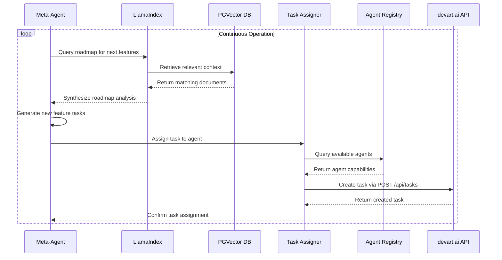

# Meta-Agent System Architecture

## Overview

The Meta-Agent System is designed to create a fully self-evolving platform that can analyze its own roadmap, generate tasks for new features, and assign them to other agents. The system implements a hybrid approach using LlamaIndex for the "Analysis" layer and Langroid for the "Orchestration" layer.

## System Architecture

The Meta-Agent System follows a two-phase architecture with clear separation between data analysis and task orchestration:

```mermaid
graph TD
    subgraph "Phase 1: Data Ingestion (LlamaIndex)"
        A[Roadmap Documents <br/>(PDFs, Markdown, etc.)] --> B{LlamaIndex Ingestion Pipeline};
        B --> C[Chunking & Metadata Extraction];
        C --> D[OpenAI Embedding API];
        D --> E[PGVector Knowledge Base];
    end

    subgraph "Phase 2: Agentic Execution (Langroid)"
        F[Meta-Agent (Langroid)] -- "1. What's next on the roadmap?" --> G{Query Engine (LlamaIndex)};
        G -- "2. Retrieves relevant context" --> E;
        G -- "3. Synthesized answer" --> F;
        
        F -- "4. Analyzes answer, generates new feature tasks" --> F;
        
        F -- "5. 'Assign this task: ...'" --> H[Task Assigner Agent (Langroid)];
        H -- "6. Finds best agent for the job" --> I[devart.ai Agent Registry];
        H -- "7. Creates task via API" --> J[devart.ai API <br/>(POST /api/tasks)];
    end
```

## Component Breakdown

### LlamaIndex Analysis Layer

The LlamaIndex Analysis Layer is responsible for ingesting and processing the platform's roadmap documents.

#### Document Ingestion Pipeline
- Supports multiple document formats (PDF, Markdown, plain text)
- Uses LlamaIndex Readers for robust document parsing
- Implements intelligent chunking strategies based on document structure
- Extracts metadata such as document type, version, and creation date

#### Semantic Indexing
- Generates embeddings using OpenAI's text-embedding-ada-002 model
- Stores embeddings in PGVector database for efficient similarity search
- Implements RouterQueryEngine for deciding between vector search and structured queries
- Maintains up-to-date index as roadmap documents evolve

### Langroid Orchestration Layer

The Langroid Orchestration Layer is responsible for analyzing roadmap context, generating tasks, and assigning them to appropriate agents.

#### Meta-Agent
- Central agent that analyzes roadmap context and generates new tasks
- Uses LLM reasoning to break down complex features into manageable sub-tasks
- Prioritizes tasks based on roadmap positioning and dependencies

#### Task Generation Module
- Generates detailed task descriptions with clear objectives
- Defines required capabilities for task completion
- Sets appropriate priority levels based on roadmap importance
- Establishes dependencies between related tasks

#### Agent Assignment Module
- Queries devart.ai Agent Registry to identify available agents
- Matches task requirements with agent capabilities using JSONB containment
- Considers agent workload and availability for optimal assignment
- Implements fallback mechanisms for tasks with specialized requirements

## Integration with Existing System

### Agent Registry Integration

The Meta-Agent System integrates with the existing devart.ai Agent Registry:

| Component | Integration Point | Purpose |
|-----------|-------------------|---------|
| Agent Capabilities | `agents.capabilities` JSONB column | Match tasks with qualified agents |
| Agent Status | `agents.status` field | Ensure agents are available for assignment |
| Agent API Keys | `agents.api_key_hash` field | Secure agent authentication |

### Task Management Integration

The system leverages existing task management infrastructure:

| Component | Integration Point | Purpose |
|-----------|-------------------|---------|
| Task Creation | `POST /api/tasks` endpoint | Create new tasks generated by meta-agent |
| Task Capabilities | `tasks.required_capabilities` JSONB column | Define skills needed for each task |
| Task Assignment | `PUT /api/tasks/:taskId/capabilities` endpoint | Update task requirements as needed |

### Knowledge Base Integration

The system extends the existing knowledge base functionality:

| Component | Integration Point | Purpose |
|-----------|-------------------|---------|
| Vector Storage | `knowledge_base` table with PGVector | Store roadmap embeddings for semantic search |
| Semantic Search | `match_knowledge` function | Retrieve relevant roadmap context |
| Knowledge Ingestion | `generateEmbedding` service | Create embeddings for new roadmap content |

## Workflow and Data Flow

### Meta-Agent Execution Cycle



### Data Flow Diagram

```mermaid
graph LR
    A[Roadmap Documents] --> B[LlamaIndex Ingestion];
    B --> C[Embedding Generation];
    C --> D[PGVector Storage];
    D --> E[Semantic Search];
    E --> F[Meta-Agent Analysis];
    F --> G[Task Generation];
    G --> H[Agent Assignment];
    H --> I[devart.ai API];
    I --> J[Task Creation];
    J --> K[Agent Execution];
```

